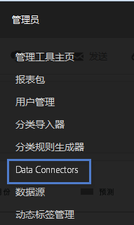
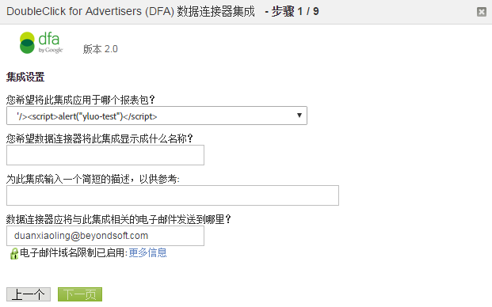

# DFA 集成{#dfa-integration}

配置 DFA 集成涉及以下任务：

## 配置 DFA 集成{#configure-the-dfa-integration}

逐步完成 DFA Data connectors 集成。

配置页面提供有关集成的概述以及可获取更多信息的有用链接。Adobe 和 DoubleClick 费用均与此集成相关。请联系这两个组织相应的销售代表，并确保您了解费用结构。

1. 登录到 [!DNL Adobe Analytics]。
1. Click **[!UICONTROL Admin]** &gt; **[!UICONTROL Data Connectors]**.

   

1. Locate **[!UICONTROL DoubleClick DFA]**, then click **[!UICONTROL Add New]**.

   

   On each page of the Integration Wizard, provide the required information, then click **[!UICONTROL Next]**. 下表解释了通过该向导完成集成所需要的信息。

<table id="table_8F6F7F304C36431DA5FD6E5D54F60FC0"> 
 <thead> 
  <tr> 
   <th colname="col1" class="entry"> 向导页码 </th> 
   <th colname="col2" class="entry"> 字段 </th> 
   <th colname="col3" class="entry"> 描述 </th> 
  </tr> 
 </thead>
 <tbody> 
  <tr> 
   <td colname="col1"> 1 </td> 
   <td colname="col2"> 集成名称 </td> 
   <td colname="col3"> Genesis 在报表包的活动集成列表中显示的集成名称。 </td> 
  </tr> 
  <tr> 
   <td colname="col1"> 1 </td> 
   <td colname="col2"> 集成电子邮件地址 </td> 
   <td colname="col3"> 接收与此集成相关的所有通知的电子邮件地址。 </td> 
  </tr> 
  <tr> 
   <td colname="col1"> 2 </td> 
   <td colname="col2"> 用户名 </td> 
   <td colname="col3"> 随此集成一起使用的 DFA API 用户名。要允许用户进行 API 登录，请检查 DFA 界面中的 API 属性。在启用 API 登录后，将显示一个密码字段为用户提供密码。将此密码连同用户名一起输入到向导中进行验证。 </td> 
  </tr> 
  <tr> 
   <td colname="col1"> 2 </td> 
   <td colname="col2"> 密码 </td> 
   <td colname="col3"> DFA API 密码。 </td> 
  </tr> 
  <tr> 
   <td colname="col1"> 2 </td> 
   <td colname="col2"> 广告商 ID </td> 
   <td colname="col3"> <p>DFA 广告商 ID 或父 Floodlight 配置 ID。Data connectors 使用此 ID 标识要跟踪的 DFA 广告商（1.5 版本的集成）。此广告商ID不在集成版本2.0中使用——将查找并使用父Floodlight配置ID。 请参阅屏幕上的说明 </p> </td> 
  </tr> 
  <tr> 
   <td colname="col1"> 3 </td> 
   <td colname="col2"> DFA 广告变量 </td> 
   <td colname="col3"> 用于接收 DFA 促销活动属性、展示次数和点击量数据的 Analytics eVar。通常，此为跟踪代码 eVar ( <span class="varname"> s.campaign </span>), but you can choose any available eVar. Data connectors 还将以下 DFA 相关分类添加到选定 eVar： <p><b>促销活动</b>：向包含常见消息的多个网站提供的广告集合。 </p> <p><b>网站名称</b>：提供广告服务的网站。 </p> <p><b>广告名称</b>：在您的 DFA 帐户中定义的广告名称。 </p> <p><b>网站版面名称</b>：提供广告服务的网站和页面。 </p> <p><b>交付工具</b>：DoubleClick for Advertisers。 </p> <p><b>渠道</b>：横幅广告。 </p> <p><b>成本结构</b>：CPM、CPC 或固定成本，具体取决于广告的成本结构。 </p> <p><b>创作名称</b>：与广告/版面/创作 ID 关联的创作名称。 </p> <p><b>DFA &gt; SearchCenter 重复数据删除</b>：指定在发生 DFA 点进和显示到达时，DFA 应将值置入 Searchcenter 变量中。</a>。 </p> </td> 
  </tr> 
  <tr> 
   <td colname="col1"> 4 </td> 
   <td colname="col2"> 展示次数 </td> 
   <td colname="col3"> 用于接收 DFA 展示次数量度数据的自定义事件。展示次数指示提供广告服务的次数。 </td> 
  </tr> 
  <tr> 
   <td colname="col1"> 4 </td> 
   <td colname="col2"> 点击量 </td> 
   <td colname="col3"> 选择接收 DFA 点击量量度数据的自定义事件。点击量指示访客点击广告的次数，它由 DFA 的重定向测量。点击量量度与 Analytics 点进次数量度关联。 <p>Note:  DFA Clicks and Analytics Click-throughs might not match exactly due to differences in the way data is collected.  </a>. </p> </td> 
  </tr> 
  <tr> 
   <td colname="col1"> 5 </td> 
   <td colname="col2"> 显示到达变量 </td> 
   <td colname="col3"> <p>用于接收 DFA 显示到达数据的 Analytics eVar。显示到达变量可帮助您了解显示到达次数如何影响网站上的转化率。 </p> <p>Data connectors 将添加到 DFA 广告变量的相同 DFA 相关分类添加到此 eVar（参见上文）。 </p> </td> 
  </tr> 
  <tr> 
   <td colname="col1"> 5 </td> 
   <td colname="col2"> 自上次查看以来的时间（显示到达时间段变量） </td> 
   <td colname="col3"> 用于接收自上次查看以来的 DFA 时间数据的 Analytics eVar。自上次查看以来的时间指示自上次广告显示到达起过去的时间量。 </td> 
  </tr> 
  <tr> 
   <td colname="col1"> 5 </td> 
   <td colname="col2"> 显示到达次数 </td> 
   <td colname="col3"> 用于接收 DFA 显示到达次数量度数据的自定义事件。结合使用显示到达次数事件和显示到达变量，以了解哪些促销活动虽没有影响直接点进，但可能在后续的某个时候起到将流量引导至网站的作用。 <p>Data connectors 将选定的自定义事件重新命名为“显示到达次数”。 </p> </td> 
  </tr> 
  <tr> 
   <td colname="col1"> 6 </td> 
   <td colname="col2"> DFA 查询失败 </td> 
   <td colname="col3"> （可选）用于接收任何报告的 DFA 查询失败消息代码的 Analytics eVar。可能的 DFA 消息代码包括： 
    <ul id="ul_85FC7FB19F7F4ADF83ABCA6DDB44CE19"> 
     <li id="li_0A3181DED5A149588A0D3F1584E2FE8B"><b>nc</b>：无 DoubleClick Cookie。 </li> 
     <li id="li_D397AA73AD5E4086A18B87F271E4EC14"><b>oo</b>：用户已退出。 </li> 
     <li id="li_5AC1D0C8049340B4AD857D88E275CBD6"><b>nh</b>：无促销活动历史记录。 </li> 
     <li id="li_73A8C5E905C54E2BB531A1FCDBC6AA1A"><b>qe</b>：查询错误（超时、服务器故障等）。 </li> 
    </ul> </td> 
  </tr> 
  <tr> 
   <td colname="col1"> 6 </td> 
   <td colname="col2"> 超时事件 </td> 
   <td colname="col3"> <p>该 Analytics 计数器事件在每次 <span class="varname"> s.maxDelay </span> timer expires, and no response was received from the DFA servers. Use this event to configure the <span class="varname"> s.maxDelay </span> variable Tuning s.maxDelay </a>.) </p> </td> 
  </tr> 
 </tbody> 
</table>

## 针对 DFA 集成的网站更新{#web-site-updates-for-the-dfa-integration}

在 Genesis 为 DFA 集成配置了 Analytics 报表包之后，您必须执行以下操作以配置您的网站和 DFA 环境来支持集成：

### 验证域中的 Cookie 空间{#verify-cookie-space-on-the-domain}

DFA 的 Data connectors 集成要求您在页面的域中设置 Cookie。

部分域已达到了某些 Web 浏览器所允许的最大 Cookie 容量，不过这种情况并不多见。要避免影响访客在您网站上的浏览体验，请咨询您的网络运营部门、开发团队或工程小组，以确认将其他 Cookie 添加到用于 DFA 集成的页面域将不会影响用户体验。您还将需要为此 Cookie 选择一个名称。

### 更新您的 DFA 查询字符串参数{#update-your-dfa-query-string-parameter}

如果您在 DFA 集成之前已通过 Adobe Analytics 跟踪广告促销活动，则有可能所有促销活动（电子邮件、搜索或横幅）均使用相同的查询字符串参数来标识登陆页面上的反向链接促销活动 ID。

要弄清何时为您的 DFA 广告促销活动请求来自 DFA 数据的显示到达和点进数据，Data connectors 需要在访客点击某 DFA 促销活动横幅广告时进行标识。要做到这一点，您必须在 DFA 广告促销活动的登陆页面 URL 中添加一个差异化的查询字符串参数，这样 Data connectors 就能够区分 DFA 广告促销活动页面和您的网站上可能存在的其他广告促销活动页面。用 `dfa_overrideParam` 于DFA的JavaScript插件中的。

>[!CAUTION]
>
>尽管“营销活动”变量可用于其他营销活动，但请勿将其用于DFA营销活动。 如果您将促销活动变量设置为 DFA 促销活动登陆页面，则 Adobe 无法将展示次数和点击量关联到 DFA 促销活动点进次数。每次访问后，Adobe 收集服务器都会检查 DFA 服务器中的上一次点进或显示到达。因此，请仅在常见登录页面上包含DFA插件代码，以避免不必要的重定向，这些重定向会减慢页面加载时间，尤其是对于Internet连接较慢的用户。

## 更新网站的数据收集代码{#update-your-web-site-s-data-collection-code}

DFA 的 Genesis 集成可利用 DFA Floodlight 配置 ID (dfa_SPOTID)，以提高 DFA 和 Adobe 数据收集系统之间的报表一致性。

>[!NOTE]
>
>在Google DFA的最新版本中，术语Spotlight已更改为Floodlight。 JavaScript 参数 `dfa_SPOTID` 基于 Spotlight 术语而命名，但它可同时用于两个版本。

要在您的网站上启用 DFA 集成，您必须通过添加以下内容来更新 JavaScript 数据收集代码：

* DFA 的集成模块
* 添加到收集代码的内容

### DFA 的集成模块 {#section-fa00e42a732a4e27a4ab3dfcfeae1a5b}

The DFA integration leverages the Adobe Experience Cloud Integrate Module, which adds functionality to your core JavaScript data collection code ( `s_code.js`). 当您从代码管理器下载AppMeasurement for Javascript代码时，集成模块将作为。zip文件的一部分提供。 仅当您需要查找它的其他帮助时，才与Adobe顾问联系。

Insert the Integrate Module code in the `Modules` section of your website's `s_code.js` file.

### 添加到收集代码的内容 {#section-8f98c727f1ba414fb8b4f02d696b8791}

基于您在集成向导中激活 DFA 集成时所做的选择，Data connectors 会为您的 JavaScript 数据收集代码生成自定义的添加内容，并通过电子邮件发送给您。将此代码插入 `s_code.js` 文件的主部分（不在 `doPlugins` 函数或任何其他函数中）。

以下显示的示例代码仅适用于插图；请使用您在完成 Data connectors 集成向导之后通过电子邮件收到的代码。

收集代码由以下组件组成：

* DFA 集成设置
* 需要集成的插件

**DFA 集成设置**

```
/************************** DFA VARIABLES **************************/ 
var dfaConfig = { 
   CSID:              "1234567", 
   SPOTID:            "29876543", 
   tEvar:             "eVar17", 
   errorEvar:         "eVar59", 
   timeoutEvent:      "event76", 
   requestURL:         "http://fls.doubleclick.net/ 
json?spot=[SPOTID]&src=[CSID]&var=[VAR]&host=integrate.112.2o7.net%2 
Fdfa_echo%3Fvar%3D[VAR]%26AQE%3D1%26A2S%3D1&ord=[RAND]", 
 
   maxDelay:          "1500", 
   visitCookie:       "s_dfa", 
   clickThroughParam: "CID", 
   searchCenterParam: "s_kwcid", 
   newRsidsProp:      undefined 
}; 
/************************ END DFA Variables ************************/ 
```

DFA 集成设置块可设置 DFA 集成所需要的变量。这其中每个变量的值来自以下来源：

**CSID**：客户端 ID。在您完成集成向导之后即由 DFA 生成。Data connectors 在此变量中预填充您的 DFA CS ID，并且在您完成集成向导后通过设置电子邮件向您发送此值。如果您的帐户中启用了高级广告服务，则不需要此变量。

**SPOTID**：Floodlight 配置（以前称为 Spotlight ID）。根据您在集成向导中指定的 DFA 帐户信息，Data connectors 在此变量中预填充您的 DFA Floodlight 配置 ID。

**tEvar**：转移变量。Data connectors 在此变量中预填充您在集成向导中为显示到达变量指定的 Analytics 变量名称。在没有与 Adobe 工程或工程服务部门密切协调的情况下，请不要更改此值。

**errorEvar**：错误变量。Data connectors 在此变量中预填充您在集成向导中为 DFA 查询失败变量指定的 Analytics 变量名称。

**timeoutEvent**：超时事件。Data connectors 在此变量中预填充您在集成向导中为超时事件变量指定的 Analytics 变量名称。

**requestURL**：用于查询广告信息的远程 DFA 主机。请不要更改此值，除非 Adobe 指示您这么做。

**maxDelay**：指定 JavaScript 数据收集代码等待来自 DFA Floodlight 服务器响应的时间量（以毫秒为单位）。Adobe 建议对此值进行试验，以找出基于您网站流量的最佳值。例如，提高此值通常会收集更多的 DFA 数据，但也会增加损失基本访客数据的风险（如果访客在延迟期间离开网站的话）。降低此值可减少损失点击数据的风险，但也会减少随 Adobe 点击数据一起发送的 DFA 数据量。

**visitCookie**：用于将 DFA 调用限制为每次访问调用一次的 Cookie 的名称。

**clickThroughParam**：一个查询字符串，通常包含在所有广告内，可通知集成模块刚刚发生了一次点击。如果查询字符串中存在此参数，则无论最近 30 分钟内是否已查询该访客，都可导致向 DFA Floodlight 服务器发出请求。

**newRsidsProp**：（可选）映射到未使用的流量属性变量。DFA 集成可在访问 Cookie 中收集并存储此值，以标识收集特定访客数据的报表包。此属性仅在通过 Adobe 工程服务进行自定义实施时需要用到。

**需要集成的插件**

所添加的收集代码加入了可改善 DFA 集成运行的额外插件：

* 将 DFA 查询限制为每次访问查询一次
* 使 Cookie 名称具有灵活性。尽管大部分组织都使用 s_dfa，但您可以对 DFA 集成使用任何有效的 Cookie 名称。
* 消除了不必要的重定向。由于显示到达数据是实时收集的，Adobe 收集服务器和 DFA 有可能交换每次页面查看的数据。在信息并非必要的情况下，插件可阻止这些数据交换。

>[!CAUTION]
>
>插件用于消除不必要的DFA查询的机制之一是基于域的访问cookie。 当访客在一次受 DFA 影响的显示到达或点进后跨了多个域时，跨越多个域的集成报表包会夸大点进和显示到达数据。

## 确认 DFA 集成成功{#confirming-a-successful-dfa-integration}

在进行了所有需要的网站更新之后，您可以使用网络流量查看器（如 Charles*、Chrome 开发人员工具或 Firebug*）来确认 DFA 正在与 Adobe 收集服务器通信。

在部署启用了 DFA 的 `s_code.js` 文件后，请使用网络流量查看器来查看 DFA 和 Adobe 数据收集服务器之间的请求，进而查找以下内容：

* A request to DFA's `fls.doubleclick.net/json` service. 此服务可做出不同的响应，具体取决于您使用的 DFA 版本。通过 DFA 集成版本 1.5 可以：

   * 到 [!DNL ad.doubleclick.net] 的 HTTP 302 重定向。这将在响应中发送一个 Location: 标识，其中包含有关广告访客的信息。
   * This Location tag causes a redirect to [!DNL integrate.112.2o7.net/dfa_echo]. 此服务将有关广告访客的信息转换为 JSON（启用 JavaScript 对象表示法）编码的字符串。将通过一个 200 OK HTTP 响应返回此数据。

* 通过 DFA 集成版本 2.0（启用高级广告服务）可以：

   * [!DNL fls.doubleclick.net] 将通过一个 200 OK 做出直接响应。

在任何一种情况下，一次成功的请求将导致对 Adobe 数据收集服务器的请求，并且该请求中包含参数 vX，其中 X 是您的显示到达 eVar 数。此参数值采取以下格式：DFA-XXXX-XXXX- XXXX-XXXX-XXXX-XXXX-XXXX-XXXX-XXXX。此字符串包含有关当前访客上次点击和上次展示的数据。

## 调整 s.maxDelay{#tuning-s-maxdelay}

为成功实现 DFA 实施，需要为您的特定网站优化 s.maxDelay。

通常，提高或降低访客数据的决 *`s.maxDelay`* 定涉及在获取更多DFA访客数据与危及收集Adobe访客数据之间的权衡。 Increasing *`s.maxDelay`* obtains more DFA visitor data, but (placed excessively high) could endanger the collection of Adobe visitor data. 降低 s.maxDelay 值可确保 Adobe 访客数据的收集，但可能损失 DFA 访客数据。

*`s.maxDelay`*&#x200B;不仅在网络通信中封装时间来联系 DFA，它还表示要触发的浏览器延迟并评估这些通信所基于的 JavaScript。这是因为集成模块在将HTML元素插入 *`s.maxDelay`* DOM后开始计时器，DOM会从DFA Floodlight服务器中提取数据。 浏览器基于这一新 HTML 元素实际发起 HTTP 请求所花费的时间量，根据同时加载的其他图像或 JavaScript 文件、访客计算机的速度和特定的浏览器实施而有所不同。此外，在从 DFA Floodlight 服务器中检索 JSON 数据时，JavaScript 必须由浏览器评估。它仍然由浏览器完全控制，并在同时运行的 JavaScript 代码量较大或存在大量异步 JavaScript 请求的情况下可将其延迟。

如此一来，*`s.maxDelay`*&#x200B;需要根据登陆页面的复杂性以及 DFA 的网络延迟量进行设置。在某些网站上，一种可用来降低复杂性的方法是在页面加载过程中提早触发 Adobe 收集代码，这样可在请求 Floodlight 服务器时减少浏览器中运行的内容。

超时变量在调整 *`s.maxDelay`*, because it is incremented every time the s.maxDelay timeout is reached. 在决定是增加还是减少时，我 *`s.maxDelay`* 们建议遵循以下过程：

1. 收集设置为特定值 *`s.maxDelay`* 的数天数据。
1. 运行 [!DNL Daily Unique Visitors Report] 时间范围。
1. Run the [!DNL Timeout Event Report] to check the number of timeouts that are coming through. 请记住，超时只针对每个访客收集一次。

现在有了数据在手，便可计算

```
Timeout Percentage = [Step 3] / [Step 2] * 100
```

请注意，超时百分比实际上考虑了所有的网站访客。这其中的某些访客完全不会关联到 DFA，因此该超时具有误导性。To improve this computation, another analysis could consider only unique visitors to pages with the `clickThroughParam` set (for example, `?CID=1`). 这将显示更高的准确性。

如果超时百分比非常低，请考虑降低 *`s.maxDelay`*。如果它非常高，请提高 *`s.maxDelay`*. When decreasing *`s.maxDelay`*, you will want to rerun the [!DNL Timeout Report] to ensure that timeouts have not dramatically increased. When increasing *`s.maxDelay`*, you will want to run a [!DNL Page Views Report] to make sure page views aren’t falling out due to lost data. Each time *`s.maxDelay`* is changed observe the data for several days in order to ensure that the data represents a trend, and not just a day-to-day fluctuation.

The optimal setting for *`s.maxDelay`* is the point at which the timeout percentage is minimized while Page Views do not drop off.

当您转到版本 2.0 的集成时，超时次数预计会因为消除了 302 重定向而减少。使用测试版客户端的初步调查结果显示超时次数持续减少，因此将收集更多的 DFA 数据。
