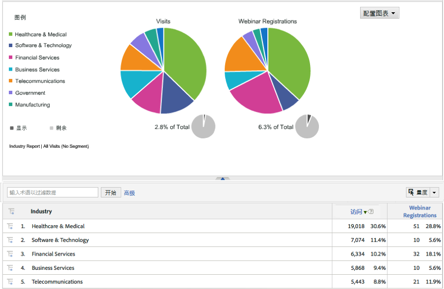

# 部署集成{#deploying-the-integration}

部署此集成是一个简单的过程，包括完成Adobe集成向导和验证集成。

## 完成Adobe集成向导{#completing-the-adobe-integration-wizard}

完成数据连接器界面中集成向导的步骤。

1. 导航到Adobe Experience cloud中的数据连接器（以前称为Genesis）区域。
1. 启动Dynamic Signal集成向导。
1. 选择所需的报表包并提供集成的名称。
1. 配置以下项目：

   | 项目 | 描述 |
   |---|---|
   | 电子邮件地址 | 主要联系人的电子邮件地址。 |
   | 描述 | （可选）此集成设置的说明。 |
   | 社区ID | 您可以从动态信号代表处获取此ID。 |

1. 配置以下 **[!UICONTROL 变量映射]** :

   | 项目 | 描述 |
   |---|---|
   | 跟踪代码 | 从报表包中选择可用的eVar变量。 |

1. 查看将为此集成创建的分类。
1. 选中该框可创建Dynamic Signal集成仪表板（可选，但强烈建议）。
1. 查看所有配置项，然后单击“ **[!UICONTROL 立即激活]**”。
1. **重要说明**:完成向导后，您必须通知动态信号代表，以便他们激活VoiceStorm平台上的集成。

## 验证集成{#verifying-the-integration}

查看Adobe Experience cloud中Dynamic Signal VoiceStorm集成设置的步骤

1. 在集成活动日志中查看动态信号集成设置。
   1. 在Adobe Experience cloud中，导航至“支持” **[!UICONTROL &gt;“集]** 成活动日志” **** 。

      

   1. 查找成功导入 **[!UICONTROL 的分类数据等条目]**。 这些条目应在成功部署后的24小时内显示。
1. 在Adobe Analytics中，使用控制面板查看动态信号报告，该控制面板是使用Adobe Integration向导自动为您创建的（步骤7）。 或者，您也可以导航到Adobe Analytics菜单结构中的动态信号报告——请参阅以下屏幕快照。

   **注意**: 此数据应在成功部署后的24-48小时内显示。

   

   
