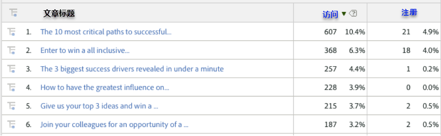
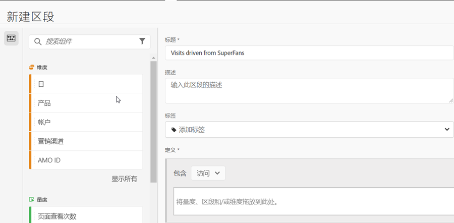
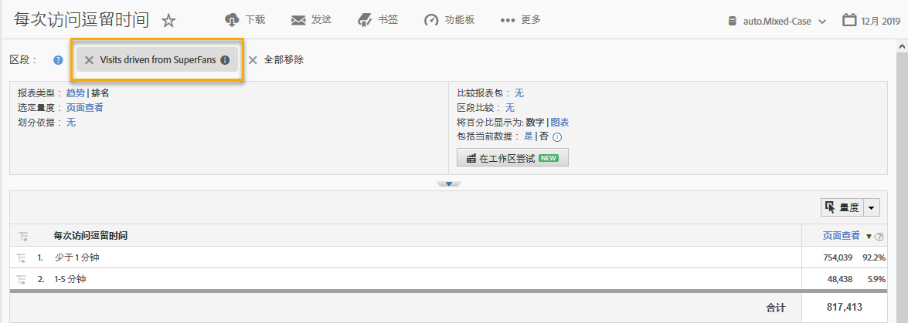

# 使用集成{#using-the-integration}

部署后，您可以开始使用此集成提供的其他功能。

**注意**:在Adobe Analytics报告中，可能需要24-48小时才能开始查看某些动态信号数据。

以下操作会从Adobe Analytics中的此集成中获得增值。

## 按动态信号维度查看流量和转换指标{#viewing-traffic-and-conversion-metrics-by-dynamic-signal-dimensions}

Adobe Analytics中的报表示例。

此集成提供了新维度，这些维度可作为Adobe Analytics报告使用。 以下报告是分析访问和按文章标题细分的转化量度（注册）的示例。

## 按动态信号维数细分{#segmenting-by-dynamic-signal-dimensions}

基于动态信号尺寸的段示例。

此集成的主要功能是能够根据集成的报告维度创建Adobe Analytics细分。 例如，您可以构建一个区段，该区段仅包含来自特定VoiceStorm社区的访问。 您可以将此称为“由超级粉丝驱动的访问”。 此区段定义可能如下所示。

## 集成的报告维度{#integrated-reporting-dimensions}

列出此集成中包含的动态信号报告维度。

| 维度 | 描述 |
|---|---|
| 渠道类型 | 用户共享社区帖子的社交网络（或博客平台）。 用户可以在多个渠道上共享帖子。 单击和其他活动会按渠道进行分段。 此字段显示Facebook、Twitter等。 这样您就可以看到驱动活动的渠道类型。 |
| 文章ID | 文章ID可唯一标识动态信号社区中的每条内容。 |
| 源类型 | 此字段指示帖子是由“会员”还是“品牌”创建的。 请注意，无论哪种情况，内容都可以在应用程序中手动创建或从外部源导入。 |
| 用户名 | 在其社交网络上共享帖子的用户，生成对您网站的点进。 |
| 源ID | 源ID可唯一标识共享帖子的创建者（或作者）。 这通常是特定成员或外部源。 |
| 用户 ID | 用户ID可唯一标识动态信号社区中的用户（即成员）。 在这种情况下，用户是在其社交网络上共享帖子的共享者。 |
| 源名称 | 源是共享帖子的创建者（或作者）。 在大多数情况下，这是社区的成员或外部源。 |
| 文章标题 | 生成单击返回站点的共享帖子的标题。 |
| 社区名称 | 您的动态信号社区的名称。 |

