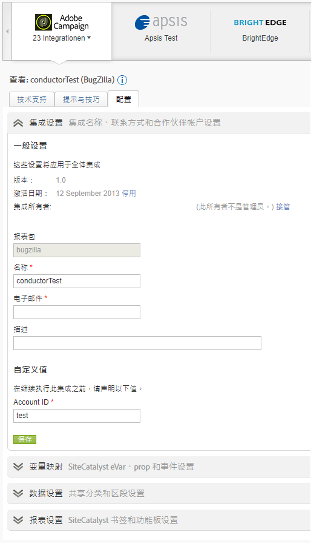

# 数据连接器概述

Adobe 为组织提供有关数字化策略和营销活动的可执行实时资讯。Data Connectors 可让您将第三方应用程序中的跟踪数据导入 Analytics，因此，您可以从一个中心位置收集和使用数据。如果您使用的是合作伙伴产品，则可以创建集成，将应用程序数据导入营销报表。一旦创建了该集成，您便可以生成包含应用程序中数据的报表。

例如，电子邮件集成可能想要使用电子邮件合作伙伴来分发电子邮件促销活动。当访客访问您的网站时，您希望了解哪些人响应了您的电子邮件促销活动从而来访。Data Connectors 会将数据从您的电子邮件合作伙伴集成到营销报表，因此您可以使用此信息衡量电子邮件促销活动的成效。

**系统要求**

Data Connectors 应与最受欢迎的浏览器适当集成。但是，在符合以下推荐配置的系统上，报表的外观和运行效果最佳：

* 浏览器：Microsoft Internet Explorer V6 和更高版本
* Cookie：必需
* JavaScript：启用
* 操作系统：基于 Windows
* Macromedia Flash Player：版本 6 或更高版本
* 显示器分辨率：1024x768（最低设置为 800x600）
* 颜色深度：16 位或更高

此外，当用户的Web浏览器启用JavaScript时，数据收集会得到改进。

**先决条件**

为您的产品配置 Data Connectors 集成之前，请执行以下操作：

* 准备好合作伙伴产品帐户必需的访问权限凭据，以便您有权访问要与营销报表集成的所有数据。您可能需要创建一个特殊的电子邮件帐户，以便用于报表发布程序和有关集成操作的通知。
* 识别用于保存您的促销活动信息的自定义变量。这些变量通常称为促销活动跟踪代码，但您的组织可能会使用一些其他的术语。
* 确定您要用于接收展示次数和点击数据的事件。您可能要相应地重命名事件。
* 将相应代码放置在您的登录页面上，这样 Analytics 就可以使用来自合作伙伴产品的数据进行相应的建模。可在“Data Connectors 展示区”的“资源”选项卡上找到每个合作伙伴产品的特定说明。

## 添加集成

您必须具有当前帐户才能访问 [!UICONTROL Data Connectors登录页] （控制台）。 还建议您熟悉Adobe Analytics。

1. 登录Adobe Experience Cloud。
1. Click **[!UICONTROL Analytics]** &gt; **[!UICONTROL Admin]** &gt; **[!UICONTROL Data Connectors]**.
1. 单击&#x200B;**[!UICONTROL 新增]**。
1. 遍历添加 **[!UICONTROL 集成界面]** 。

   根据各个产品集成，您可能需要在集成过程中提供特定的配置信息。

   集成完成后，Data Connectors Network（数据连接器网络）页面上会显示合作伙伴产品图标，该图标显示在菜单中。

## Data Connectors 控制台

激活集成后，该集成会显示在“数据连 [!UICONTROL 接器] ”页面。 您可以在控制台上查看详细信息并进行配置更改。 可以查看处于活动状态的集成和公司中所有报表包中的集成。还可以查看活动日志、将集成设置为功能板、配置集成和查找帮助。



## 数据连接器中的再营销细分

再营销区段是基于 Data Connectors 集成所用变量创建的数据文件。

Adobe Analytics通过数据仓库将这些文件分别发送到Adobe为第三方创建的FTP中。 第三方随后再将这些文件分发给客户。公司通常会使用这些文件对访问过网站并查看过产品，但没有完成购买的客户进行再营销。（例如，您可以联系特定客户，针对其查看过但最终没有购买的产品提供折扣。）

**区段**

* [!UICONTROL 放弃购买：]将产品添加到购物车但没有完成购买的访客百分比。从技术上说，这是一种计算量度，由订购数除以购物车加货次数得到。
* [!UICONTROL 购买]：根据特定产品中的消息 ID 进行购买的收件人 ID 数（或访客 ID 数）。
* [!UICONTROL 产品查看]:与“购物 [!UICONTROL 车放弃”类似]，这也是一个计算量度。 It reports [!UICONTROL Product Views] divided by Orders, because customers' viewing the product shows some interest.

**实施示例**

要成功实施再营销区段，必须满足以下条件：

* 必须已经建立 Data Connectors 合同，且贵公司已经与一名 Adobe 顾问完成了实施阶段。
* 相应事件与产品变量同时触发：
   * 购物车放弃： `scAdd` 事件
   * 购买： `purchase` 事件
   * Product Views: `prodView` event

> [!NOTE] 如果定义产品时没有关联事件，则prodView事件会自动触发。
如果不满足以上要求，那么相应的再营销区段将无法正常报告。

[!UICONTROL 放弃购买]：用户将产品添加到购物车后触发：

```
s.products=";cat";
s.events="scAdd";
```

[!UICONTROL 购买]：在购买确认页面触发：

```
s.products=";
cat;1;50";
s.events="purchase";
//Note: Though optional, adding the purchaseID variable increases accuracy by preventing duplicate purchases
```

**常见问题**

| 问题 | 描述 |
| -----------| ---------- |  
| 再营销区段文件中不显示任何产品 ID 信息。 | 当触发正确的事件，但同一图像请求上没有产品变量时发生。 要更正此问题，请确保产品变量和对应的事件在同一页面上触发，如以上实施示例所示。 |
| 未收到再营销区段文件。 | 如果没有收到您的文件，请让贵公司的某位受支持用户联系 ClientCare，以调查未成功收到报表的原因。 |


> [!IMPORTANT] 除了标准的数据连接器集成再营销段文件外，顾问通常还会将数据仓库请求设置为每日计划报告。 该数据仓库请求将包含 Data Connectors 变量和非 Data Connectors 变量，且请求只能根据贵公司的特定请求进行计划。为避免在故障诊断时造成混淆，请明确相关文件是实际的再营销区段文件，还是包含非 Genesis 变量的数据仓库请求。
