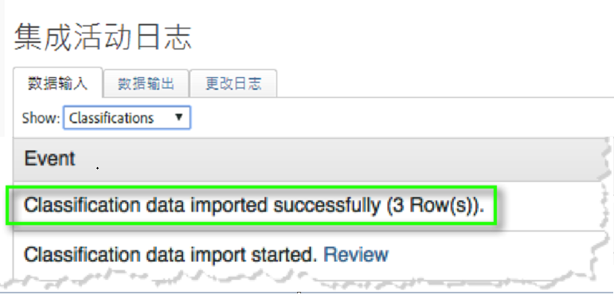
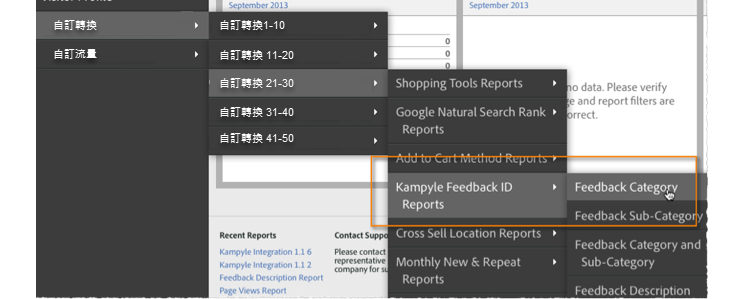

# 部署集成{#deploying-the-integration}

部署此集成过程很简单，包括完成Adobe集成向导、部署插件代码(javascript)和验证集成。

## 完成Adobe集成向导{#complete-the-adobe-integration-wizard}

要激活集成，必须在数据连接器界面中完成配置向导。

1. 登录到 Adobe Experience Cloud.
1. 导航到 **[!UICONTROL 数据连接器]** （以前称为Genesis）。
1. 启动Kampyle集成向导。
1. 选择所需的报表包并提供集成的名称。
1. 配置以下项目：

   1. **[!UICONTROL 电子邮件地址]** -主要联系人的电子邮件地址。
   1. **[!UICONTROL 说明]** -（可选）此集成设置的说明。
   1. **[!UICONTROL Kampyle Key]** —— 在Kampyle应用程序的“反馈表单” **[!UICONTROL &gt;“反馈表单自]** 定义”下找到此键 ****。
   1. **[!UICONTROL 跟踪服务器]** -用于跟踪Adobe Analytics数据的跟踪服务器（域）设置。
   1. **[!UICONTROL 跟踪服务器安全]** -如果跟踪服务器与安全/https通信不同，请在此处提供该设置。
1. 配置以下 **[!UICONTROL 变量映射]** :

   1. **[!UICONTROL Kampyle反馈ID]** —— 从报表包中选择一个可用的eVar变量
   1. **[!UICONTROL 反馈级别]** -从您的报告套件中选择可用的成功事件（键入“计数器”）。
   1. **[!UICONTROL 反馈项]** -从报告包中选择可用的成功事件（键入“计数器”）。
   1. **[!UICONTROL 评级反馈]** -从报表包中选择一个可用的成功事件（键入“计数器”）。
1. 选中该框，自动为您创建Kampyle集成控制面板（建议）。
1. 查看所有配置项，然后单击“ **[!UICONTROL 立即激活]**”。

## 部署集成配置对象{#deploy-the-integration-configuration-object}

完成集成向导后，必须将集成配置对象部署到Web属性。

在很多情况下，部署集成配置对象的最简单方法是将其包含在Adobe Analytics部署代码中。

>[!NOTE]
>
>如果您使用Adobe TagManager或动态标签管理来部署Adobe Analytics，则可以通过该工具轻松添加集成配置对象。

1. 导航到集 **[!UICONTROL 成的]** Resources &gt; **[!UICONTROL Support]** （资源&gt;支持）选项卡。
1. 下载并保存 **[!UICONTROL Kampyle集成代码(JS)资源]** 。 代码类似于：

   ```
   /* Kampyle:  Integration configuration settings */
     window.k_sc_param = { "version":1.1 }
   ```

1. 使用下列方法之一部署代码：

   | **您可以使用Adobe TagManager或动态标签管理。** | 使用标签管理界面添加代码。 |
   |---|---|
   | **在所有其他情况下** | 将代码交付到负责更新Adobe Analytics部署代码的组织资源。 |

## 验证集成{#verify-the-integration}

通过完成两项检查，验证集成是否成功传输数据。

### 集成活动日志 {#section-0472df9180db4f218db5f6040cab07af}

通过导航至“支持” **[!UICONTROL &gt;“集成活动日志”，查看Adobe Experience cloud中的Kampyle]** 集成设置 ****。 在“数 **[!UICONTROL 据输入]** ”选项卡下，您应当看到说明分类数据已成功导入的条目。

>[!NOTE]
>
>成功部署后的24小时内应显示日志条目。



### Adobe报告数据 {#section-1ae9f0a5e6bc40988478ff55aefd56ac}

通过Adobe Analytics，在相应的菜单结构中导航到Kampyle报告，即可查看Kampyle反馈报告。

>[!NOTE]
>
>在成功部署后的24-48小时内应显示报告数据，前提是集成反馈表单正在主动接收提交。



