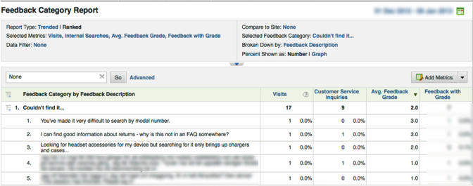
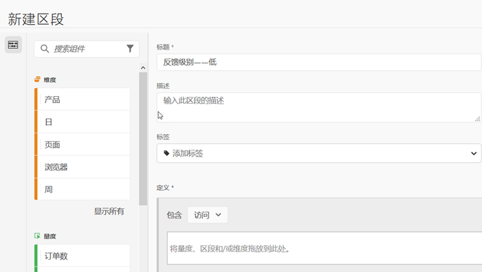

# 使用集成{#using-the-integration}

部署后，您可以开始使用此集成提供的其他功能。 以下是从Adobe Analytics中获取此集成价值所需的操作。

> [!NOTE] 在您的Adobe Analytics报告中，可能需要24-48小时才能开始查看Kampyle响应数据。

## 混合反馈和现场行为数据{#mix-feedback-and-onsite-behavior-data}

您可以按反馈维度对“报告与分析”报告进行细分。

使用Adobe Reports &amp; Analytics，您可以深入查看报告中提供的大量反馈维度。 下面的报告是一个示例，用于钻取特定的反馈类别，然后按反馈描述将其细分。 报告与分析（访问和客户服务查询）和Kampyle（平均反馈级别）的指标并排显示，以便轻松分析。

## 按反馈维度细分{#segment-by-feedback-dimension}

您可以根据反馈维度创建区段。

此集成的主要功能是能够根据Kampyle反馈维度创建Adobe Analytics细分。 例如，您可以构建一个区段，该区段将仅包含给定1级或2级的访问。 您可以将此称为“反馈级别——低”。 此区段定义如下所示：

此区段随后可应用于几乎任何报表——例如，此处显示的“每次访问所花费的时间”报表。

