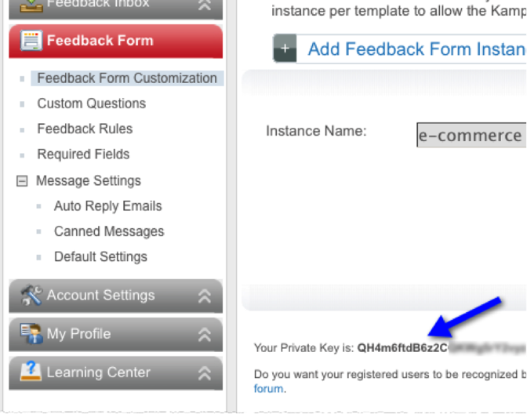

# 检索Kampyle Private Key{#retrieve-the-kampyle-private-key}

在Kampyle界面中检索密钥的步骤。

1. 登录到您的Kampyle帐户，网址为 [https://www.kampyle.com/login](https://www.kampyle.com/login)。
1. 在左侧导航中，转到 **[!UICONTROL 反馈表单]** &gt; **[!UICONTROL 反馈表单自定义]**。

   

1. 查找主内容窗格下半部分列出的私钥。

   

