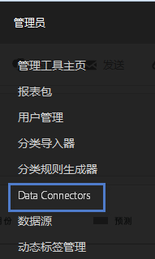
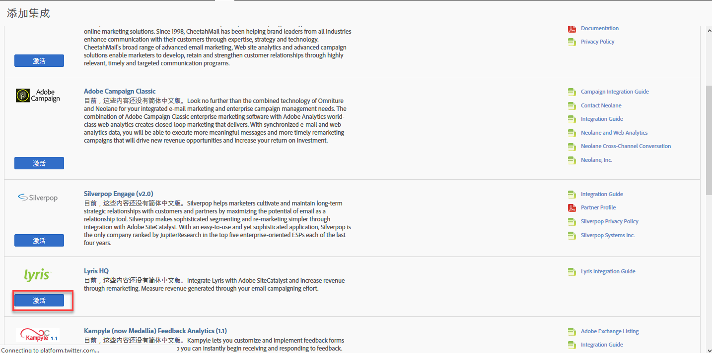
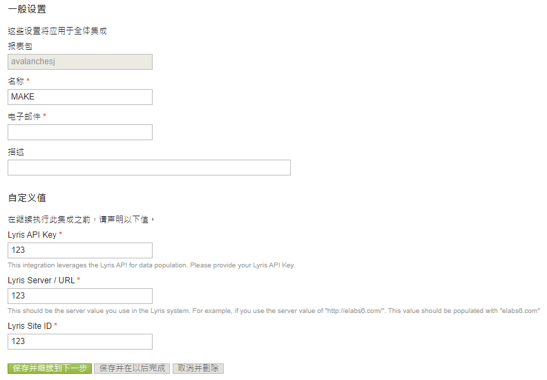
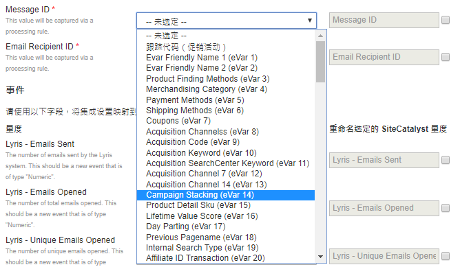
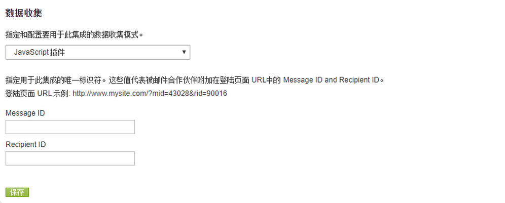
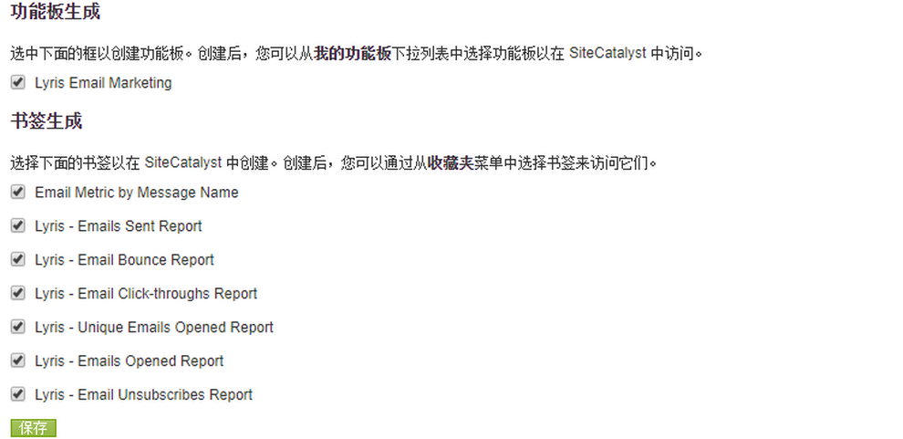
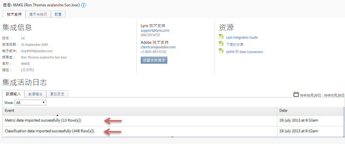

# 部署集成{#deploying-the-integration}

描述三步部署过程。

部署此集成是一个简单的过程，它需要执行以下操作：

## 完成集成向导{#completing-the-integration-wizard}

使用集成向导的步骤。

要激活集成，您必须在Data Connectors界面中完成Lyris集成向导。

1. 导航到Adobe Experience cloud中的数据连接器（以前称为Genesis）区域。

   

1. 在“ **[!UICONTROL 添加集成]**”下，将Lyris插件拖放到Adobe Experience Cloud中。 这将打开Lyris Data Connector集成。

   

1. 在“ **[!UICONTROL 常规设置]**”下，选择所需的报表包并提供集成的名称。
1. 在“自定义值”下填写所有与Lyris帐户相关 **[!UICONTROL 的信息]**。

   

1. 从下拉菜单中选择适当的保留eVar和事件。

   

1. 除了3个自动化的合作伙伴区 **[!UICONTROL 段外]** ，您还可以在“区段”下选择您自己的区段。
1. 此集成可能需要将几个数据点下载到您的Lyris帐户。 您可以在“访问请求”下选择授予此访 **[!UICONTROL 问权限]**。
1. 在“ **[!UICONTROL 数据收集]**”下，您可以选择使用自动或手动解决方案（JavaScript插件）从登录页面URL中收集查询字符串参数。 如果您选择拥有自动化解决方案，请为消息ID和收件人ID输入查询字符串参数。 有关JavaScript插件，请与Adobe顾问联系。

   

1. 您可以选择自动为您生成Lyris控制面板和书签。

   

1. 查看集成摘要，然后单击“ **[!UICONTROL 激活]**”。

## Lyris emailLabs中的配置{#configuration-within-the-lyris-emaillabs}

完成向导后，说明在Lyris中要配置什么的步骤。

1. 完成集成向导后，您必须与Lyris Professional团队合作，以完成与Lyris HQ帐户的集成并促进测试。
1. 添加URL查询字符串参数：验证在用户界面的“组织”设置区域中是否正确输入了附加的URL字符串。 这应包含系列活动级别ID(hq_m)和收件人级别ID(hq_v)。

   字符串ID的示例如下：

   ```
   hq_lid=149&hq_m=96843&hq_l=23&hq_v=7703a51905
   ```

   >[!NOTE]
   >
   >如果要应用Lyris的本机分析工具，请 *单击跟踪* ，以标记所有添加的所需变量。

## 验证集成{#verifying-the-integration}

验证Lyris/Adobe Analytics集成是否成功的步骤。

完成所有部署步骤后，您可以验证集成是否成功传输数据。

> [!NOTE] 数据交换需要几天时间才能开始。 请确保在激活集成后与Lyris联系。

1. 导航到Data Connectors中的Lyris集成。 在“支持 **** ”选项卡&gt;“集成 **[!UICONTROL 活动日志”下，您应当看到成功导入的]** Metric数据和 **[!UICONTROL /或成功导入的]****** Classification数据等事件：

   

1. 现在，使用相应的指标查看您的Lyris消息报告。 在Adobe Experience cloud中，选择“报 **[!UICONTROL 告与分析”]**。
1. 选择适当的报表包。
1. 在“自 **[!UICONTROL 定义转换]**”下，选择“ **[!UICONTROL 消息ID报告]** ”，然后选择“ **[!UICONTROL 消息ID/消息名称”]**。

## 查询字符串参数插件代码{#query-string-param-plug-in-code}

显示要与Adobe Analytics一起使用的Lyris插件代码。

> [!NOTE] 在使用以下代码之前，请确保在Adobe Analytics的Admin Tool中保留了必要的eVar。 一旦您知道已保留哪些eVar，请用相关eVar替换eVarN。 例如eVar10。

```
/* 
  * Plugin: getQueryParam 2.3 
  */ 
s.getQueryParam=new Function("p","d","u","" 
+"var s=this,v='',i,t;d=d?d:'';u=u?u:(s.pageURL?s.pageURL:s.wd.locati" 
+"on);if(u=='f')u=s.gtfs().location;while(p){i=p.indexOf(',');i=i<0?p" 
+".length:i;t=s.p_gpv(p.substring(0,i),u+'');if(t){t=t.indexOf('#')>-" 
+"1?t.substring(0,t.indexOf('#')):t;}if(t)v+=v?d+t:t;p=p.substring(i=" 
+"=p.length?i:i+1)}return v"); 
s.p_gpv=new Function("k","u","" 
+"var s=this,v='',i=u.indexOf('?'),q;if(k&&i>-1){q=u.substring(i+1);v" 
+"=s.pt(q,'&','p_gvf',k)}return v"); 
s.p_gvf=new Function("t","k","" 
+"if(t){var s=this,i=t.indexOf('='),p=i<0?t:t.substring(0,i),v=i<0?'T" 
+"rue':t.substring(i+1);if(p.toLowerCase()==k.toLowerCase())return s." 
+"epa(v)}return ''"); 
 
/*in the s_doPlugins function - Replace N with actual eVar number*/ 
s.eVarN=s.getQueryParam("<insert Lyris QS Param>");  
//places query param value from Message ID in eVarN variable s.eVarN=s.getQueryParam("<insert Lyris QS Param>");  
//places query param value from Recepient ID in eVarN variable 
```
