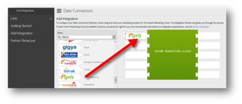

# 完成集成向导{#completing-the-integration-wizard}

使用集成向导的步骤。

要激活集成，您必须完成数据连接器界面中的Lyris集成向导。

1. 导航到Adobe Marketing Cloud中的数据连接器(以前称为Genesis)区域。

   

1. 在 **[!UICONTROL Add Integration]**&#x200B;中，将Lyris插件拖放到Adobe Marketing Cloud中。这打开了Lyris Data Connector集成。

   

1. 在 **[!UICONTROL “常规设置]**”下，选择所需的报表包并提供集成的名称。
1. 在 **[!UICONTROL “自定义值]**”下填写所有与Lyris帐户相关的信息。

   

1. 从下拉菜单中选择适当的保留eVar和事件。

   

1. 您可以在您的区段下 **[!UICONTROL 选择自己的区段]** -不同于自动合作伙伴细分。
1. 此集成可能需要将几个数据点下载到您的Lyris帐户。您可以选择在访问请求下 **[!UICONTROL 对此进行访问]**。
1. 在 **[!UICONTROL “数据收集]**”下，您可以选择拥有自动或手动解决方案(JavaScript插件)，从登陆页面URL收集查询字符串参数。如果选择具有自动解决方案，请输入消息ID和收件人ID的查询字符串参数。有关JavaScript插件，请与您的Adobe顾问联系。

   

1. 您可以选择为您自动生成Lyris Dashboard和书签。

   

1. 查看集成摘要，然后单击 **[!UICONTROL 激活]**。
