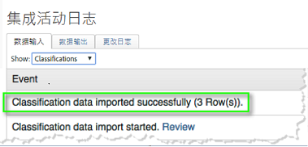
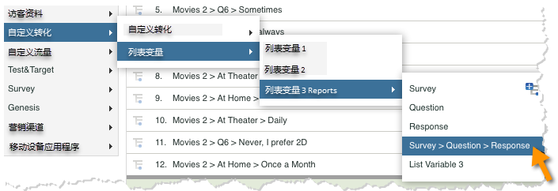
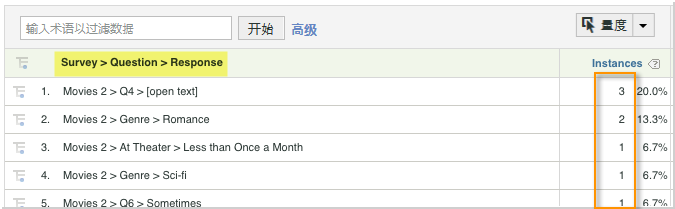

# 部署集成{#deploying-the-integration}

部署此集成是一个简单的过程，需要执行以下操作。

## 完成Adobe集成向导{#completing-the-adobe-integration-wizard}

要激活集成，您必须在Data Connectors界面中完成Qualtrics集成向导

1. 导航到数据连接器并启动Qualtrics集成向导。
1. 选择要用于此集成的报表包并提供名称。

   完成集成向导，提供以下步骤中描述的信息。 1.向 **导步骤1**

   | Email Address | 主要联系人电子邮件地址。 |
   |---|---|
   | 描述 | （可选）此集成设置的说明。 |
   | Qualtrics组织ID | [查找Qualtrics组织ID](../qualtrics-overview/qualtrics-org-id.md) |
   | Adobe SiteCatalyst令牌 | [生成Qualtrics Adobe Analytics令牌](../qualtrics-overview/qualtrics-token.md) |

1. **向导步骤2 —— 变量映射**

   | Qualtrics响应列表 | 从报表包中选择一个可用列表变量。 （您可能需要在报表包管理器中启用新的listVar。） |
   |---|---|
   | Qualtrics响应ID | 从报表包中选择可用的eVar或prop。 （您可能需要在报表包管理器中启用新的listVar。） |
   | 跟踪服务器 | 提供用于跟踪Adobe Analytics数据的跟踪服务器（域）设置。 如果跟 `trackingServerSecure` 踪服务器与标准跟踪服务器设置不同，请使用它。 |
   | Qualtrics Survey提交 | 从报告包中选择可用活动（您可能需要从报告包管理器中启用新活动）。 |

1. **向导步骤3**:无需任何信息。

   步骤结果1. **向导步骤4 —— 导出设置**

   | eVar | 选择最多五个eVar以供导出到Qualtrics |
   |---|---|
   | 事件 | 选择最多五个要显示的自定义事件以导出到Qualtrics |
   | Prop | 选择最多五个要公开的Prop以导出到Qualtrics |
   |  访问请求 | 选中要导出到Qualtrics的任何标准度量和维度的复选框。 需 `visitor_id` 要允许导出正常工作。 |

1. **向导步骤5**:查看配置，然后单击“ **[!UICONTROL 立即激活”]**。

## 在Qualtrics Research suite中启用集成{#enabling-the-integration-in-qualtrics-research-suite}

完成集成向导后，您必须为要连接的每个Qualtrics调查激活集成。

1. 登录到Qualtrics Research Suite。
1. 在“我 **[!UICONTROL 的调查]** ”选项卡上，单击要集 **[!UICONTROL 成的调查的“编辑]** ”按钮。
1. 单击“高 **[!UICONTROL 级选项]** ”菜单，然 **[!UICONTROL 后选择Adobe Analytics]**。 （如果看不到此选项，请向您的管理员询问获取所需权限的事宜）。

   

1. 选择Adobe Analytics配置，然后单击保 **[!UICONTROL 存]**。 如果没有可用的配置，则您可能尚未完成Adobe集成向导。
   1. 可 **[!UICONTROL 以使用“包括部分响应]** ”复选框指示您希望在每个部分调查屏幕完成后将数据捕获到Adobe Analytics。 如果未选中此项，则只为完全完成的调查传输数据。
   1. 仅 **** 当与配置为接收带时间戳的数据（非常见）的报表包集成时，才应使用“发送带有信标的时间戳”复选框。
   

## 验证集成{#verifying-the-integration}

完成所有部署步骤后，您可以验证集成是否成功传输数据。

1. **集成活动日志**:在数据连接器UI中，查看Qualtrics集 **[!UICONTROL 成的]** “支持”选项卡。 在标题集 **[!UICONTROL 成活动日志下]** ，您应当看到说明成功导入分类数据的条目。

   >[!NOTE]
   >
   >这些条目应在成功部署后的1小时内显示。

   

1. **报告数据**:通过导航Qualtrics调查报告（在列表变量下），使用市场营销报告和分析UI查看 **[!UICONTROL Qualtrics调查报告]**。

   >[!NOTE]
   >
   >如果综合调查正在积极接收响应，则这些数据应在成功部署后的24-48小时内显示。

    

