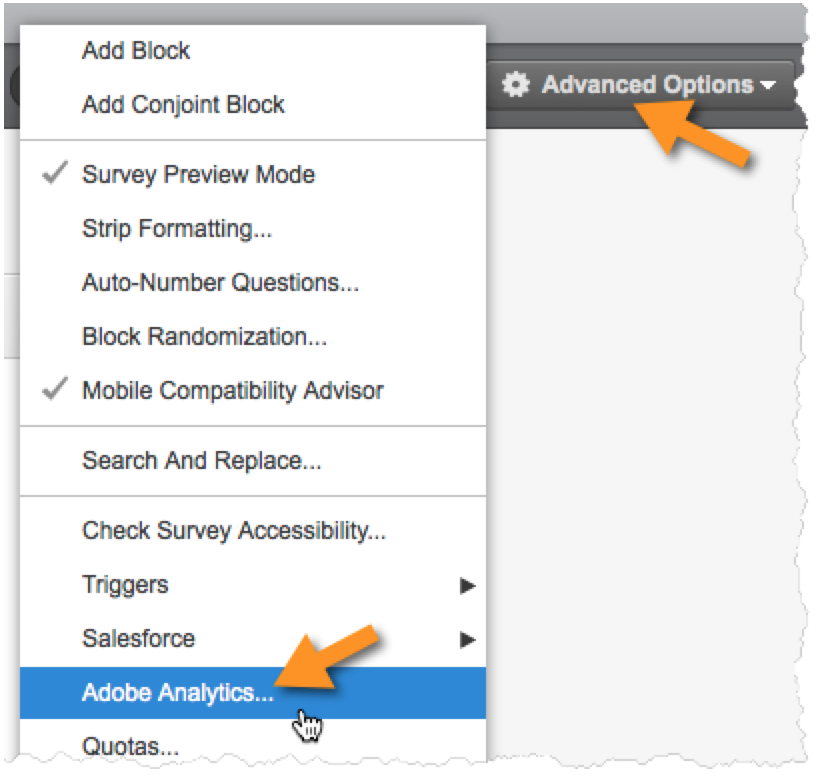

# 启用Qualtrics Research Suite中的集成{#enabling-the-integration-in-qualtrics-research-suite}

完成集成向导后，您必须激活要连接的每个Qualtrics调查的集成。

1. 登录Qualtrics Research Suite。
1. 在 **[!UICONTROL “我的调查”]** 选项卡上，单击要集成的调查的 **[!UICONTROL “编辑]** ”按钮。
1. 单击 **[!UICONTROL “高级选项]** ”菜单，然后选择 **[!UICONTROL “Adobe Analytics]**”。(如果您看不到此选项，请询问管理员获取所需权限)。

   

1. 选择Adobe Analytics配置，然后单击 **[!UICONTROL 保存]**。如果没有可用的配置，您可能还没有完成Adobe集成向导。
   1. **[!UICONTROL “包含部分答复”]** 复选框可用于表示您希望在每个部分调查屏幕完成后将数据捕获到Adobe Analytics。如果未选中，则仅对完全完成的调查传输数据。
   1. 仅当与配置为接收时间戳数据(不常见)的报告套件集成时，才应使用“ **[!UICONTROL 发送时间戳带有信标”]** 复选框。
   

