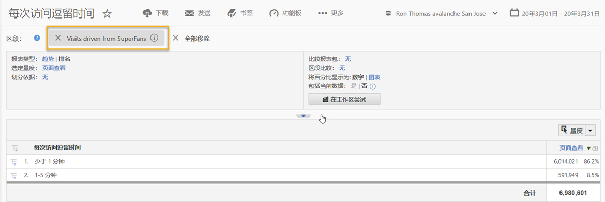
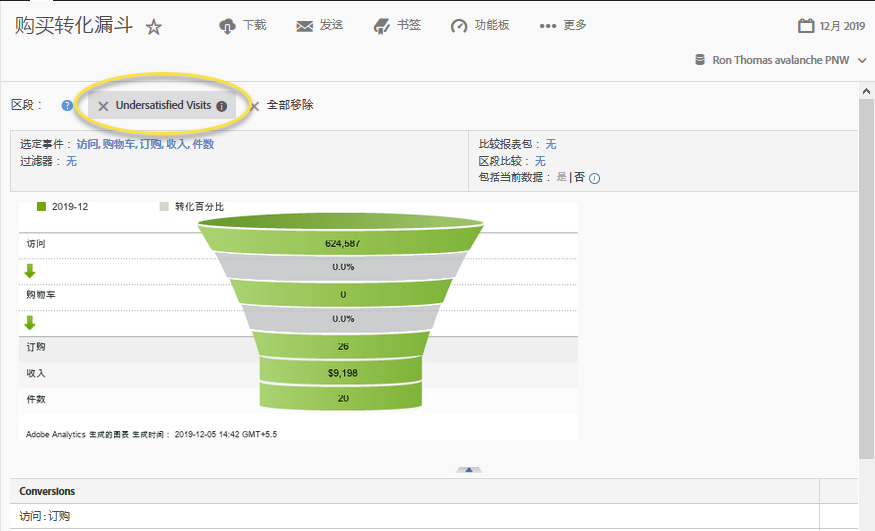

# 使用集成{#using-the-integration}

部署完成后，您可以开始使用此集成提供的其他功能。

>[!NOTE]
>
>在您的Adobe Analytics报告中，开始查看Qualtrics响应数据可能需要24-48小时。

以下是从Adobe Analytics中获取此集成的值所采取的操作。

1. 使用调查响应数据创建区段(请参阅 [创建区段](http://microsite.omniture.com/t2/help/en_US/sc/user/index.html?f=t_segment.html))。
1. 将区段应用于关键报表。

## 示例 {#section-07051d0d60a44408a4e108034586c42f}

以下显示了分析人员如何使用调查响应数据定义Adobe Analytics细分。此案例假设一个调查问题，如“您今天对访问有多满意？”使用此问题，我们可以创建一个区段来识别“不满意”访客。此类区段可用于进入任何Adobe Analytics报告(如购买转换漏斗)，如下所示。

 

