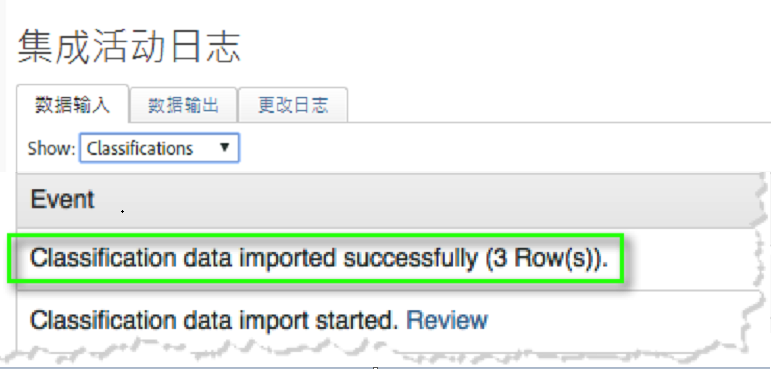
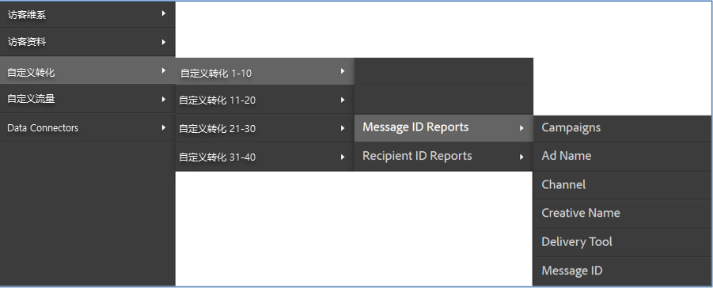

# 验证集成{#verifying-the-integration}

部署完成后，您应验证集成成功地通过以下检查传输数据。

1. 查看集成活动日志。
   1. 在Adobe Marketing Cloud中，导航到 **[!UICONTROL 支持]** &gt; **[!UICONTROL 集成活动日志]**。

      

   1. 查找成功导入 **[!UICONTROL 的分类数据]**、成功导入 **[!UICONTROL 的指标数据]**&#x200B;以及成功导出 **[!UICONTROL 指标数据等条目]**。这些条目应在成功部署的天内显示。
1. 在Adobe Analytics中查看您的报表数据。
   1. 导航到 **[!UICONTROL “自定义转换]** ”&gt;“ **[!UICONTROL 自定义转换1-10]** ”&gt; **[!UICONTROL “消息ID报告]**”。

      

   1. 查找Responsys报告。此数据应在成功部署的24-48小时内显示。
