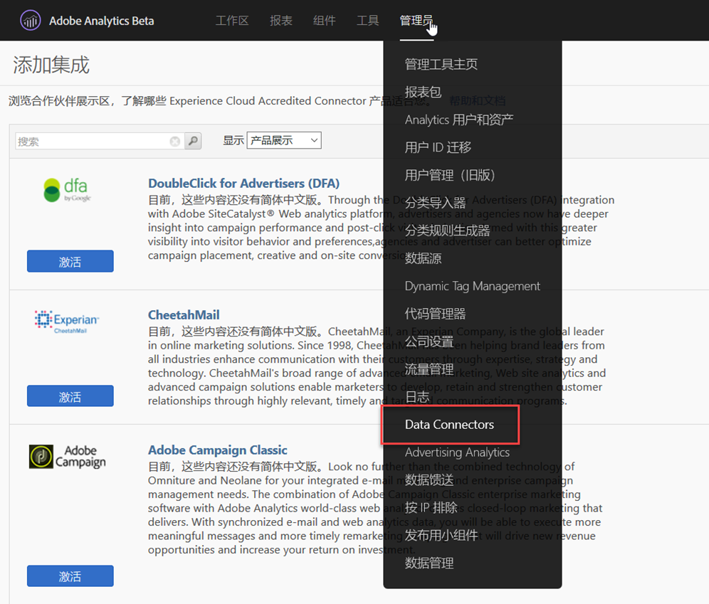
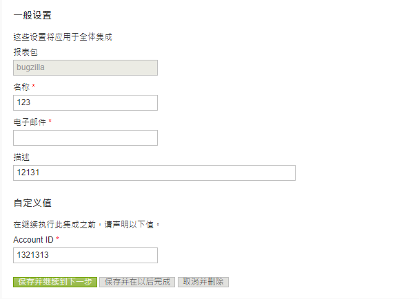
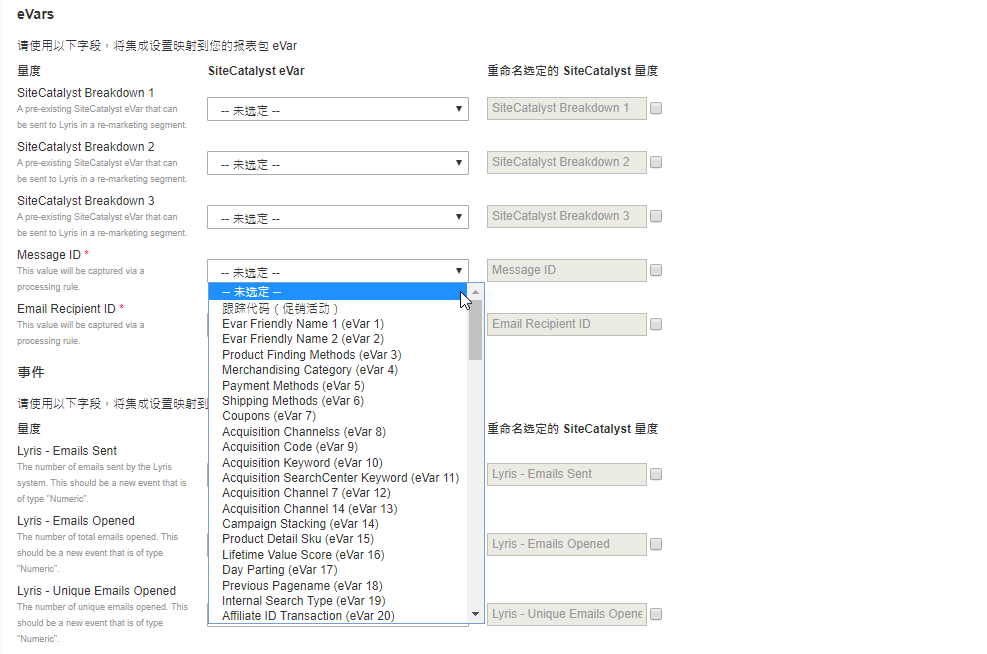

# 部署集成{#deploying-the-integration}

部署此集成是一个简单的3步过程。

## 完成集成向导{#completing-the-integration-wizard}

要激活集成，您必须在数据连接器界面中完成智能集成向导。

1. 导航到Adobe Experience cloud中的“数据连接器”区域。

   

1. 在“ **[!UICONTROL 添加集成]**”下，将Selligent插件拖放到Adobe Experience Cloud中。

   

   这将打开Selligent Data Connector集成。

1. **集成设置**:选择所需的报表包，并在“集成设置”下提供集成 **[!UICONTROL 的名称]**。

1. 在“ **[!UICONTROL 自定义值]**”下，填写所有与Selligent帐户相关的信息。

   

1. **变量映射**:从下拉菜单中选择相应的保留eVar和事件：

   

1. **数据设置**:除了3个自动合作伙伴区段 **[!UICONTROL 外，您还可以在]** “区段”下选择 **[!UICONTROL 您自己的区段]** 。

1. 此集成可能需要将几个数据点下载到您的Selligent帐户。 您可以在“访问请求”下选择授予相同 **[!UICONTROL 权限]**。
1. 在“ **[!UICONTROL 数据收集]**”下，选择自动或手动解决方案（JavaScript插件），以从登录页面URL中收集查询字符串参数。 如果选择自动解决方案，请为消息ID和收件人ID输入查询字符串参数（分别为MID和RID）。 有关JavaScript插件，请与Adobe顾问联系。
1. **报告设置**:在“功 **[!UICONTROL 能板生成]**”(Dashboard Generation)下，选中该框可自动为您生成“智能”功能板。

   

1. 查看集成摘要，然后单击“ **[!UICONTROL 激活]**”。

## Selligent中的配置{#configuration-within-selligent}

在Adobe Analytics中启用集成后，智能端便会启用自动配置。

已创建跟踪器，它将跟踪每封电子邮件。 如果您希望将其限制到特定域，请更新跟踪器配置。

我们强烈建议您将URL中Adobe Analytics的跟踪参数移到最前面。 这将确保Adobe处理规则从登录页面URL中选取参数。 通过选中下面所示的复选框启用跟踪。

## 验证集成{#verifying-the-integration}

完成所有部署步骤后，您可以验证集成是否成功传输数据。

数据交换需要几天时间才能开始。 在激活集成后，请确保与Selligent联系。

### 集成活动日志 {#section-927e270495db479fba9578915d9ae9c9}

导航到Data Connectors中的Selligent集成。 在支持 **[!UICONTROL 选项卡下]** ，您应当看到成功导入的度量数据和／或分类数据等事件：

### 报告数据 {#section-ebd481a162324e66bd6dc8cb4b8d2424}

查看包含相应量度的“智能消息”报告。

1. 转到Adobe Experience cloud下的“报告与分析”。
1. 选择适当的报表包。
1. 在“自 **[!UICONTROL 定义转换]**”下，选择“ **[!UICONTROL 消息ID报告]** ”，然后选择“ **[!UICONTROL 消息ID/消息名称”]**。
