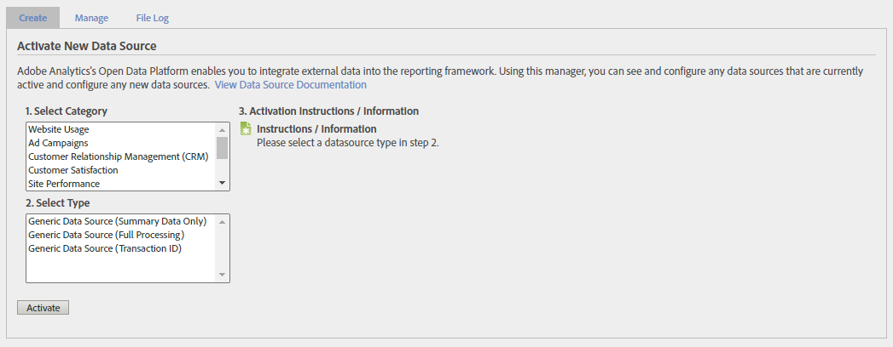

# 管理数据源

使用数据源管理器创建、编辑或停用数据源。 您还可以使用此界面跟踪上传到数据源FTP位置的文件的状态。

**[!UICONTROL 管理员]** > **[!UICONTROL 所有管理员]** > **[!UICONTROL 数据源]**

使用右上方的报表包选择器，在组织中的报表包之间进行切换。

此界面有三个主要选项卡； **[!UICONTROL 管理]**, **[!UICONTROL 创建]**&#x200B;和 **[!UICONTROL 文件日志]**.

## 管理

的 **[!UICONTROL 管理]** 选项卡可处理贵组织创建的所有数据源。 您可以查看FTP信息、编辑模板文件中使用的变量，或完全停用数据源。

最顶层的数据源始终 [!UICONTROL 网站信标]. 此数据源是您通过AppMeasurement进行典型数据收集时使用的数据源。 无法编辑或停用。

每个数据源都具有以下选项：

* **[!UICONTROL 重新启动处理]**:重新启动之前因错误而停止的数据源处理。 处理将继续进行，直到发生下一个错误为止。只有在您选择 **[!UICONTROL 出错时停止处理]**.
* **[!UICONTROL 完成处理]**:不再使用 — 此按钮仅用于 [完全处理数据源](full-processing-eol.md).
* **[!UICONTROL 出错时停止处理]**:一个复选框，指示处理服务器在遇到错误时停止。 在您选择 **[!UICONTROL 重新启动处理]**. 当数据源遇到文件错误时，它会通知您该错误。 Adobe将出错的文件移入名为 `files_with_errors` 在FTP服务器上。 在问题解决之后，请重新提交 文件进行处理。
* **[!UICONTROL 配置]**:可引导您完成此数据源的数据源创建向导的链接。 此向导允许您重命名数据源，或重新配置下载模板文件时自动包含的变量。
* **[!UICONTROL FTP信息]**:此链接可引导您进入数据源创建向导的最后一个步骤，其中显示了FTP凭据。

在数据源收到数据后，将显示一个表，其中包含上载文件的多列。

* **[!UICONTROL 处理队列中的文件]**:文件的名称。
* **[!UICONTROL 行]**:文件中的总行数。
* **[!UICONTROL 错误]**:包含错误且无法摄取的行数。
* **[!UICONTROL 警告]**:包含警告的行数。
* **[!UICONTROL 已接收]**:在报表包的时区中收到文件的时间戳。
* **[!UICONTROL 状态]**:文件的状态(`Success` 或 `Failed`)。

## 创建

的 **[!UICONTROL 创建]** 选项卡为您提供了数据源创建向导的起点。

数据源的类别和类型在以前版本的Adobe Analytics中更有价值。 但是，它们的用途仍有限：

* 数据源类型显示在 [管理](#manage) 选项卡，以及 [文件日志](#file-log) 选项卡。
* 下载模板文件时，某些数据源类型会自动包含变量。 但是，只要维度或量度符合已建立的维度或量度，您就可以包含任何可用的维度或量度 [文件格式](file-format.md).

除了这些原因外，您可以选择的所有数据源类别和类型实际上都是相同的。 选择最能代表您使用数据源目的的类别和类型。

随着 [完全处理数据源](full-processing-eol.md)，无法选择多个类别和类型。 如果您选择完全处理数据源类型，则 **[!UICONTROL 激活]** 按钮灰显。

## 文件日志

的 **[!UICONTROL 文件日志]** 选项卡会为您提供为给定报表包上传的所有数据源文件的汇总视图。

提供了搜索栏，可帮助您查找特定数据源。 下表显示了以下列：

* **[!UICONTROL 数据源名称]**:数据源的名称。
* **[!UICONTROL 类型]**:数据源的类型。
* **[!UICONTROL 文件名]**:上传的文件的名称。
* **[!UICONTROL 行]**:文件中的总行数。
* **[!UICONTROL 错误]**:包含错误的行数。
* **[!UICONTROL 警告]**:不再使用。 包含警告的行数。
* **[!UICONTROL 已接收]**:Adobe开始处理文件的日期和时间。
* **[!UICONTROL 状态]**:文件的状态(`Success` 或 `Failed`)。
