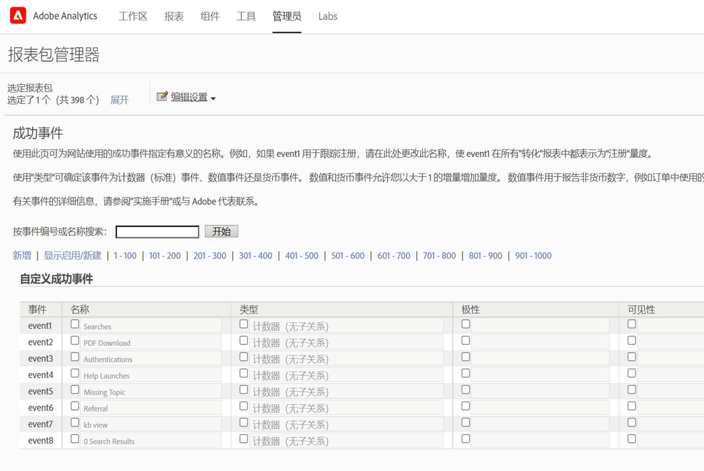
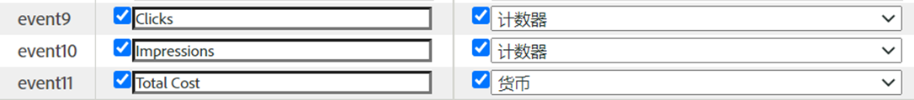
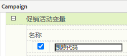
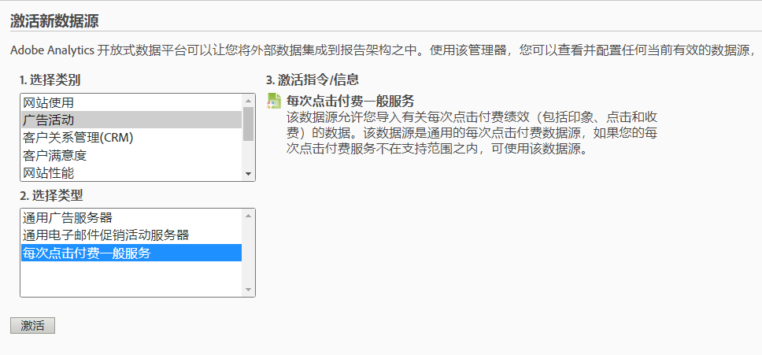
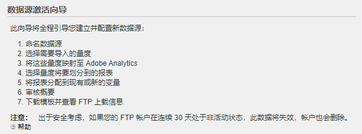
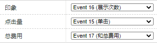
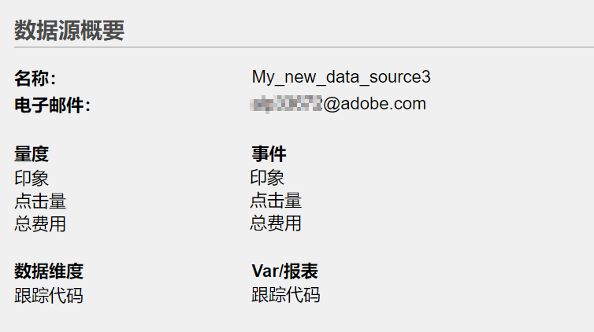
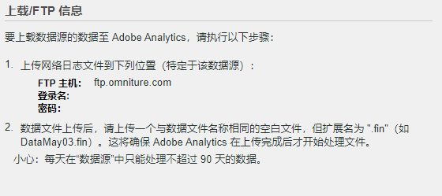

# 使用[!UICONTROL 数据源]导入[!UICONTROL 付费搜索]指标

对许多营销机构而言，付费搜索是接触新客户和维系现有客户的最有用和最可靠的方法之一。通过Adobe Analytics中的[!UICONTROL 数据源]功能，可轻松地从Google Ads等数字广告平台导入高级付费搜索数据。 可将这些数据与您其余的营销数据以及现场行为数据和客户属性数据整合在一起，以使您可更好地了解您组织的付费搜索成果。

这些步骤向您展示如何配置与广告的集成，以导入关键词数据以及展示次数、点击次数、每次点击成本等指标。

这些步骤说明了如何设置每次点击付费数据的一次性导入。 但是，通过[!UICONTROL 数据源]，可使用此处所述的文件格式持续导入数据。根据您的付费搜索平台，您有可能可以安排定期导出（每天、每月等）、设置将这些导出转换为 Adobe Analytics 所需的文件格式的自动化过程以及将这些文件上传到 Adobe Analytics 中以生成付费搜索集成报表。

## 先决条件

* 您已实施付费搜索检测。
* 您正在捕获跟踪代码数据。
* 您对每个广告组都有独特的跟踪代码。

## 配置[!UICONTROL 成功事件]

我们的第一步是准备 Adobe Analytics 以接收指标。为此，您需要设置一些成功事件。

[!UICONTROL 成功事件]是可跟踪的操作。由您决定[!UICONTROL 成功事件]是什么。对于我们跟踪[!UICONTROL 付费搜索]指标的用途，我们要围绕[!UICONTROL 点击次数]、[!UICONTROL 展示次数]、[!UICONTROL 总成本]设置[!UICONTROL 成功事件]并启用[!UICONTROL 跟踪代码]。

1. 转到 **[!UICONTROL Adobe Analytics > 管理 > 报表包]**。
1. 选择某个报表包。
1. 单击 **[!UICONTROL 编辑设置 > 转化 > 成功事件]**。

   

1. 在“自定义成功事件”下，使用&#x200B;**[!UICONTROL 新增]**&#x200B;创建 3 个自定义成功事件：[!UICONTROL “点击次数”]（计数器）、[!UICONTROL “展示次数”]（计数器）和[!UICONTROL “总成本”]（货币）。

   

1. 单击“保存”。
您应收到一条消息，表示您的保存获批。
1. 导航到&#x200B;**[!UICONTROL 管理 > 报表包 > 编辑设置 > 转化 > 转化变量]**。
1. 通过在&#x200B;**[!UICONTROL 营销活动 > 营销活动变量]**&#x200B;下选中&#x200B;**[!UICONTROL 跟踪代码]**&#x200B;旁的复选框，启用跟踪代码。

   

## 设置数据源

通过[!UICONTROL 数据源]，可与 Adobe Analytics 共享非点击流数据。在本例中，我们使用 Adobe Analytics 跟踪付费搜索指标。我们使用跟踪代码作为我们将付费搜索指标和 Adobe Analytics 指标这两项数据联系在一起的关键。

1. 导航到 **[!UICONTROL Adobe Analytics > 管理员 > 所有管理员 > 数据源]**。
1. 选择&#x200B;**[!UICONTROL 创建]**&#x200B;选项卡以开始激活新的数据源。
1. 在&#x200B;**[!UICONTROL 选择类别]**&#x200B;下方，选择&#x200B;**[!UICONTROL 广告营销活动]**。

   

1. 在&#x200B;**[!UICONTROL 选择类型]**&#x200B;下，选择&#x200B;**[!UICONTROL 通用每次点击付费服务]**。
1. 单击&#x200B;**[!UICONTROL 激活]**。
随后将显示[!UICONTROL 数据源激活向导]：

   

1. 单击&#x200B;**[!UICONTROL 下一步]**，并为您的数据源命名。此名称显示在数据源管理器中。
1. 接受服务协议，然后单击&#x200B;**[!UICONTROL 下一步]**。
1. 选择三个标志指标：[!UICONTROL 展示次数]、[!UICONTROL 点击数]和[!UICONTROL 总成本]，然后单击&#x200B;**[!UICONTROL 下一步]**。
1. 现在，将这个新的数据源“映射”到我们在[成功事件](/help/admin/admin/c-manage-report-suites/c-edit-report-suites/conversion-var-admin/c-success-events/success-event.md)中创建的自定义事件。

   

1. 选择数据维度
单击“跟踪代码”旁的框，然后单击**[!UICONTROL 下一步]**。
1. 映射数据维度。
将导入的数据维度（属性）映射到要将它存入的 Adobe Analytics 属性。这可以是标准维度或 eVar。单击**[!UICONTROL 下一步]**&#x200B;之后，将在摘要中显示所得的映射：

   

1. 单击&#x200B;**[!UICONTROL 保存]**。
1. 单击&#x200B;**[!UICONTROL 下载]**以下载此数据源的模板文件。
文件名对应于您最初指定的数据源类型 — 在本例中为“Generic Pay-Per-Click Service template.txt”。
1. 在您喜爱的文本编辑器中打开该模板。
已为该文件填入了指标和维度及其映射。

## 导出 PPC 数据并将它上传到 Analytics

类似这些的步骤适用于Google Ads、Microsoft Advertising和其他PPC帐户。

### 导出数据

1. 登录到您的 PPC 帐户，然后创建新报表或导出。
确保该导出包括以下字段：日期、目标 URL（登陆页）、展示次数、点击次数和成本。该导出可能包括其他字段，但您将在下方的步骤中删除它们。
1. 如有可能，请将该报表另存为 `.csv` 或制表符分隔的文件。这样将使其在以下步骤中更易用。
1. 在 Microsoft Excel 中打开该文件。

### 在 Microsoft Excel 中编辑该文件

1. 在 Microsoft Excel 中，删除上面提到的列之外的所有列。
1. 删除位于顶部的任何多余的行。
1. 要从目标 URL 中分离出跟踪代码，请执行以下操作：
a. 从所有列复制并粘贴数据。
b. 单击**[!UICONTROL 数据 > 分列]**。
c. 在向导的第 1 步中，确保选中了**[!UICONTROL 分隔符号]**，然后单击&#x200B;**[!UICONTROL 下一步]**。
d.在向导的第2步中，根据创建URL的方式指定分隔符(？ 或&amp;)，然后单击**[!UICONTROL 下一步]**。
e. 在向导的第 3 步中，预览您的数据，并确保其中一列为“trackingcodename=trackingcode”。如果有其他变量，请（使用 &amp; 作为分隔符）重复这些步骤。
f. 删除跟踪代码、展示次数、点击次数和成本之外的所有列。添加一个名为 Date 的新列，并按以下顺序整理您的各个列：Date :: Tracking code :: Impressions :: Clicks :: Cost。
1. 将这些数据添加到您在上方的“设置数据源”部分中下载的模板。
现在您已准备好上传该文件。

### 通过 FTP 将该文件上传到 Adobe Analytics

返回数据源向导以获取说明，然后通过 FTP 上传该文件：

## 创建计算指标

添加计算指标将在作出每次点击付费决策时有所帮助。

例如，可添加这些[计算指标](https://experienceleague.adobe.com/docs/analytics/components/calculated-metrics/calcmetric-workflow/cm-build-metrics.html#calculated-metrics?lang=zh-Hans)：

| 名称 | 公式 | 指标类型 | 描述 |
| --- | --- | --- | --- |
| 每次访问页面查看次数 | 页面查看/访问 | 数值 | 应用于网站级别时：显示每次访问的平均页面数量。应用于“最受欢迎页面”报表时：显示每次访问时特定页面的平均查看次数。 |
| 平均订购值 | 收入/订购 | 货币 | 显示每次订购的平均收入。 |
| 每次访问的收入 | 收入/访问次数 | 货币 | 显示每次访问的平均收入。 |
| 点进率 (CTR) | 点击次数/展示次数 | 数值 | 衡量在线广告或电子邮件市场营销活动的点击次数与展示次数之比。 |
| 利润 | 收入 — 成本 | 货币 | 显示营销活动的收入减去成本。 |
| 每次展示的利润 (PPI) | (收入 — 成本)/展示次数 | 货币 | 显示每次展示广告产生了多少收入，并扣除成本。 |
| 广告支出回报率 (ROAS) | 销售额/广告支出 | 货币 | (ROI) 表示在相应的广告上每花费一元可赚到几元。 |

## 配置并运行报表

最后一步是将数据源指标和任何计算指标添加到跟踪代码报表，并深入研究某个营销活动以直观地了解每个广告组的表现如何。

1. 在 **[!UICONTROL Adobe Analytics > 报表]**&#x200B;中，选择已将数据源导入到其中的报表包。
1. 导航到&#x200B;**[!UICONTROL 报表 > 营销活动 > 跟踪代码 > 跟踪代码]**。
1. 选择日期范围。
1. 单击&#x200B;**[!UICONTROL 指标 > 添加]**，然后从标准指标的列表中添加您的数据源指标（点击次数、展示次数、总成本）。
1. 对任何可能已添加计算指标执行相同操作。随着您添加指标，报表将更新。
