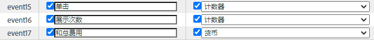

# 使用[!UICONTROL 数据源]导入[!UICONTROL 付费搜索]量度

对于许多营销组织而言，付费搜索是触及新客户和留住现&#x200B;有客户的最有价值、最可靠的方式之一。 Adobe Analytics中的[!UICONTROL 数据源]功能使从Google AdWords等数字广告平台导入高级付费搜索数据变得很容易。 您可以将其与其他营销数据以及现场行为和客户属性数据相集成，以便更好地了解组织的付费搜索工作。

这些步骤向您展示如何配置与AdWords的集成，以导入关键词数据以及展示次数、点击次数、每次点击成本等量度。

这些步骤说明了如何设置一次性导入的按点付费数据。 但是，[!UICONTROL 数据源]允许使用此处描述的文件格式持续导入数据。 根据您的付费搜索平台，您可以计划定期导出（每日、每月等），设置自动化流程，将这些导出转换为Adobe Analytics需要的文件格式，并将这些文件上传到Adobe Analytics以进行付费搜索集成报告。

## 先决条件

* 您已实施付费搜索检测。
* 您正在捕获跟踪代码数据。
* 您拥有每个广告组的唯一跟踪代码。

## 配置[!UICONTROL 成功事件]

我们的第一步是准备Adobe Analytics接收量度。 为此，您需要设置一些成功事件。

[!UICONTROL 成功事件是指可跟踪的活动。]确定[!UICONTROL 成功事件]是什么。 为了跟踪[!UICONTROL 付费搜索]量度，我们要设置[!UICONTROL 成功事件]，以[!UICONTROL 点击]、[!UICONTROL 展示次数]、[!UICONTROL 总成本]和启用[!UICONTROL 跟踪代码]。

1. 转至&#x200B;**[!UICONTROL Adobe Analytics >管理员>报表包]**。
1. 选择报表包。
1. 单击&#x200B;**[!UICONTROL 编辑设置 > 转化 > 成功事件]**.

   

1. 在“自定义成功事件”下，使用&#x200B;**[!UICONTROL Add New]**&#x200B;创建3个自定义成功事件:[!UICONTROL 单击]（计数器）、[!UICONTROL 展示次数]（计数器）和[!UICONTROL 总费用]（货币）。

   

1. 单击“保存”。您应会收到一条消息，表明您的保存版本已获得批准。
1. 导航到&#x200B;**[!UICONTROL 管理>报表包>编辑设置>转换>转换变量]**。
1. 选中&#x200B;**[!UICONTROL 活动>活动变量]**&#x200B;下的&#x200B;**[!UICONTROL 跟踪代码]**&#x200B;旁边的复选框，即可启用跟踪代码。

   

## 设置数据源

[!UICONTROL 数据] 源允许您与Adobe Analytics共享非点击流数据。在这种情况下，我们使用Adobe Analytics跟踪付费搜索量度。 我们使用跟踪代码作为将两个数据片段(付费搜索量度和Adobe Analytics量度)绑定在一起的关键。

1. 导航到&#x200B;**[!UICONTROL Adobe Analytics >管理员>所有管理员>数据源]**。
1. 选择&#x200B;**[!UICONTROL 创建]**&#x200B;选项卡以开始激活新数据源。
1. 在&#x200B;**[!UICONTROL 选择类别]**&#x200B;下，选择&#x200B;**[!UICONTROL 广告活动]**。

   

1. 在&#x200B;**[!UICONTROL 选择类型]**&#x200B;下，选择&#x200B;**[!UICONTROL 通用按点付费服务]**。
1. 单击&#x200B;**[!UICONTROL 激活]**。[!UICONTROL 数据源激活向导]显示：

   

1. 单击&#x200B;**[!UICONTROL 下一步]**&#x200B;并命名数据源。 此名称显示在数据源管理器中。
1. 接受服务协议，然后单击&#x200B;**[!UICONTROL 下一步]**。
1. 选择以下三个标准量度：[!UICONTROL 展示次数]、[!UICONTROL 点击次数]和[!UICONTROL 总费用]，然后单击&#x200B;**[!UICONTROL 下一步]**。
1. 现在，将此新事件源“映射”到我们在[配置成功事件](/help/admin/admin/c-success-events/t-success-events.md)中创建的自定义。

   

1. 选择数据维度
选中“跟踪代码”旁边的框，然后单击**[!UICONTROL 下一步]**。
1. 映射数据Dimension。
将导入的数据维度（属性）映射到要将其存储到的Adobe Analytics属性。 这可以是标准尺寸或eVar。 单击**[!UICONTROL 下一步]**&#x200B;后，生成的映射将显示在摘要中：

   

1. 单击&#x200B;**[!UICONTROL 保存]**。
1. 单击&#x200B;**[!UICONTROL 下载]**以下载此数据源的模板文件。
文件名与您最初指定的数据源类型相对应 — 在本例中为“Generic Pay-Per-Click Service template.txt”。
1. 在您喜欢的文本编辑器中打开模板。
文件已填充量度、维度及其映射。

## 导出PPC数据并将其上传到Analytics

类似于Google Adwords、MSN、Yahoo和其他PPC帐户的这些工作步骤。

### 导出数据

1. 登录您的PPC帐户并创建新报告或导出。
确保导出包含以下字段：日期、目标URL(登陆页)、展示次数、点击次数和成本。 导出可以包括其他字段，但您将按照以下步骤删除这些字段。
1. 如果可能，将报告另存为`.csv`或制表符分隔的文件。 这样，在以下步骤中可以更轻松地使用。
1. 在Microsoft Excel中打开文件。

### 在Microsoft Excel中编辑文件

1. 在Microsoft Excel中，删除除上述列之外的所有列。
1. 删除顶部的任何额外行。
1. 要从目标URL中分离跟踪代码：
a.复制和粘贴所有列中的数据。
b.单击**[!UICONTROL 数据>文本到列]**。
c.在向导的步骤1中，确保选择**[!UICONTROL 分隔]**，然后单击&#x200B;**[!UICONTROL 下一步]**。
d.在向导的步骤2中，根据您创建URL的方式指定分隔符(以下任一方式？ 或&amp;)，然后单击**[!UICONTROL 下一步]**。
e.在向导的步骤3中，预览数据并确保其中一列为“trackingcodename=trackingcode”。 如果您有其他变量，请重复这些步骤（使用&amp;作为分隔符）。
f.删除除跟踪代码、展示次数、点击次数和费用外的所有列。 添加一个名为“日期”的新列，并按以下顺序组织列：日期：跟踪代码：展示次数：点击：成本。
1. 将此数据添加到您在上面“设置数据源”部分下载的模板。
现在，您已准备好上载文件。

### 通过FTP将文件上传到Adobe Analytics

返回“数据源”向导，获取说明并通过FTP上传文件：

## 创建计算量度

添加计算量度在制定按点击付费决策时非常有用。

例如，您可以添加以下[计算量度](https://experienceleague.adobe.com/docs/analytics/components/calculated-metrics/calcmetric-workflow/cm-build-metrics.html?lang=en#calculated-metrics):

| 名称 | 公式 | 指标类型 | 描述 |
| --- | --- | --- | --- |
| 每次访问页面查看次数 | 页面查看/访问 | 数值 | 应用于网站级别时：显示每次访问的平均页面数量。应用于“最受欢迎页面”报表时：显示每次访问时特定页面的平均查看次数。 |
| 平均订购值 | 收入/订购 | 货币 | 显示每次订购的平均收入。 |
| 每次访问的收入 | 收入/访问 | 货币 | 显示每次访问的平均收入。 |
| 点进率(CTR) | 点击量/展示次数 | 数值 | 衡量在线广告或电子邮件营销活动的点击率与展示次数之比。 |
| 利润 | 收入 — 成本 | 货币 | 显示活动的收入减去成本。 |
| 每印象利润(PPI) | （收入 — 成本）/印象 | 货币 | 显示每次展示广告时产生的收入与成本之间的平衡。 |
| 广告支出回报(ROAS) | 销售额/广告支出 | 货币 | (ROI)指在相应广告上每美元所得的美元。 |

## 配置和运行报告

最后一步是将数据源量度和任何计算量度添加到“跟踪代码”报表，并细化到活动，以立即视图每个广告组的效果。

1. 在&#x200B;**[!UICONTROL Adobe Analytics > Reports]**&#x200B;中，选择已导入数据源的报表包。
1. 导航到&#x200B;**[!UICONTROL 报表>活动>跟踪代码>跟踪代码]**。
1. 选择日期范围。
1. 单击&#x200B;**[!UICONTROL 量度>添加]**，然后在“标准量度”列表中添加您的数据源量度（点击量、展示次数、总成本）。
1. 对可能已添加的任何计算量度执行相同操作。 在您添加量度时，报表将会更新。
