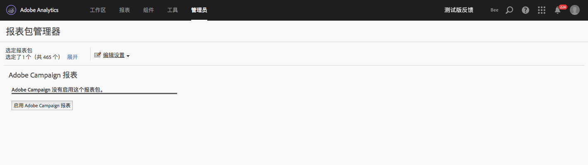

# Adobe Campaign报告

有关如何配置此集成的更多信息，请参阅 [Adobe Campaign 文档](https://helpx.adobe.com/campaign/standard/integrating/using/about-campaign-analytics-integration.html)。

Adobe Analytics 与 Adobe Campaign 之间的此集成

* 允许您将 KPI（关键绩效指标）数据从 Adobe Campaign Standard 共享到 Adobe Analytics。
* 通过 Adobe Analytics 参数丰富了跟踪公式。
* Adds a new report under  **[!UICONTROL Analytics]** &gt; **[!UICONTROL Reports]** &gt; **[!UICONTROL Adobe Campaign.]**
* 添加了 5 个新的 Adobe Campaign 分类。
* 添加了 10 个新的 Adobe Campaign 量度。
* 添加了 6 个新的 Adobe Campaign 维度。
* 每隔 15 分钟将数据同步到 Analytics。

## 步骤 1. 启用 Adobe Campaign 报表功能 {#section_C685EF10505045708A6536BB13F6CD58}

要在 Analytics 中查看 Campaign 数据，您首先需要启用 Campaign 报表功能。

1. Navigate to  **[!UICONTROL Analytics]** &gt; **[!UICONTROL Admin]** &gt; **[!UICONTROL Report Suites]** &gt; **[!UICONTROL <select report suite>]** &gt; **[!UICONTROL Edit Settings]** &gt; **[!UICONTROL Adobe Campaign]** &gt; **[!UICONTROL Adobe Campaign Reporting]** .
1. Click **[!UICONTROL Enable Campaign Reporting]**.

   

## 步骤 2. 查看 Adobe Campaign 报表 {#section_9C18A29F3CC54BD4AC5EA96417F17B33}

The integration between Adobe Campaign Standard and Adobe Analytics adds the following report under  **[!UICONTROL Analytics]** &gt; **[!UICONTROL Reports]**

<table id="table_3627F40DC90646A7B5E217A88B6FD630"> 
 <thead> 
  <tr> 
   <th colname="col1" class="entry"> 报表 </th> 
   <th colname="col2" class="entry"> 定义 </th> 
  </tr> 
 </thead>
 <tbody> 
  <tr> 
   <td colname="col1"> 
Adobe Campaign 执行的提交 ID 
 </td> 
   <td colname="col2"> 
显示从 Adobe Campaign 导入的有关发送自 Adobe Campaign 的电子邮件的数据。 
 </td> 
  </tr> 
 </tbody> 
</table>

## 步骤 3. 使用 Adobe Campaign 分类 {#section_74A28AF3F4CA4091943789DE4D8B2B63}

**[!UICONTROL “分析]** ”&gt; **[!UICONTROL “管理员]** ”&gt; **[!UICONTROL “报告包]** ”&gt; **[!UICONTROL <select report suite>]** &gt;“ **[!UICONTROL 编辑设置]** ”&gt; **[!UICONTROL “Adobe Campaign]** ”&gt; **[!UICONTROL “Adobe Campaign分类”]**

在为您的报表包启用了 Adobe Campaign 后，可以使用以下分类：

* 提交 ID（您在 Campaign 中看到的内部提交名称）
* 交付标签((营销活动中的分发-单独交付/重复交付/交易交付)
* 促销活动 ID（您在 Campaign 中看到的促销活动名称）
* 促销活动标签（Adobe Campaign 中的促销活动）
* 执行的提交标签（执行的各个提交的列表）

## Adobe Analytics 中可用的 Adobe Campaign 维度和量度 {#section_F33385C9660644AF84172EC39601469B}

在 Adobe Analytics 报表包的 Campaign 中可以使用以下&#x200B;**量度**：

* Adobe Campaign 已发送
* Adobe Campaign 已打开
* Adobe Campaign 已点击
* Adobe Campaign 已处理
* Adobe Campaign 已提交
* Adobe Campaign 唯一打开
* Adobe Campaign 唯一点击
* Adobe Campaign 已取消订阅
* Adobe Campaign 总跳出次数
* Adobe Campaign 执行的提交 ID 实例

在 Adobe Analytics 报表包的 Campaign 中可以使用以下&#x200B;**维度**：

| 维度名称 | 定义 |
|--- |--- |
| 促销活动 ID | 在活动持续期间为其发送了 KPI 的所有促销活动的 ID |
| 促销活动标签 | 促销活动 ID 的标签 |
| 提交 ID | 在活动持续期间为其发送了 KPI 的所有提交的 ID。还包含循环提交和交易提交的主提交的 ID。示例：循环提交 DM1 是计划的提交，DM2、DM3、DM4 和 DM5 是该循环提交的子提交。提交 ID 将显示从 DM1 到 DM5 的所有提交的结果。 |
| 提交标签 | 提交 ID 的标签 |
| 执行的交付ID | 仅执行的提交的 ID。不包含循环/交易主提交的 ID。示例：循环提交 DM1 是计划的提交，DM2、DM3、DM4 和 DM5 是该循环提交的子提交。执行的提交 ID 显示从 DM2 到 DM5 的所有提交（即已实际执行的提交）的结果。 |
| 执行的提交标签 | 执行的提交 ID 的标签 |
