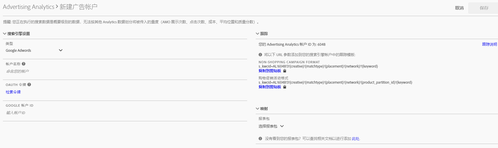

# 设置广告帐户

Adobe Analytics 管理员可以创建新的广告帐户，并将多个帐户映射到多个报表包（一对一、一对多、多对多）。

管理员还可以[为非管理员授予访问权限](/help/integrate/c-advertising-analytics/overview.md#section_FCC58EB635954A32990D4E67B52B4369)，以设置广告帐户。

1. In Adobe Analytics, navigate to **[!UICONTROL Admin]** &gt; **[!UICONTROL Advertising Accounts]**.
1. （仅限首次使用）接受最终用户许可协议的条款。
1. Click **[!UICONTROL + Add]**.
1. 显示[!UICONTROL 新搜索引擎帐户]对话框：

   

1. 按照以下说明填写&#x200B;**[!UICONTROL 搜索引擎设置]：**

   <table id="table_B3BE66B7D4C54766B8FFD2C6DCD657AF"> 
    <thead> 
      <tr> 
      <th colname="col1" class="entry"> 设置 </th> 
      <th colname="col2" class="entry"> 描述 </th> 
      </tr>
    </thead>
    <tbody> 
      <tr> 
      <td colname="col1"> 
类型 
 </td> 
      <td colname="col2"> 
您有2个选项：Google adWords和Microsoft Bing Ads。 
 
注意：Microsoft Bing 于 2019 年 3 月 31 日收购了 Yahoo Gemini。因此，现已不再提供 Yahoo Gemini 广告帐户选项。  
 </td> 
      </tr> 
      <tr> 
      <td colname="col1"> 
帐户名称 
 </td> 
      <td colname="col2"> 
您可以选择将此帐户名称设置为适合您的任意名称。这是将显示在 UI 中的帐户的友好名称。 
 </td> 
      </tr> 
      <tr> 
      <td colname="col1"> 
OAuth 令牌 
 </td> 
      <td colname="col2"> 
注意：OAuth 是一种针对访问权限委派的开放标准，通常用于授予网站或应用程序访问其他网站上的信息的权限，且无需提供密码。 
 
注意：您会注意到您将被路由到一个第三方 URL (efrontier.com)。Adobe 使用 efrontier 为所有三个搜索引擎启用 OAuth 身份验证过程。 
 
注意：如果您使用的是 Internet Explorer 11（或更早版本），则无法为三个搜索引擎中的任何一个成功检索 Oauth 令牌。请改用其他 Web 浏览器。 
 
单击检索令牌可启动 OAuth2 身份验证过程。这意味着您将需要使用自己的凭据登录到 Google/Bing 搜索帐户。根据您选择的搜索引擎，过程会略有不同： 
 
        <ul id="ul_FC9B5612F6554495B04C357CB0AB72EB"> 
        <li id="li_CD54231BFF134F83B3B5B14B34A0E1D2">Google Adwords：提供 Google 帐户 ID。 </li> 
        <li id="li_89B9D54BAA914E5DB2959B193489582E">Microsoft Bing：提供 Bing 帐户 ID 和 Bing 客户 ID。 </li> 
        </ul> 
请参考<a href="/help/integrate/c-advertising-analytics/c-adanalytics-workflow/aa-locate-account-id.md"  >查找帐户 ID</a> 以获取有关这些 ID 的信息。 
 
成功登录后，将显示OAuth令牌字段 
        <systemoutput>
          已检索
        </systemoutput>. 
 </td> 
      </tr> 
    </tbody> 
    </table>

1. 在&#x200B;**[!UICONTROL 跟踪]部分中，您提供的是有关您的 Adobe Analytics 实施如何对搜索引擎数据进行跟踪的信息。**&#x200B;这是向 Adobe Analytics 数据适当增加搜索引擎数据的必要步骤。按照以下说明填写&#x200B;**[!UICONTROL 跟踪设置]：**

   <table id="table_1AB4E31456E84ABF8209B02058259C4D"> 
    <thead> 
      <tr> 
      <th colname="col1" class="entry"> 设置 </th> 
      <th colname="col2" class="entry"> 描述 </th> 
      </tr>
    </thead>
    <tbody> 
      <tr> 
      <td colname="col1"> 
类型 
 </td> 
      <td colname="col2"> 
        <ul id="ul_1C5A0502A4984E57A08417A91CCD6FFE"> 
        <li id="li_5736E38286FF494ABDDC6E85281D7F2A">  自动:让Advertising Cloud引擎决定如何将跟踪参数附加到搜索引擎的跟踪模板／目标URL。 这种方法最简单，但可能不会生成最佳的集成数据集。 
重要说明：要在“自动模式”中配置搜索引擎帐户，您负责执行以下操作： 
          <ul id="ul_4FF9D1E3CC4E452BA339E0A725D29FEE"> 
            <li id="li_6F3A6D6259C0420CB7E6FD2C26A1B6E0">将“s_kwcid”参数和值添加到要添加帐户的帐户跟踪模板或登陆页面 URL 中。该参数和值将插入到 URL 的末尾。因此，如果您的 Web 服务器要求在 URL 末尾使用特定的键值对，或者需要更新以支持 URL 中的任何新键值对，则可能需要执行其他操作。 </li> 
            <li id="li_A04D4AA31A934392808639E46C86573F">此外，可以将关键字作为“s_kwcid”值的一部分插入到登陆 URL 中，因此如果它们包含特殊字符或符号，请确认您的 Web 服务器可以支持这些字符（例如，常见特殊字符“+”，用于“修改广泛匹配”关键字）。 </li> 
          </ul> 
 </li> 
        <li id="li_EAA7A7CA1E584854A7EC1E43E13B63FE"> 手动:允许您管理如何将跟踪参数添加到搜索引擎的跟踪模板／目标URL。 <a href="/help/integrate/c-advertising-analytics/c-adanalytics-workflow/aa-manual-vs-automatic-tracking.md"  >请参考每个搜索引擎的手动跟踪示例</a>。 </li> 
        </ul> </td> 
      </tr> 
    </tbody> 
    </table>

1. 在&#x200B;**[!UICONTROL 映射]部分，您可以选择链接到此搜索引擎帐户的报表包。**&#x200B;您必须先提供至少一个报表包，然后才能保存广告帐户。您可以将多个帐户映射到多个报表包（一对一、一对多、多对多）。请注意，AMO 从搜索引擎提取的数据只是简单地复制到所有映射的报表包中，因此不会出现拆分数据的情况。

   >[!IMPORTANT]
   >
   >Only report suites that have been [mapped to an Experience Cloud organization](https://marketing.adobe.com/resources/help/en_US/mcloud/map-report-suite.html) will be available for selection. If you do not see your report suite listed, refer to [Troubleshoot Advertising Analytics](/help/integrate/c-advertising-analytics/c-adanalytics-workflow/aa-troubleshooting.md).

   对于&#x200B;**[!UICONTROL 映射设置]，请遵循以下说明：**

   <table id="table_AF876DC40F97403882C0AA528BD204FF"> 
    <thead> 
      <tr> 
      <th colname="col1" class="entry"> 设置 </th> 
      <th colname="col2" class="entry"> 描述 </th> 
      </tr>
    </thead>
    <tbody> 
      <tr> 
      <td colname="col1"> 
报表包映射 
 </td> 
      <td colname="col2"> 
报表包映射可确定链接到此搜索引擎帐户的报表包。换句话说，它可确定搜索引擎数据会发送到哪些报表包。 
 
如果在列出的报表包中未看到您的报表包，则可使用此工具<a href="https://marketing.adobe.com/resources/help/en_US/mcloud/map-report-suite.html"  >将您的报表包映射到 Experience Cloud 组织</a>。 
 </td> 
      </tr> 
    </tbody> 
    </table>

1. 单击&#x200B;**[!UICONTROL 保存]**。
1. 保存之后，会显示免责声明列出一系列注意事项。您需要确认您已经阅读并理解这份协议。Click the checkbox, then click **[!UICONTROL OK]**.

   现在，您会进入广告帐户[管理 UI](/help/integrate/c-advertising-analytics/c-adanalytics-workflow/aa-manage-ad-accounts.md)，您新创建的帐户应已列于此处。

> [!NOTE] 您应该至少等待24小时，然后搜索引擎数据开始填充您的Analytics报告。

