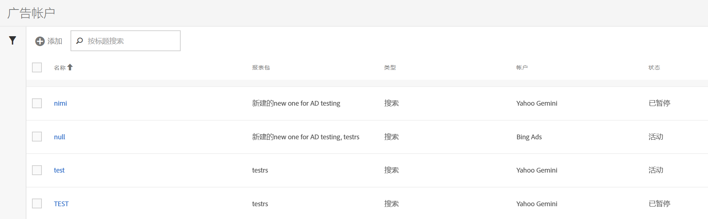

# 设置广告帐户

Adobe Analytics管理员可以创建新的广告帐户，并将多个帐户映射到多个报表包（1 ：1， 1 ：多、多：多）。

管理员还可以[为非管理员授予访问权限](/help/integrate/c-advertising-analytics/overview.md#section_FCC58EB635954A32990D4E67B52B4369)，以设置广告帐户。

<!--

-->

1. 在 Adobe Analytics 中，导航到&#x200B;**[!UICONTROL 管理员]** > **[!UICONTROL 广告帐户]**。
1. （仅限首次使用）接受最终用户许可协议的条款。
1. 选择&#x200B;**[!UICONTROL +添加]**。
1. 显示[!UICONTROL 新搜索引擎设置]对话框。

   

1. 按照以下说明填写&#x200B;**[!UICONTROL 搜索引擎设置]**：

   | 设置 | 描述 |
   | --- | --- |
   | **[!UICONTROL Type]** | 您有2个选项：**[!UICONTROL Google Adwords]**&#x200B;和&#x200B;**[!UICONTROL Bing Ads]**。  注意：Microsoft Bing 于 2019 年 3 月 31 日收购了 Yahoo Gemini。因此，现已不再提供 Yahoo Gemini 广告帐户选项。 |
   | 帐户名称 | 您可以选择将此帐户名称设置为适合您的任何名称。  帐户名称是UI中显示的帐户的友好名称。 |
   | OAuth 令牌 | **注意**： OAuth是一种访问委派的开放标准，通常用于授予网站或应用程序访问网站上的信息的权限，但不提供密码。 您注意到您被引向了第三方URL (efrontier.com)。 Adobe使用Adobe Media Optimizer为所有三个搜索引擎实现OAuth身份验证过程。 如果您使用的是Internet Explorer 11（或更早版本），则无法为三个搜索引擎中的任何一个检索Oauth令牌。 请改用其他 Web 浏览器。
选择&#x200B;**[!UICONTROL 检索令牌]**&#x200B;以启动OAuth2身份验证过程。 您需要使用自己的凭据登录到Google/Bing搜索帐户。 根据您的选择，此过程会略有不同： <ul><li>Google Adwords：提供 Google 帐户 ID</li><li>Microsoft Bing：提供 Bing 帐户 ID 和 Bing 客户 ID。</li></ul>有关这些ID的信息，请参阅[查找您的帐户ID](/help/integrate/c-advertising-analytics/c-adanalytics-workflow/aa-locate-account-id.md)。 当您成功登录后，**[!UICONTROL OAuth 令牌]**&#x200B;字段即显示&#x200B;**[!UICONTROL 已检索]**。 |

1. 在&#x200B;**[!UICONTROL 跟踪]**&#x200B;部分中，您提供了有关如何使用Adobe Analytics实施跟踪数据的信息。 跟踪是使用搜索引擎数据正确增加Adobe Analytics数据的必要步骤。
按照以下说明填写&#x200B;**[!UICONTROL 跟踪设置]**：

   | 设置 | 描述 |
   | --- | --- |
   | 类型 | <ul><li>**自动**：让Advertising Cloud引擎自行决定如何将跟踪参数附加到的跟踪模板/目标URL。 [!UICONTROL 自动类型跟踪]是最简单的方法，但可能不会生成最佳的集成数据集。 **重要提示：**&#x200B;若要使用[!UICONTROL 自动类型跟踪]配置搜索引擎帐户，您需要执行以下操作：<ul><li>`s_kwcid`参数和值已添加到要添加帐户的帐户跟踪模板或登陆页面URL中。 参数和值插入到URL的末尾。 如果您的Web服务器要求在URL末尾使用特定的`key=value`对，则可能需要执行其他操作。 或者需要更新才能支持URL中的任何新`key=value`对。 **注意**：了解关于是否应将此参数添加到您的[内容安全策略](https://experienceleague.adobe.com/zh-hans/docs/id-service/using/reference/csp)的更多信息。</li><li>此外，还可以将关键字作为 `s_kwcid` 值的一部分插入到登陆 URL 中。如果关键字包含特殊字符或符号，请确认您的Web服务器可以支持这些字符。 `+`是常见的特殊字符示例，该字符用于“修改广泛匹配”关键字。</li></ul></li><li>**手动**：让您管理如何将跟踪参数添加到搜索引擎的跟踪模板/目标URL。 [请参考每个搜索引擎的手动跟踪示例](/help/integrate/c-advertising-analytics/c-adanalytics-workflow/aa-manual-vs-automatic-tracking.md)。</li></ul> |

1. 选择&#x200B;**[!UICONTROL 保存]**。
1. 免责声明会显示警告列表。 确认您已阅读并理解本协议。 选中复选框，然后选择&#x200B;**[!UICONTROL 确定]**。

   现在，您会进入广告帐户[管理 UI](/help/integrate/c-advertising-analytics/c-adanalytics-workflow/aa-manage-ad-accounts.md)，您新创建的帐户应已列于此处。

>[!NOTE]
>
>您可能需要至少等待24小时，搜索引擎数据才会开始填充到您的Analytics报表中。
