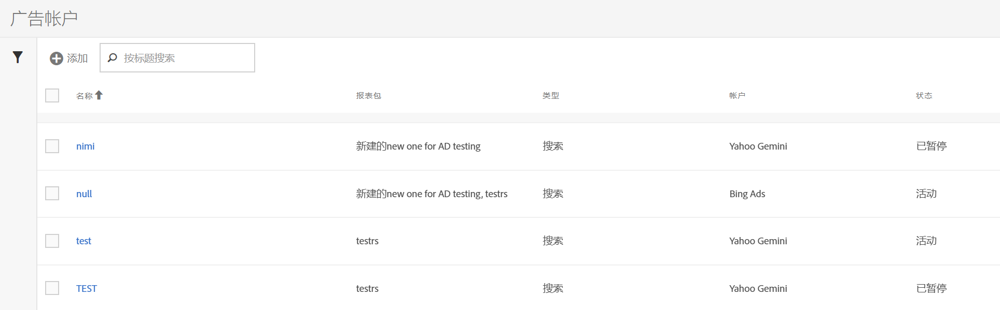

# 设置广告帐户

Adobe Analytics管理员可以创建新的广告帐户，并将多个帐户映射到多个报表包（1 ：1， 1 ：多、多：多）。

管理员还可以[为非管理员授予访问权限](/help/integrate/c-advertising-analytics/overview.md#section_FCC58EB635954A32990D4E67B52B4369)，以设置广告帐户。

<!--

-->

1. 在 Adobe Analytics 中，导航到&#x200B;**[!UICONTROL 管理员]** > **[!UICONTROL 广告帐户]**。
1. （仅限首次使用）接受最终用户许可协议的条款。
1. Select **[!UICONTROL + Add]**.
1. The [!UICONTROL New search engine setting] dialog displays.

   

1. Fill in the **[!UICONTROL search engine Settings]** following these guidelines:

   | 设置 | 描述 |
   | --- | --- |
   | **[!UICONTROL Type]** | 您有2个选项：**[!UICONTROL Google Adwords]**&#x200B;和&#x200B;**[!UICONTROL Bing Ads]**。 注意：Microsoft已于2019年3月31日收购了Yahoo Gemini。 因此，现已不再提供 Yahoo Gemini 广告帐户选项。 |
   | 帐户名称 | You can choose to set this account name to any name that suits you.  Account name is the friendly name of the account that appears in the UI. |
   | OAuth 令牌 | **Note**: OAuth is an open standard for access delegation, commonly used as a way to grant web sites or applications access to information on web sites but without providing passwords. You notice that you get routed to a third-party URL (efrontier.com). Adobe uses Adobe Media Optimizer to power the OAuth authentication process for all three search engines. If you use Internet Explorer 11 (or earlier), you are unable to retrieve the Oauth token for any of the three search engines. 请改用其他 Web 浏览器。
Select **[!UICONTROL Retrieve Token]** to launch the OAuth2 authentication process. You are asked to sign in to your Google Ads or Microsoft Advertising search account using your credentials. Depending on which you chose, the process is slightly different: <ul><li>Google Ads：提供Google帐户ID</li><li>Microsoft Advertising：提供您的帐户ID和经理帐户ID。</li></ul>Refer to [Locate your Account ID](aa-locate-account-id.md) for information on these IDs. 当您成功登录后，**[!UICONTROL OAuth 令牌]**&#x200B;字段即显示&#x200B;**[!UICONTROL 已检索]**。 |

1. In the **[!UICONTROL Tracking]** section, you provide information on how to track the data using your Adobe Analytics implementation. Tracking is a required step to augment the Adobe Analytics data properly with the search engine data.
按照以下说明填写&#x200B;**[!UICONTROL 跟踪设置]**：

   | 设置 | 描述 |
   | --- | --- |
   | 类型 | <ul><li>**Auto**: Lets the Adobe Advertising engine decide how the tracking parameters are appended to the &#39;s tracking templates/destination URLs. [!UICONTROL Auto Type Tracking] is the simplest approach, but may not result in the best integrated dataset. **Important:** To configure a search engine account with [!UICONTROL Auto Type Tracking], you are responsible for taking the following actions:<ul><li>`s_kwcid`参数和值已添加到要添加帐户的帐户跟踪模板或登陆页面URL中。 参数和值插入到URL的末尾。 如果您的Web服务器要求在URL末尾使用特定的`key=value`对，则可能需要执行其他操作。 或者需要更新才能支持URL中的任何新`key=value`对。 **注意**：了解关于是否应将此参数添加到您的[内容安全策略](https://experienceleague.adobe.com/en/docs/id-service/using/reference/csp)的更多信息。</li><li>此外，还可以将关键字作为 `s_kwcid` 值的一部分插入到登陆 URL 中。If the keywords contain special characters or symbols, please confirm that your web server can support those characters. An example of a common special characters is `+`, which is used in &quot;Broad Match Modified&quot; keywords.</li></ul></li><li>**Manual**: Lets you manage how the tracking parameters are added to the search engine&#39;s tracking templates/destination URLs. [请参考每个搜索引擎的手动跟踪示例](/help/integrate/c-advertising-analytics/c-adanalytics-workflow/aa-manual-vs-automatic-tracking.md)。</li></ul> |

1. 选择&#x200B;**[!UICONTROL 保存]**。
1. A disclaimer displays a list of caveats. Confirm that you have read and you understand this agreement. Select the checkbox, then select **[!UICONTROL OK]**.

   现在，您会进入广告帐户[管理 UI](/help/integrate/c-advertising-analytics/c-adanalytics-workflow/aa-manage-ad-accounts.md)，您新创建的帐户应已列于此处。

>[!NOTE]
>
>您可能需要至少等待24小时，搜索引擎数据才会开始填充到您的Analytics报表中。
