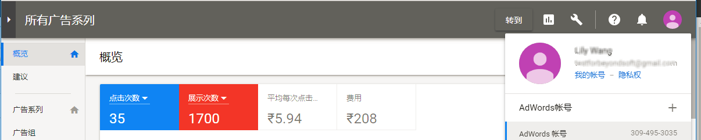

# 找到帐户ID

此处提供有关帮助您找到Google和Bing帐户ID的说明。

## Google AdWords {#section_2A62AD448BD949889DB77C2AF3E04C33}

>[!IMPORTANT]
>
>Google AdWords使用两种类型的帐户：a) MCC(我的客户中心)帐户和b)标准帐户。对于此项与 Adobe Analytics 的集成，**您必须使用标准帐户登录，而不是 MCC 帐户登录**。其原因是，MCC帐户充当一个“伞”帐户，可以通过一次登录访问多个AdWords帐户，而Standard帐户登录只能访问每个登录名的一个AdWords帐户。

单击右上角的“帐户”图标可查看 AdWords 帐号（客户 ID）。

## Bing {#section_F1B9C7E997444746936599732CD62665}

需要同时输入 帐户 ID 和客户 ID。它们均已在“帐户”选项卡上列出。

>[!NOTE]
>
>帐户编号与帐户ID不相同。

