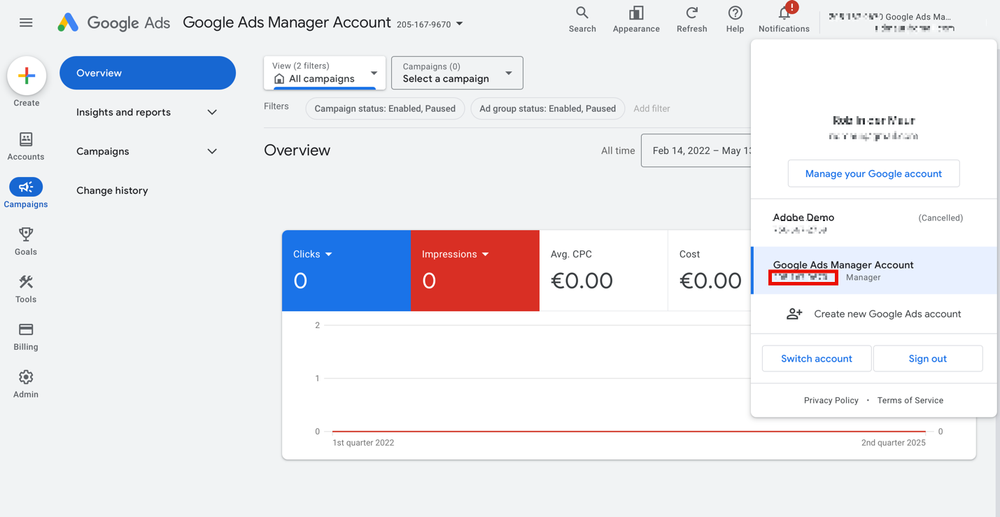

# 找到帐户 ID {#locate-your-account-ids}

了解如何找到用于Google Ads和Microsoft Advertising的帐户ID。

## Google Ads (AdWords) {#google}

>[!IMPORTANT]
>
>Google Ads使用两种类型的帐户：
>
>- MCC（我的客户中心）帐户和
>- 标准帐户。
>
>对于与Adobe Analytics的集成，**必须使用标准帐户登录名**，而不是MCC帐户登录名。 原因在于MCC帐户作为一种“伞状”帐户，登录一次即可访问多个Google Ads帐户，而标准帐户每次登录只能访问一个帐户。 虽然Google支持关联一个电子邮件以管理5个帐户，但Advertising Analytics尚不支持此功能。 一个电子邮件只能链接到一个Google Ads帐户。

单击右上角的帐户图标以查看Google Ads帐号（客户ID）。

## Microsoft Advertising (Bing) {#microsoft}

>[!NOTE]
>
>如果您的Microsoft Advertising（以前称为Bing）帐户使用Google导入功能，请确保更新正确的跟踪字符串。 跟踪字符串不会自动从Google版本更新为正确的Microsoft Advertising跟踪字符串，并可能会产生不明确的数据。 有关详细信息，请参阅Microsoft Advertising帮助中的[从Google Ads导入的内容](https://help.ads.microsoft.com/apex/index/3/en/50851/)。

**[!UICONTROL 帐户ID]**&#x200B;和&#x200B;**[!UICONTROL 经理帐户ID]**&#x200B;都是必需的。

- **[!UICONTROL 帐户ID]**&#x200B;位于&#x200B;**[!UICONTROL 设置]** > **[!UICONTROL 帐户设置]** > **[!UICONTROL 帐户ID]**&#x200B;下。 确保您使用[!UICONTROL 帐户ID]而非[!UICONTROL 帐号]。
- **[!UICONTROL 经理帐户ID]**&#x200B;位于&#x200B;**[!UICONTROL 设置]** > **[!UICONTROL 经理帐户设置]** > **[!UICONTROL 经理帐户ID]**&#x200B;下。 确保您使用[!UICONTROL 经理帐户ID]，而不是[!UICONTROL 经理帐户号]。

>[!CONTEXTUALHELP]
>id="adanalytics_ma_account_id"
>title="帐户 ID"
>abstract="&#39;帐户 ID&#39; 是一个数字值，位于 Microsoft Advertising 界面中。 您可以通过导航至“设置”>“帐户设置”>“帐户 ID”找到该值。"

>[!CONTEXTUALHELP]
>id="adanalytics_ma_manager_account_id"
>title="管理器帐户 ID"
>abstract="&#39;管理器帐户 ID&#39; 是一个数字值，位于 Microsoft Advertising 界面中。 您可以通过导航至“设置”>“管理器帐户设置”>“管理器帐户 ID”找到该值。"
