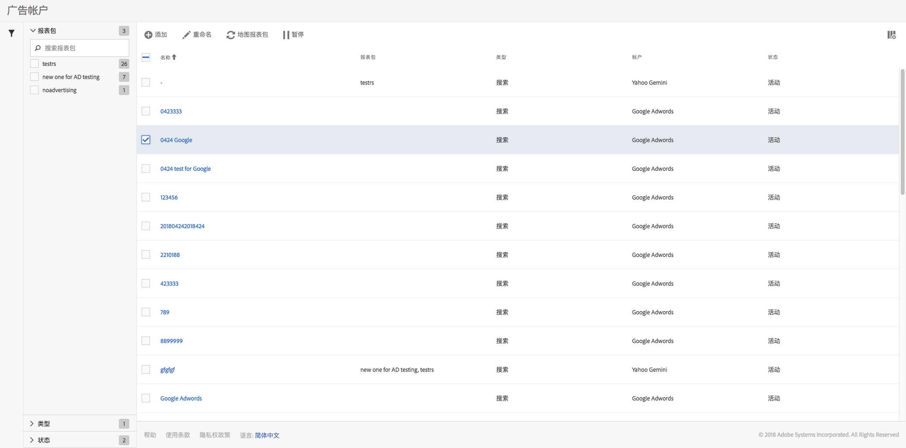

# 管理广告帐户

You can access the Management UI by navigating to **[!UICONTROL Admin]** &gt; **[!UICONTROL Advertising Accounts]**.

<table id="table_BE318026CF024E94A885EED86AA7077F"> 
 <thead> 
  <tr> 
   <th colname="col1" class="entry"> 元素 </th> 
   <th colname="col2" class="entry"> 定义 </th> 
  </tr>
 </thead>
 <tbody> 
  <tr> 
   <td colname="col1"> 
<b>操作</b> 
 </td> 
   <td colname="col2"> 
<b>注意：仅当您至少选择了一个广告帐户时，才会显示操作。 </b> 
 </td> 
  </tr> 
  <tr> 
   <td colname="col1"> 
+ 添加 
 </td> 
   <td colname="col2"> 
使您转到<a href="../../../integrate/c-advertising-analytics/c-adanalytics-workflow/aa-create-ad-account.md#concept_1958E8C15C334E8B9DC510EC8D5DCA7C" format="dita" scope="local">设置广告帐户</a> UI。 
 </td> 
  </tr> 
  <tr> 
   <td colname="col1"> 
重命名 
 </td> 
   <td colname="col2"> 
在此账户映射的所有报表包中，重命名此帐户。 
 </td> 
  </tr> 
  <tr> 
   <td colname="col1"> 
映射报表包 
 </td> 
   <td colname="col2"> 
让您编辑报表包映射。 
 </td> 
  </tr> 
  <tr> 
   <td colname="col1"> 
暂停 
 </td> 
   <td colname="col2"> 
停用该帐户。要再次激活它，请单击激活。 
 </td> 
  </tr> 
  <tr> 
   <td colname="col1"> 
<b>列标题</b> 
 </td> 
   <td colname="col2"> </td> 
  </tr> 
  <tr> 
   <td colname="col1"> 
名称 
 </td> 
   <td colname="col2"> 
您分配给此广告帐户的名称。 
 </td> 
  </tr> 
  <tr> 
   <td colname="col1"> 
报表包 
 </td> 
   <td colname="col2"> 
映射到此广告帐户的报表包。 
 </td> 
  </tr> 
  <tr> 
   <td colname="col1"> 
类型 
 </td> 
   <td colname="col2"> 
我们目前只支持一种类型：搜索。 
 </td> 
  </tr> 
  <tr> 
   <td colname="col1"> 
帐户 
 </td> 
   <td colname="col2"> 
列出 2 个受支持的帐户类型中的其中一个类型：Google Adwords 或 Bing Ads。 
 </td> 
  </tr> 
  <tr> 
   <td colname="col1"> 
状态 
 </td> 
   <td colname="col2"> 
包含 2 个状态指标： 
 
    <ul id="ul_376263DEF6EE44B48564D272D3CBFCBC"> 
     <li id="li_75E329B68B4D4E929E227E717C993082"><b>活动</b>：该帐户正在积极提取搜索数据。 </li> 
     <li id="li_5E2DF98B22D34437A2A2C93F996C1EA2"><b>暂停</b>：该帐户目前处于停用状态，不会提取搜索数据。 </li> 
    </ul> </td> 
  </tr> 
  <tr> 
   <td colname="col1"> 
<b>过滤器</b> 
 </td> 
   <td colname="col2"> 
（左侧）您可以通过报表包、类型和状态来过滤广告帐户。 
 </td> 
  </tr> 
 </tbody> 
</table>

