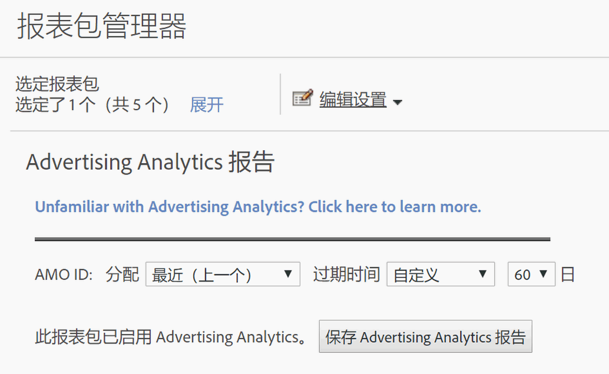

# 为 Advertising Analytics 启用报表包

要在Analytics中查看任何Advertising Analytics搜索数据，您需要为Advertising Analytics报告配置每个映射到Experience Cloud的报告套件。

1. [将报表包映射到组织](https://marketing.adobe.com/resources/help/en_US/mcloud/map-report-suite.html)。
1. Navigate to **[!UICONTROL Admin]** &gt; **[!UICONTROL Report Suites]**.

1. Select the report suite that is [mapped to your Experience Cloud organization](https://marketing.adobe.com/resources/help/en_US/mcloud/map-report-suite.html).
1. Click **[!UICONTROL Edit Settings]** &gt; **[!UICONTROL Advertising Analytics Configuration]**.

   

   >[!IMPORTANT]
   >
   >AMO ID指将要插入搜索数据的Adobe Advertising cloud变量。

1. 设置您想要 AMO ID 变量使用的变量分配和过期日期。转化变量 (eVar) 允许 Adobe Analytics 将成功事件归属于特定的变量值。有时候，在一个事件成功之前变量会遇到多个值。对于这类情况，分配将确定哪个变量值可获得该成功事件的信用。

   | 设置 | 定义 |
   |--- |--- |
   | 原始值（第一个） | 无论该变量的后续值是什么，所看到的第一个值将获得全部分配点数。 |
   | 最近（上一个） | 无论之前使用了什么变量，所看到的最后一个值将获得成功事件的全部分配点数。 |
   | 过期时间 | 让您可以指定一个时段或事件，eVar 值将在此时段或事件之后过期（即，不再接收成功事件的点数）。如果在 eVar 过期之后发生成功事件，则由“无”值接收该事件的信用（不激活任何 eVar）。 |

1. Click **[!UICONTROL Enable Advertising Analytics Reporting]** (first time), or **[!UICONTROL Update Advertising Analytics Reporting]** (subsequent times). 您的报表包现已准备好接收 Advertising Analytics 搜索数据。现在，您可以[创建广告帐户](../../../integrate/c-advertising-analytics/c-adanalytics-workflow/aa-create-ad-account.md#concept_1958E8C15C334E8B9DC510EC8D5DCA7C)。

