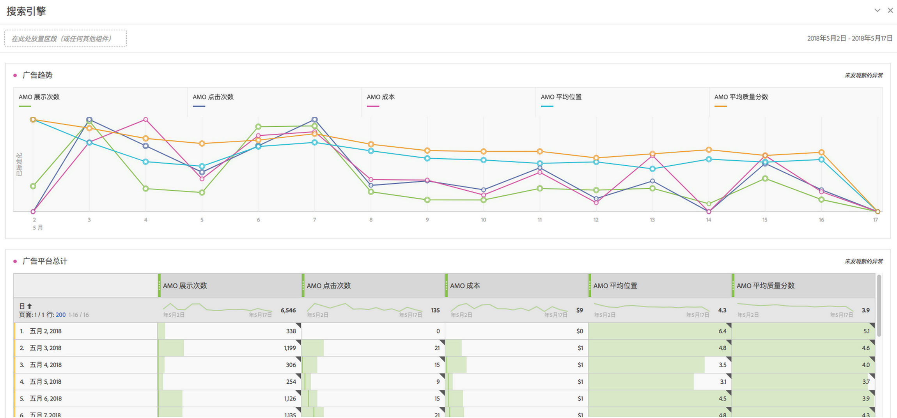
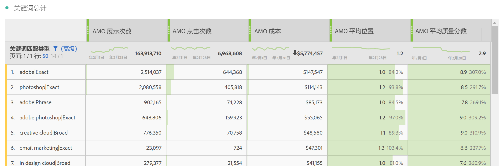
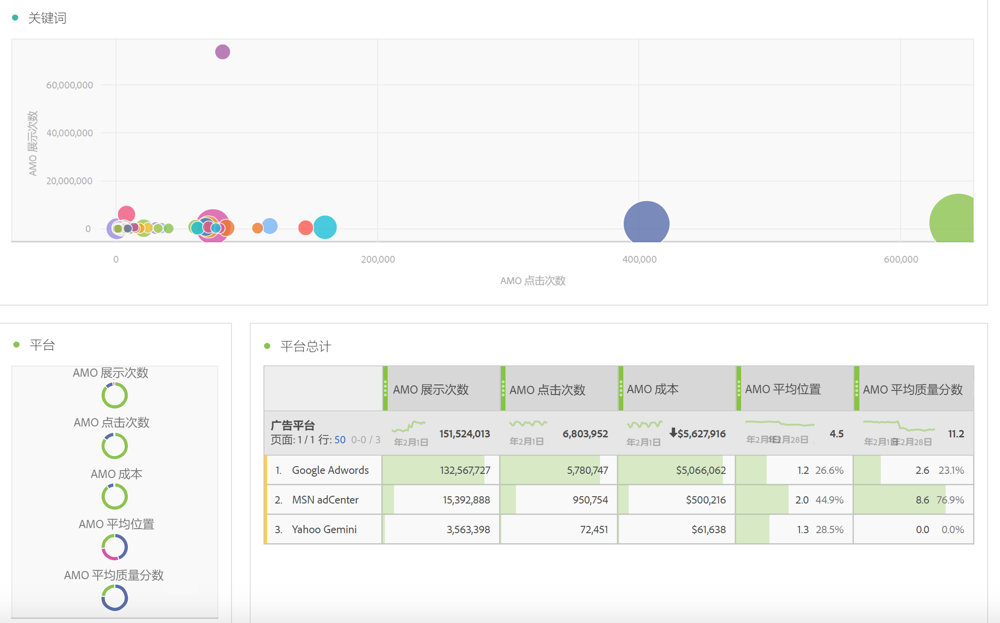
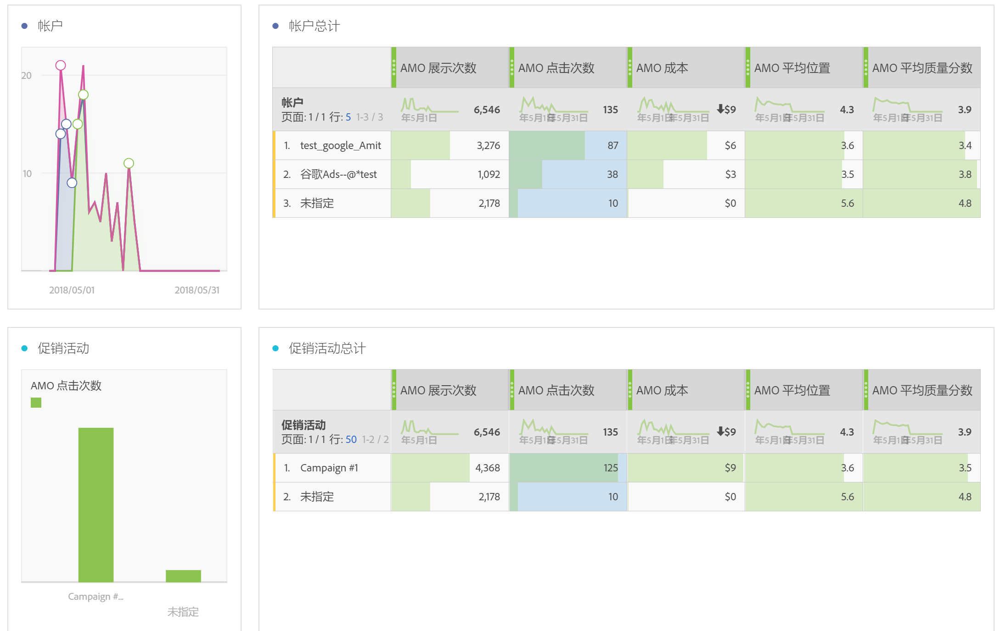
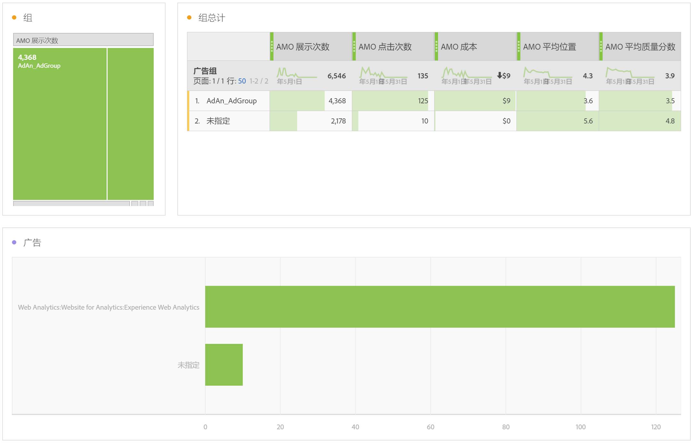
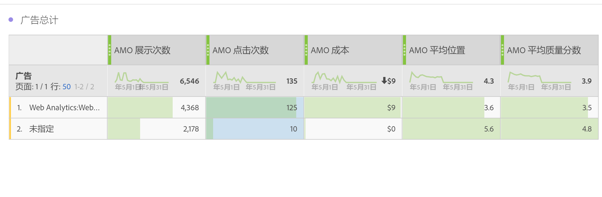
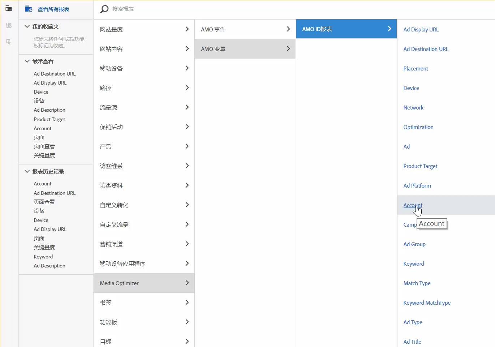

# Adobe Analytics广告数据报告

与 Analysis Workspace 模板以及在 Reports &amp; Analytics 和 Report Builder 中进行报告的相关详细信息。

>[!NOTE]
>
>在搜索引擎数据开始填充到Analytics报告之前，您应该至少等待24小时。另请注意，Analytics 报表不会以每小时的时间粒度返回数据，因为 AMO 数据不支持每小时的时间粒度。

## Analysis Workspace: Search Engines {#section_8173F42B2C784F41B9FD82CBB66F9ADF}

通过此模板，实施此搜索引擎集成的任何人都可以访问 Analytics 中丰富的搜索引擎数据。You can access it via **[!UICONTROL Workspace]** &gt; **[!UICONTROL Templates]** &gt; **[!UICONTROL Advertising]** &gt; **[!UICONTROL Search Engines.]**

>[!NOTE]
>
>即使您尚未实施任何广告帐户，“广告模板”类别也会对所有客户可见。但是，如果您尝试为尚未配置该帐户的公司打开搜索引擎模板，则会显示一条错误消息，提示您尚未配置任何搜索引擎帐户。在这种情况下，请单击&#x200B;**[!UICONTROL 立即配置]**，然后便可看到[广告帐户设置](../../../integrate/c-advertising-analytics/c-adanalytics-workflow/aa-create-ad-account.md#concept_1958E8C15C334E8B9DC510EC8D5DCA7C)页面。

       

| 表格/可视化图表 | 描述 |
|--- |--- |
| 广告趋势 | AMO 展示次数、AMO 点击次数和 AMO 成本的每日趋势概览。 |
| 广告平台 | 为前个平台(Google、Bing)支付成本的圆环图。 |
| 广告平台总计 | 排名最前的平台的自由格式表，按照 AMO 展示次数、AMO 点击次数、AMO 成本 和 AMO 平均位置、AMO 平均质量分数划分。 |
| 帐户 | 成本的堆叠面积图。 |
| 帐户总计 | 排名最前的帐户的自由格式表，按照相关量度划分。 |
| 促销活动 | 促销活动成本的条形图。 |
| 促销活动总计 | 排名最前的促销活动的自由格式表，按照相关量度划分。 |
| 群组 | 成本的树图。 |
| 群组总计 | 排名最前的广告群组的自由格式表，按照相关量度划分。 |
| 广告 | 展示次数、点击次数和成本的水平条形图。 |
| 广告总计 | 排名最前的广告的自由格式表，按照相关量度划分。 |
| 关键字 | 所有关键字/匹配类型组合的展示次数、点击次数和成本的散点图。 |
| 关键字总计 | 排名最前的关键字/匹配类型组合的自由格式表，按照相关量度划分。 |

## Reports &amp; Analytics {#section_BB2E75DF909C49EA8D4E92D14D6DFD85}

只要您设置了 Advertising Analytics 帐户，就会提供 Advertising Analytics 报表。

## Report Builder {#section_8E0371CF81144C33990D909685D1726E}

只要您设置了 Advertising Analytics 帐户，就会提供 Advertising Analytics 报表。
