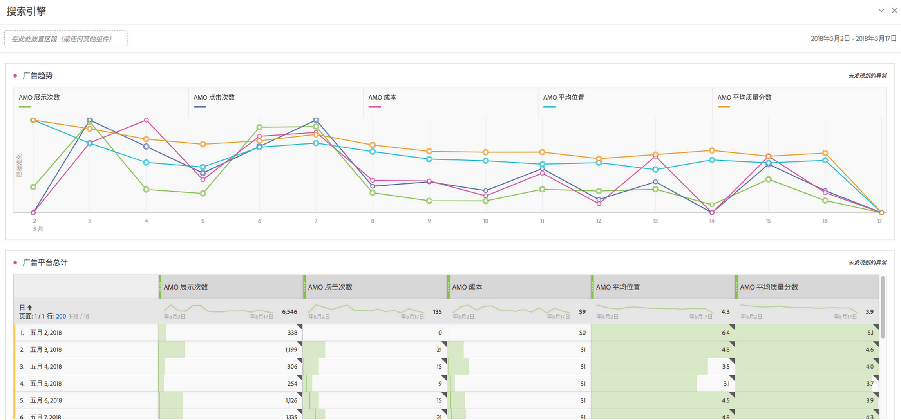
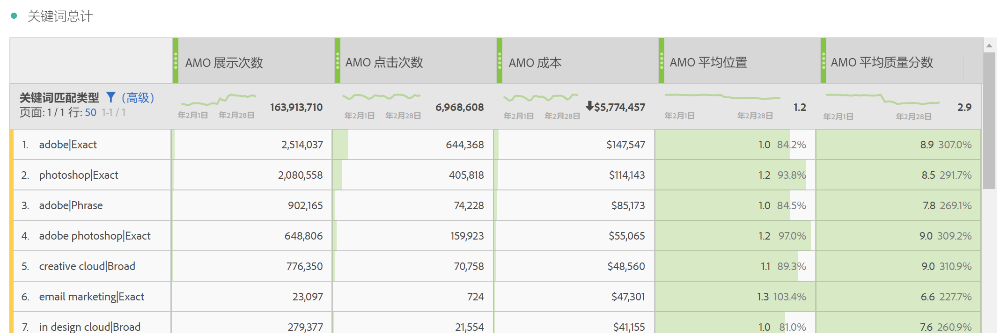
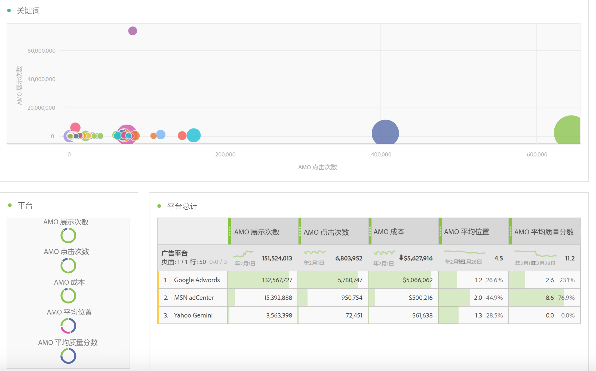
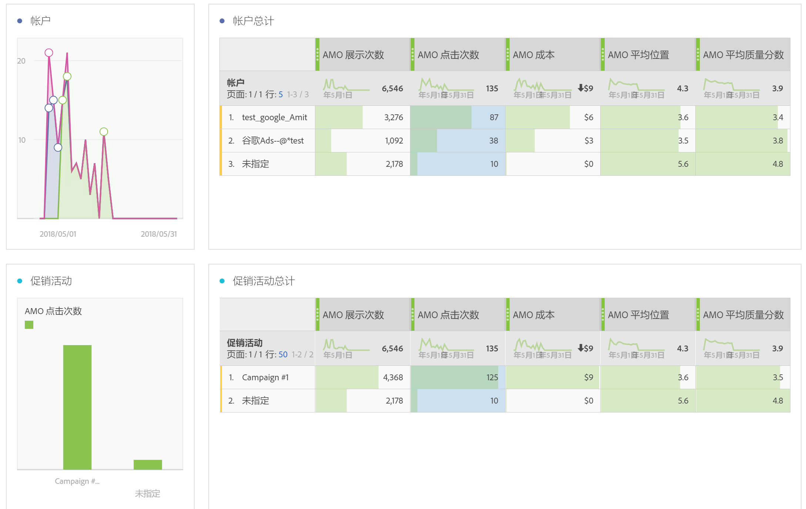
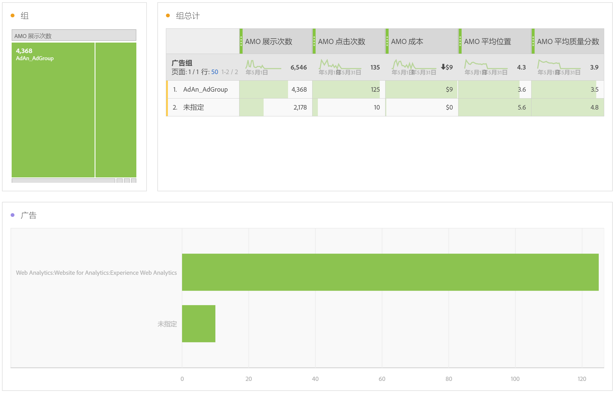
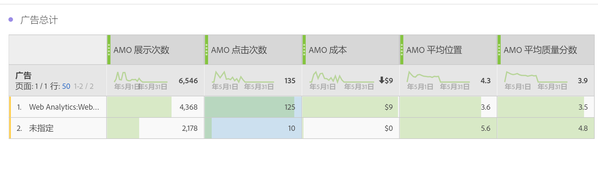

# 报告广告数据

本文提供了有关Analysis Workspace报表以及Report Builder中报表的详细信息。

>[!NOTE]
>
>预计至少等待24小时，搜索引擎数据才会开始填充Analytics报表。 Analytics报表不会以每小时的时间粒度返回数据，因为Adobe Advertising数据不支持每小时的时间粒度。

## 付费搜索报告 {#section_8173F42B2C784F41B9FD82CBB66F9ADF}

通过此报表，实施搜索引擎集成的任何人都可以访问Analytics中的搜索引擎数据。 您可以通过&#x200B;**[!UICONTROL Workspace]** > **[!UICONTROL 报表]** > **[!UICONTROL 客户获取]** > **[!UICONTROL Advertising Analytics：付费搜索]**&#x200B;访问它

>[!NOTE]
>
>所有客户都可以看到付费搜索报表，即使您尚未实施任何Advertising帐户也是如此。 如果您尝试打开未配置的公司的付费搜索报表，则会出现一条错误消息，说明您未配置任何搜索引擎帐户。 选择&#x200B;**[!UICONTROL 立即配置]**，此时将转到[Advertising帐户设置](/help/integrate/c-advertising-analytics/c-adanalytics-workflow/aa-create-ad-account.md)屏幕。

       

| 表/可视化图表 | 描述 |
|--- |--- |
| 广告趋势 | AMO展示次数、AMO点击次数和AMO成本的每日趋势概述。 |
| 广告平台 | 排名最前的2大平台（Google广告、Microsoft Advertising）的成本圆环图。 |
| 广告平台总计 | 排名最前的平台的自由格式表，按AMO展示次数、AMO点击次数、AMO成本、AMO平均数划分。 位置，AMO平均 质量分数。 |
| 帐户 | 栈叠成本面积。 |
| 帐户总计 | 排名最前的帐户的自由格式表，按照相关指标划分。 |
| 营销活动 | 促销活动成本的条形图。 |
| 促销活动总计 | 排名最前的促销活动的自由格式表，按照相关指标划分。 |
| 群组 | 成本树状图。 |
| 组总计 | 排名最前的广告群组的自由格式表，按照相关指标划分。 |
| 广告 | 展示次数、点击量和成本的水平条形图。 |
| 广告总计 | 排名最前的广告的自由格式表，按照相关指标划分。 |
| 关键词 | 所有关键字/匹配类型组合的展示次数、点击量和成本的散点图。 |
| 关键词总计 | 排名最前的关键字/匹配类型组合的自由格式表，按照相关指标划分。 |

## Report Builder {#section_8E0371CF81144C33990D909685D1726E}

一旦设置了Advertising Analytics帐户，Advertising Analytics报表即可用。
