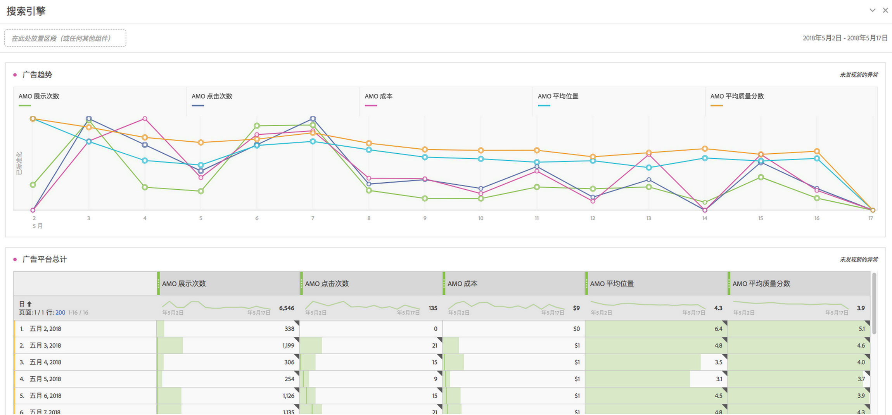

# 广告分析概述

通过 Advertising Analytics，您可以在 Adobe Analytics 中并排查看您在 Google 和 Bing 上的所有付费搜索数据。以前，任何Google AdWords/DFA或Microsoft Bing广告数据都必须在Adobe Advertising Cloud(AMO)或Google/Bing中查看。现在，您可以在 Adobe Analytics 中直接从搜索引擎获取以下数据：展示次数、点击次数、成本、质量分数、平均位置以及 AMO ID 实例数（点击实例数）。

>[!NOTE]
>
>Yahoo Gemini于2019年月31日被Microsoft Bing吸收。因此，现已不再提供 Yahoo Gemini 广告帐户选项。

将这些来自搜索引擎的数据集中到 Adobe Analytics 之后，您即可使用 Analysis Workspace 的强大功能对同样的数据进行分析。Workspace 中新的[付费搜索性能](../../integrate/c-advertising-analytics/c-adanalytics-workflow/aa-report-ad-data-an.md#concept_E29B25BEE60C4A64B66E9255D7612254)模板可帮助进行此分析。

此集成针对以下受众：

* 需要为付费搜索营销人员搜集性能报告的&#x200B;**分析师**。
* 要寻找这些问题的答案的&#x200B;**付费搜索营销人员**：我将多少流量发送到我们的网站？其中形成客户转化的流量有多少？成本效益高的广告促销活动有哪些？

## 先决条件 {#section_C25E0CA3474C4EDEAEAA9A5B8AAC9299}

* Advertising Analytics 仅适用于 Adobe Analytics [Select](https://www.adobe.com/data-analytics-cloud/analytics/select.html)、[Prime](https://www.adobe.com/data-analytics-cloud/analytics/prime.html) 和 [Ultimate](https://www.adobe.com/data-analytics-cloud/analytics/ultimate.html) 三种 SKU 版本。

* 非 Advertising Cloud 和非 AMO 的客户都可以使用此功能。
* 您必须是 Adobe Analytics 管理员才可以访问 Advertising Analytics。随后，您可以向非管理员[授予访问权限](../../integrate/c-advertising-analytics/overview.md#section_FCC58EB635954A32990D4E67B52B4369)。
* Any Analytics report suite where you want to view Google/Bing search data has to be [mapped to your Experience Cloud organization](https://marketing.adobe.com/resources/help/en_US/mcloud/report-suite-mapping.html).
* For any report suite where you want to view Google/Bing search data, you must [enable those report suite/s for Advertising Analytics](../../integrate/c-advertising-analytics/c-adanalytics-workflow/aa-provision-rs.md#concept_BE491B2A2CAE4D818C218033B985A0FB) ( **[!UICONTROL Admin]** &gt; **[!UICONTROL Edit Settings]** &gt; **[!UICONTROL Advertising Analytics Configuration]**).

* 您需要用户登录凭据（如 Google 帐户 ID 和密码），且该用户对您想要与 Adobe Analytics 集成的搜索帐户须拥有编辑权限。
* 对于 Bing Ads，您还需要 Bing 客户 ID。
* 如果您使用 Internet Explorer 11（或更早版本），则无法为三个搜索引擎中的任何一个成功[设置广告帐户](../../integrate/c-advertising-analytics/c-adanalytics-workflow/aa-create-ad-account.md#concept_1958E8C15C334E8B9DC510EC8D5DCA7C)。请改用其他 Web 浏览器。

## Advertising Analytics 权限 {#section_FCC58EB635954A32990D4E67B52B4369}

Analytics 有两种权限，可自动授予给 Analytics 管理员。然后，管理员可以选择向非管理员授予这些权限。

<table id="table_86256AD8B4554F369439A8FDF2F545E1"> 
 <thead> 
  <tr> 
   <th colname="col1" class="entry"> 权限 </th> 
   <th colname="col2" class="entry"> 定义 </th> 
   <th colname="col3" class="entry"> 在 Adobe Analytics 内授予权限 </th> 
   <th colname="col4" class="entry"> 登录到 Adobe Experience Cloud 后授予权限 </th> 
  </tr>
 </thead>
 <tbody> 
  <tr> 
   <td colname="col1"> 
Advertising Analytics 管理 
 </td> 
   <td colname="col2"> 
允许用户设置/编辑/查看广告搜索帐户。 
 </td> 
   <td colname="col3"> 管理员 &gt; 用户管理 &gt; 群组 &gt; 编辑全部报表访问 &gt; 自定义 Analytics 工具 &gt; Advertising Analytics 管理 </td> 
   <td colname="col4"> 登录到 adminconsole.adobe.com &gt; 产品 &gt; 产品配置文件 &gt; 权限选项卡 &gt; Analytics 工具 &gt; Advertising Analytics 管理 </td> 
  </tr> 
  <tr> 
   <td colname="col1"> 
Advertising Analytics 配置 
 </td> 
   <td colname="col2"> 
允许用户将报表包配置为可以使用 Advertising Analytics。 
 </td> 
   <td colname="col3"> 管理员 &gt; 用户管理 &gt; 群组 &gt; 编辑全部报表访问 &gt; 自定义报表包工具 &gt; Advertising Analytics 配置 </td> 
   <td colname="col4"> 登录到 adminconsole.adobe.com &gt; 产品 &gt; 产品配置文件 &gt; 权限选项卡 &gt; 报表包工具 &gt; Advertising Analytics 配置 </td> 
  </tr> 
 </tbody> 
</table>

## Advertising Analytics 维度和量度 {#section_C0DF4A08EA9E46ADABE9E465AFC11E32}

Advertising Analytics 可将以下维度和量度添加到 Analysis Workspace、Reports &amp; Analytics、Report Builder 和 Analytics 报表 API。

**维度**

>[!IMPORTANT]
>
>此集成通过AMO ID变量的分类创建一组新的维度。这些新的维度不会影响或修改您现有的营销渠道或促销活动跟踪变量维度。当访客通过付费搜索广告登陆网站时，AMO ID 会连接到访客配置文件。因此，AMO 维度不仅可用于划分由此集成提供的 AMO 量度，还可以划分由访客在下游捕获的任何数据（访问次数、访客数、页面查看次数、跳出率、订单数、收入、自定义事件数等等）。在报告其他本地量度时，它们也可以按照其他维度进行划分。
>
>这些量度的分类每天更新一次。因此，如果您在搜索引擎中更改元数据，那么您可能要在这些分类更新后的第二天才能看到这些更改。

| 分类（维度）名称 | 定义 |
|--- |--- |
| 关键字匹配类型 (AMO ID) | 关键字匹配类型。这些值通常为广泛、短语、精确；或者如果广告类型没有匹配类型，则没有值。 |
| 广告平台 (AMO ID) | 搜索引擎名称。值可包括Google AdWords或Microsoft Bing广告。 |
| 帐户 (AMO ID) | 正在跟踪的搜索引擎帐户名称。 |
| 促销活动 (AMO ID) | 搜索引擎帐户中的促销活动名称。 |
| 广告组 (AMO ID) | 搜索引擎促销活动中的广告组名称。 |
| 广告 (AMO ID) | 广告中使用的广告标题 + 广告描述。 |
| 关键字 (AMO ID) | 您的搜索引擎帐户的“关键字”值 |
| 匹配类型 (AMO ID) | 分配给关键字的关键字匹配类型。这些值通常为广泛、短语、精确；或者如果广告类型没有匹配类型，则没有值。 |
| 广告类型 (AMO ID) | 所投放的广告类型，通常为“文字广告”。 |
| 广告标题 (AMO ID) | 广告中使用的“标题”对象。 |
| 广告描述 (AMO ID) | 广告中使用的“广告描述”对象。 |
| 广告显示 URL (AMO ID) | 广告中使用的“广告显示 URL”对象。 |
| 广告目标 URL (AMO ID) | 分配给您的广告的登陆页面 URL 或最终 URL。 |
| 网络 (AMO ID) | 用于投放广告的网络。对于 Advertising Analytics，此值始终为“搜索”。 |
| 投放 (AMO ID) | 托管投放网站（适用于内容网络）。只有托管投放才会使用此维度。 |
| 产品目标 (AMO ID) | PLA 广告（非购买的实际产品）上使用的产品目标的名称。 |
| 优化 (AMO ID) | Advertising Analytics 不使用此功能。此功能仅由 Advertising Cloud 客户使用。 |
| 设备 (AMO ID) | 当前未使用。这是一个占位符，用于将来可能针对广告（非访客的实际设备）的指定目标设备类型（例如移动设备、桌面设备）实施的产品增强功能。 |

**量度**

>[!IMPORTANT]
>
>Advertising Analytics(以下列出)提供的指标是搜索引擎中的摘要级别数据。它们未连接到 Analytics 访客配置文件。它们仅连接到 AMO ID 变量及其关联的分类维度。因此，不应根据 AMO ID 维度以外的任何维度/区段对这些量度进行报告。这样做会导致 Analytics 将这些数据都显示为零。您可以将它们与其他量度一起纳入计算量度中，但这些计算量度也只应按照 AMO ID 维度进行划分。
>
>这些量度是每日收集的数据，因此不会有当天的数据。也不应以低于每日的粒度对其进行报告。
>
>登陆页面上设置 AMO ID 时，会设置一个 AMO ID 实例数量度（即点进次数）。此量度是在发生登陆页面点击时实时捕获的，可用来与其他也在登陆页面上设置的维度一起进行划分。

| 量度名称 | 定义 |
|--- |--- |
| AMO 展示次数 | 搜索引擎所报告的广告展示次数。 |
| AMO 点击次数 | 搜索引擎所报告的广告点击次数。 |
| AMO 成本 | 搜索引擎所报告的每个关键字/广告的成本花费。 |
| 平均位置 | 一个计算量度，可反映搜索引擎所报告的广告的平均位置。 |
| 平均质量分数 | 一个计算量度，可反映搜索引擎所报告的平均质量分数。 |