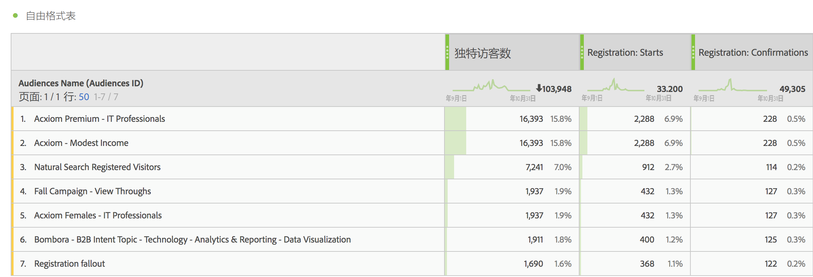
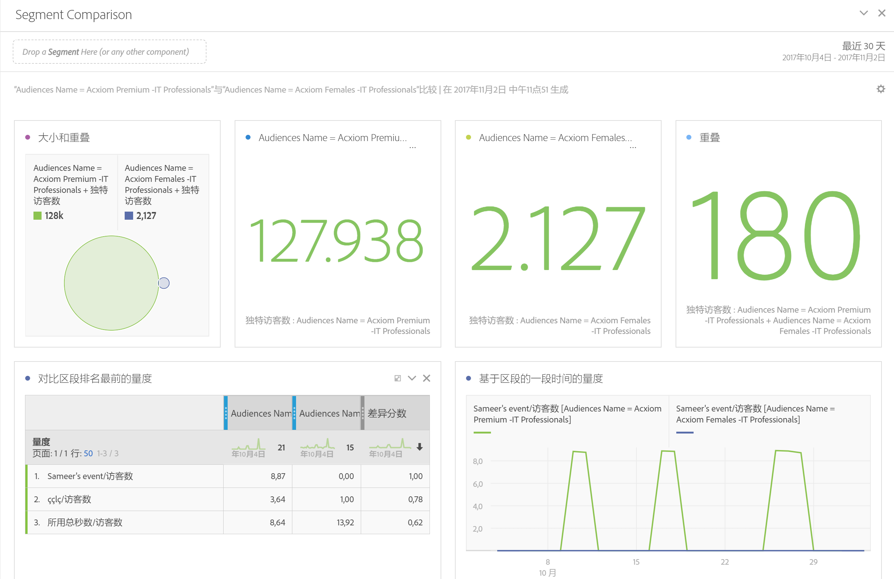
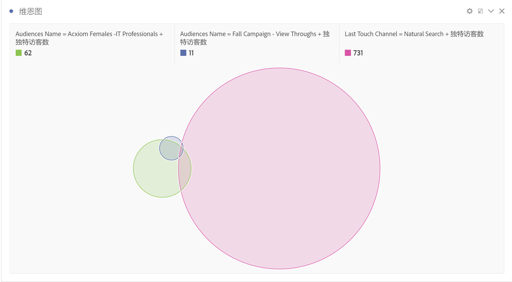
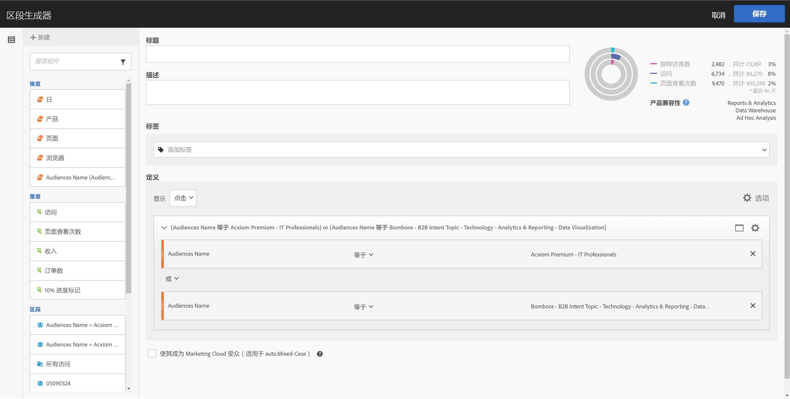
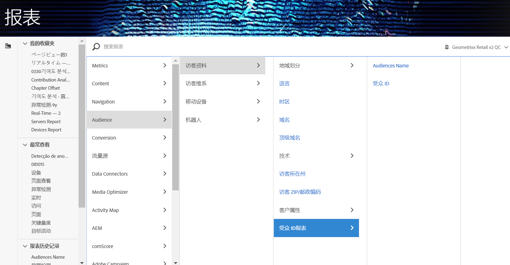

# 在 Analytics 中使用受众数据

您可以在整个 Analytics 中使用 AAM 受众维度。集成的区段是名为“受众 ID”和“受众名称”的新 Analytics 维度，并且可以像 Analytics 收集的任何其他维度一样使用。在数据馈送中，受众 ID 存储在“mc_audiences”列中。这些维度当前在 Data Workbench 或 Livestream 中不可用。有关如何利用受众维度的一些示例包括：

## Analysis Workspace {#section_C70837499BEA4DED885B3486C9E02C68}

在 Analysis Workspace 中，AAM 区段显示为两个维度。

1. Go to **[!UICONTROL Workspace]**.
1. From the list of **[!UICONTROL Dimensions]**, select the dimensions **[!UICONTROL Audience ID]** or **[!UICONTROL Audience Name]**. 名称即是一种易记的 ID 分类。

   

## 区段比较 {#section_E72B80B6470C42D4B9B19BE90E6070A2}

[区段比较](https://marketing.adobe.com/resources/help/en_US/analytics/analysis-workspace/segment-comparison.html)可发现两个区段间在统计上的最显著差异。区段比较通过以下两种方式来使用受众数据：1) 作为正在进行比较的 2 个区段，2) 作为“排名最前的维度项目”表中的项目。

1. 转至&#x200B;**[!UICONTROL 工作区]**&#x200B;并从左边栏中选择&#x200B;**区段比较]面板。[!UICONTROL **

1. 在组件&#x200B;**菜单中搜索[!UICONTROL 受众名称]。**

1. 打开[!UICONTROL 受众名称]，以便显示相关的维度项目。
1. 将需要比较的受众拖至区段比较生成器中。
1. （可选）：您还可以放入其他维度项目或区段中，最多可比较 2 个。
1. Click **[!UICONTROL Build]**.

   受众 ID 和名称维度将自动显示在“排名最前的维度项目”表中，因为它们是两个正在进行比较的区段的额外配置文件数据。

   

## Analysis Workspace 中的客户历程（流量） {#section_FC30E5795C9D4539838E30FE11FAEA6E}

AAM 区段数据依据逐次点击传递到 Analytics 中，表示访客在该时间点所具有的受众成员资格。这意味着，访客可能归属于一个区段（例如“感知”），然后又有资格访问另外一个获得授权的区段（例如“注意事项”）。您可以在 Analysis Workspace 中使用[流量](https://marketing.adobe.com/resources/help/en_US/analytics/analysis-workspace/flow.html)显示访客在各受众之间的历程。

1. 转至&#x200B;**[!UICONTROL 工作区]**&#x200B;并从左边栏中选择&#x200B;**流量]可视化。[!UICONTROL **

1. 将[!UICONTROL 受众名称]维度拖至流量生成器中。
1. Click **[!UICONTROL Build]**.
1. （可选）将任何其他维度拖至流量可视化中以创建[维度间流量](https://marketing.adobe.com/resources/help/en_US/analytics/analysis-workspace/multi-dimensional-flow.html)。

受众还可用于[流失可视化](https://marketing.adobe.com/resources/help/en_US/analytics/analysis-workspace/fallout_flow.html)。

## Analysis Workspace 中的维恩可视化 {#section_E78AB764FB5047148B51DC1526B0DF89}

[维恩可视化](https://marketing.adobe.com/resources/help/en_US/analytics/analysis-workspace/venn.html)显示最多 3 个区段之间的叠加。

1. 转至&#x200B;**[!UICONTROL 工作区]**&#x200B;并从左边栏中选择&#x200B;**维恩]可视化。[!UICONTROL **

1. 在组件菜单中搜索[!UICONTROL 受众名称]。
1. 打开[!UICONTROL 受众名称]以便显示相关的维度项目。
1. 将需要比较的受众拖至维恩生成器中。
1. （可选）：您还可以放入其他维度项目或区段，最多可比较 3 个。
1. Click **[!UICONTROL Build]**.

## 区段生成器 {#section_2AA81852A1404AB894472CA8959461B6}

您可以整合 Analytics [区段生成器](https://marketing.adobe.com/resources/help/en_US/analytics/segment/seg_build.html)中的受众维度，以及 Analytics 收集到的行为信息。

1. Go to  **[!UICONTROL Components]** &gt; **[!UICONTROL Segments]** .
1. 单击&#x200B;**[!UICONTROL 添加]以创建一个新区段。**
1. 在命名区段后，将[!UICONTROL 受众名称]维度拖至定义面板中。
1. （可选）：向区段添加其他标准。
1. 保存该区段。

   

## Reports &amp; Analytics 和 Report Builder {#section_04E8FD30F73344D7937AD3C6CD19E34A}

1. To view the Analytics report, go to  **[!UICONTROL Reports]** &gt; **[!UICONTROL Visitor Profile]** &gt; **[!UICONTROL Audience ID Reports]** .
1. 从该文件夹中，您可以同时访问受众 ID 和受众名称维度。

   

