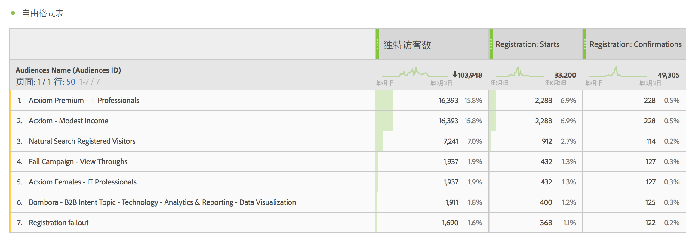
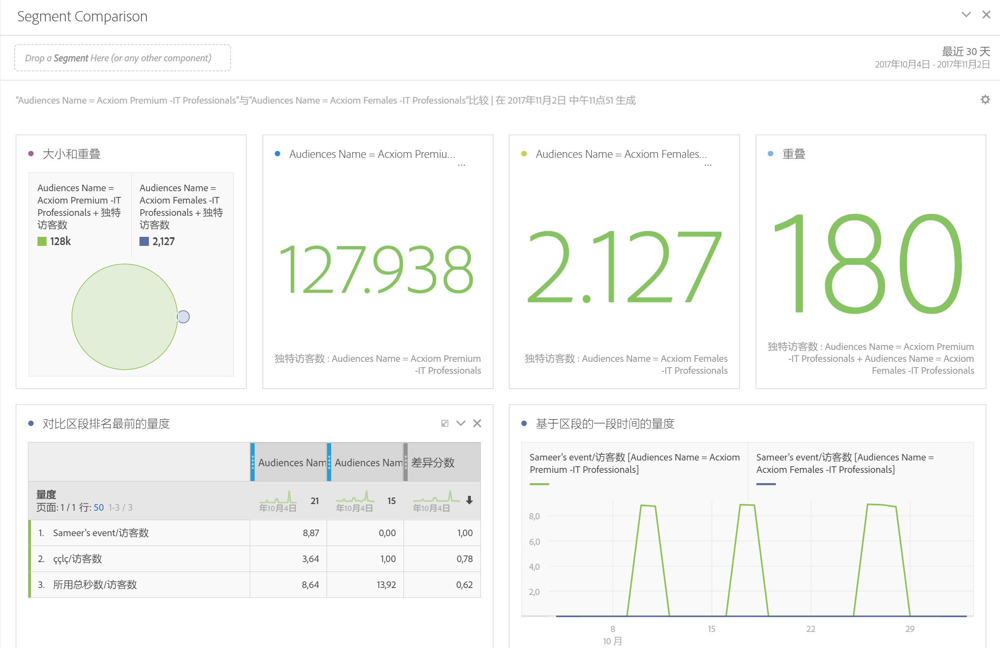
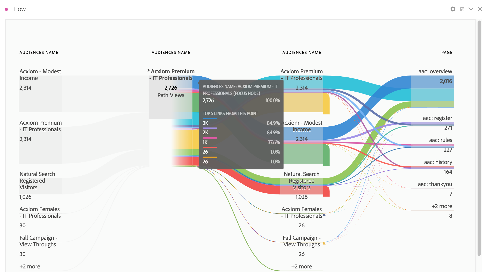
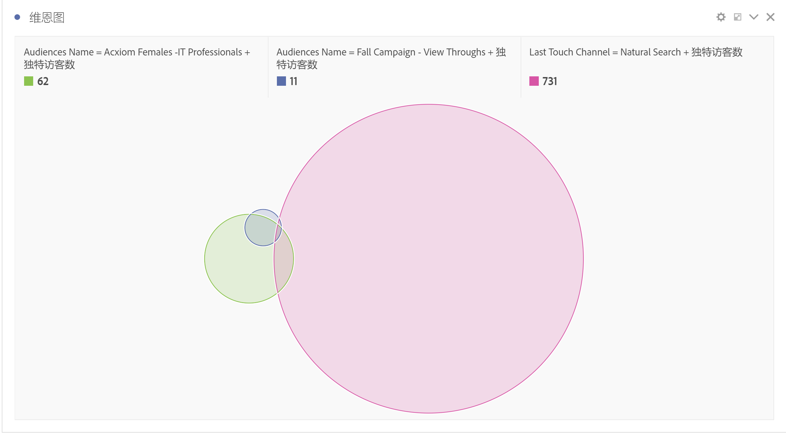
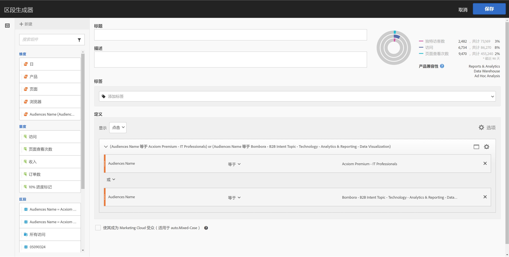

# 在 Analytics 中使用受众数据

您可以在整个Analytics中使用Adobe Audience Manager受众维度。 集成区段是新的Analytics维度，称为受众ID和受众名称，其使用方式与Analytics收集的任何其他维度相同。 在数据馈送中，受众 ID 存储在“mc_audiences”列中。 这些维度当前在 Data Workbench 或 Livestream 中不可用。 有关如何利用受众维度的一些示例包括：

## Analysis Workspace {#workspace}

在Analysis Workspace中，Adobe Audience Manager区段显示为两个维度。

1. 转到&#x200B;**[!UICONTROL Workspace]**。
1. 从&#x200B;**[!UICONTROL 维度]**&#x200B;的列表中，选择维度&#x200B;**[!UICONTROL 受众ID]**&#x200B;或&#x200B;**[!UICONTROL 受众名称]**。 名称是ID的友好分类。

   

## 区段比较 {#compare}

[区段比较](/help/analyze/analysis-workspace/c-panels/c-segment-comparison/segment-comparison.md)可发现两个区段间在统计上的最显著差异。 区段比较可通过以下两种方式来使用受众数据：1) 作为正在进行比较的 2 个区段，2) 作为“排名最前的维度项目”表中的项目。

1. 转到&#x200B;**[!UICONTROL Workspace]**，然后从左边栏中选择&#x200B;**[!UICONTROL 区段比较]**&#x200B;面板。

1. 在&#x200B;**[!UICONTROL 组件]**&#x200B;菜单中搜索[!UICONTROL 受众名称]。

1. 打开[!UICONTROL 受众名称]，以便显示相关的维度项目。
1. 将您要比较的受众拖到“区段比较生成器”中。
1. （可选）：您也可以引入其他维度项目或区段，最多可比较2个维度项目或区段。
1. 单击&#x200B;**[!UICONTROL 生成]**。

   受众 ID 和名称维度将自动显示在“排名最前的维度项目”表中，因为它们是两个正在进行比较的区段的额外轮廓数据。

   

## Analysis Workspace 中的客户历程（流量） {#flow}

Adobe Audience Manager区段数据是按点击传递到Analytics中的，表示访客在该时间点所具有的受众成员资格。 这意味着，访客可能归属于一个区段（例如“感知”），然后又有资格访问另外一个获得授权的区段（例如“注意事项”）。 您可以使用Analysis Workspace中的[流量](/help/analyze/analysis-workspace/visualizations/fallout/fallout-flow.md)可视化访客在受众之间所经历的历程。

1. 转到&#x200B;**[!UICONTROL Workspace]**，然后从左边栏中选择&#x200B;**[!UICONTROL 流量]**&#x200B;可视化图表。

1. 将[!UICONTROL 受众名称]维度拖动到流量生成器中。
1. 单击&#x200B;**[!UICONTROL 生成]**。
1. （可选）将任何其他维度拖至流量可视化中以创建[维度间流量](/help/analyze/analysis-workspace/visualizations/c-flow/multi-dimensional-flow.md)。

受众也可以在[流失可视化图表](/help/analyze/analysis-workspace/visualizations/fallout/fallout-flow.md)中使用。

## Analysis Workspace中的维恩图可视化图表 {#venn}

[维恩图可视化图表](/help/analyze/analysis-workspace/visualizations/venn.md)显示最多3个区段之间的重叠。

1. 转到&#x200B;**[!UICONTROL Workspace]**，然后从左边栏中选择&#x200B;**[!UICONTROL 维恩图]**&#x200B;可视化图表。

1. 在组件菜单中搜索[!UICONTROL 受众名称]。
1. 打开[!UICONTROL 受众名称]，以便显示相关的维度项目。
1. 将您要比较的受众拖到维恩生成器中。
1. （可选）：您也可以引入其他维度项目或区段，最多可比较3个维度项目或区段。
1. 单击&#x200B;**[!UICONTROL 生成]**。

## 区段生成器 {#builder}

您可以整合 Analytics [区段生成器](/help/components/segmentation/segmentation-workflow/seg-build.md)中的受众维度，以及 Analytics 收集到的行为信息。

1. 转至&#x200B;**[!UICONTROL 组件]** > **[!UICONTROL 区段]**。
1. 单击&#x200B;**[!UICONTROL 添加]**&#x200B;以创建一个新区段。
1. 在命名区段后，将[!UICONTROL 受众名称]维度拖动到“定义”面板中。
1. （可选）：向区段添加其他标准。
1. 保存区段。

   

