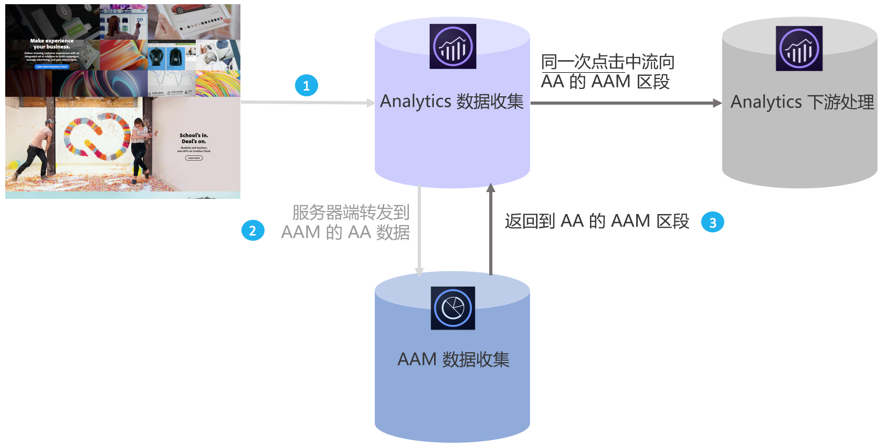

# Audience Analytics概述

Adobe Audience Manager (AAM) 作为一款功能强大的数据管理平台，可帮助您通过第一方、第二方/合作伙伴以及第三方数据集成，来构建独一无二的受众配置文件。对广告商而言，这些受众配置文件有助于定义要跨任何数字渠道使用的最有价值的区段。

通过部署 Audience Analytics 集成，您可以将 AAM 受众数据（例如，性别或收入水平等人口统计学信息、兴趣和爱好等心理学信息、CRM 数据和广告展示次数数据）整合到任何 Analytics 工作流程中。

## 主要优点 {#section_94816D17283349E0BA28521BE55BB868}

Audience Analytics 集成功能具有以下主要优点：

* 它是数据管理平台 (DMP) 和市场上的分析引擎之间的第一次产品化集成。
* 区段可从 AAM 实时共享到 Analytics，以报告受众发现、分段和优化。
* 默认情况下共享所有 AAM 区段，这极大地丰富了 Analytics 中的客户配置文件。
* 解决方案管理员只需极少的代码更改即可通过用户界面启用集成。
* 仅共享符合 Audience Manager 数据导出控件要求的区段。

## 工作原理 {#section_CECDF5A0FEC64264B206EFEF54F19EF2}

1. 每当访客访问您的数字属性时，都会收集点击量并将其发送给 Analytics。
1. 通过[服务器端转发](/help/admin/admin/c-server-side-forwarding/ssf.md)，Analytics 收到的每次点击都会实时地自动发送给 AAM。
1. 通过 Audience Analytics 集成，对于每次点击，均会在 AAM 中查找访客的受众成员资格，并将区段 ID 列表返回到 Analytics 以便进行实时处理。

由于 AAM 区段是基于相同点击而插入的，您可以确保无论 AAM 中有哪些关于访客的数据，该数据都不会丢失并针对该点击保持最新状态。由于插件只能在下一次点击（而不是当前点击）时提供这些区段，因此这种方式要优于 AppMeasurement 插件。

此外，我们会自动将 AAM 区段 ID 划分到其易记名称，因此您不必在 Analytics 报表中查看字母数字 ID。

## 先决条件 {#section_A345DC31F7D44EAE9DC1AB53E824C0CC}

请确保满足以下先决条件：

* 您既是 Audience Manager 的客户，也是 Adobe Analytics 的客户。
* 您是 Audience Manager 管理员。
* 您使用的是Identity Service v1.5或更高版本。
* AAM 和 Adobe Analytics 报表包[已映射到相同的 Experience Cloud 组织](https://marketing.adobe.com/resources/help/en_US/mcloud/report-suite-mapping.html)。
* You use [server-side forwarding](/help/admin/admin/c-server-side-forwarding/ssf.md) and have implemented the [Audience Management module](https://marketing.adobe.com/resources/help/en_US/aam/c_profiles_audiences.html) (no DIL code) - AppMeasurement 1.5 or later.

[受众分析工作流程](../../integrate/c-audience-analytics/c-workflow/audiences-workflow.md#concept_A5F067D14C794B759A1D92526DE27F83)中介绍了这些先决条件。
