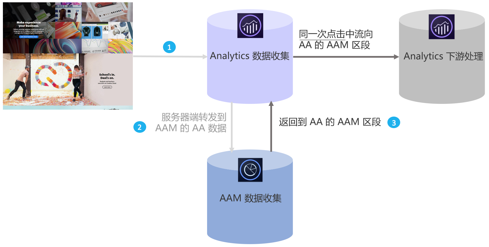

# Audience Analytics 概述

Adobe Audience Manager (Adobe Audience Manager)是一个功能强大的数据管理平台，可帮助您从第一方、第二方/合作伙伴和第三方数据集成构建独一无二的受众配置文件。 对于广告商，这些受众配置文件有助于定义在任何数字渠道中使用的最有价值的区段。

Audience Analytics集成就绪后，您可以将Adobe Audience Manager受众数据(如人口统计信息（如性别或收入水平）、心理统计信息（如兴趣和爱好）、CRM数据和广告展示数据)合并到任何Analytics工作流程中。

>[!BEGINSHADEBOX]

观看演示视频，请参阅 [Audience Analytics](https://experienceleague.adobe.com/zh-hans/docs/analytics-learn/tutorials/integrations/audience-manager/audience-analytics-integrate-aam-segments-into-analytics){target="_blank"}。

>[!ENDSHADEBOX]

## 主要优势 {#benefits}

Audience Analytics集成具有以下主要优势：

* 它是数据管理平台(DMP)与市场分析引擎之间的第一个产品化集成。
* 区段可实时从Adobe Audience Manager共享到Analytics，以告知受众发现、分段和优化。
* 默认情况下共享所有Adobe Audience Manager区段，从而完全丰富Analytics中的客户配置文件。
* 解决方案管理员可以通过用户界面启用集成，只需最少的代码更改即可。
* 只有符合Audience Manager数据导出控制的区段才会共享。

## Audience Analytics的工作原理 {#works}

1. 每次有访客访问您的数字资产时，系统都会收集点击量并将其发送到Analytics。
1. 通过[服务器端转发](/help/admin/tools/manage-rs/edit-settings/general/c-server-side-forwarding/ssf.md)，Analytics收到的每次点击都会实时自动发送到Adobe Audience Manager。
1. 通过Audience Analytics集成，对于每次点击，均会在Adobe Audience Manager中查找访客的受众成员资格，并将区段ID列表返回到Analytics以便实时处理。

由于Adobe Audience Manager区段是在同一次点击的基础上插入的，因此您可以确保Adobe Audience Manager中有关某个访客的所有可用数据都不会丢失并且会保持该点击的最新状态。 此插件比AppMeasurement插件更有优势，因为插件可以使这些区段仅在下一次点击（而非当前点击）时可用。

此外，我们会自动将Adobe Audience Manager区段ID分类为其易记名称，以便您不必在Analytics报表中查看字母数字ID。

## 先决条件 {#prerequisites}

确保满足以下先决条件：

* 您同时是Audience Manager和Adobe Analytics的客户。
* 您是Audience Manager管理员。
* 您使用的是身份标识服务 v1.5 或更高版本。
* Adobe Audience Manager和Adobe Analytics报表包已映射到同一个CX Enterprise组织。
* 您使用[服务器端转发](/help/admin/tools/manage-rs/edit-settings/general/c-server-side-forwarding/ssf.md)并实施了[受众管理模块](https://experienceleague.adobe.com/docs/audience-manager/user-guide/implementation-integration-guides/integration-other-solutions/audience-management-module.html?lang=zh-Hans)（不是 DIL 代码）- AppMeasurement 1.5 或更高版本。

[Audience Analytics 工作流程](/help/integrate/c-audience-analytics/c-workflow/audiences-workflow.md)中介绍了这些先决条件。
