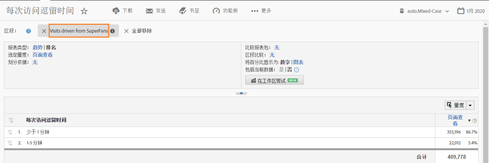

# Segmenting by Dynamic Signal Dimensions{#segmenting-by-dynamic-signal-dimensions}

基于动态信号尺寸的细分示例。

此集成的主要功能是根据集成的报表维度创建Adobe Analytics细分。例如，您可以构建一个区段，其中仅包含源自特定VoiceStorm社区的访问。您可能将此称为“从超级粉丝驱动的访问”。此区段定义可能如下所示。

