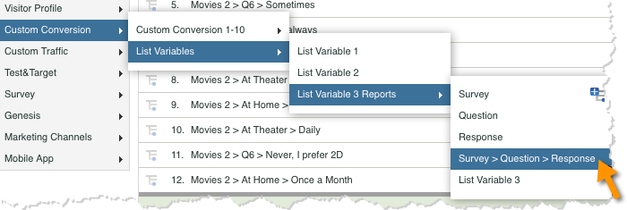

# Verifying the Integration{#verifying-the-integration}

完成所有部署步骤之后，您可以验证集成成功传输数据。

1. **集成活动日志**：在数据连接器UI中，查看Qualtrics集成上的 **[!UICONTROL “支持]** ”选项卡。Under the heading **[!UICONTROL Integration Activity Log]** you should see entries stating successful classification data imported.

   >[!NOTE]
   >
   >这些条目应在成功部署后的小时内显示。

   

1. **报表数据**：导航Qualtrics调查报告(在 **[!UICONTROL 列表变量]**&#x200B;下)，查看您的Qualtrics调查报告和营销报告和分析UI。

   >[!NOTE]
   >
   >此数据应在成功部署的24-48小时内显示，假定集成调查正在积极接收响应。

    

