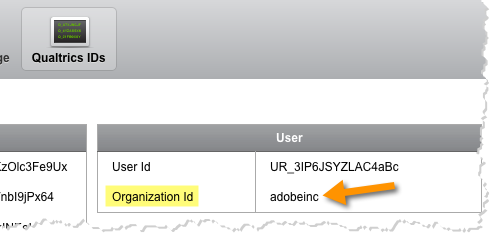

# Looking up your Qualtrics Organization ID{#looking-up-your-qualtrics-organization-id}

完成集成向导需要组织ID。要找到此ID，您必须执行以下操作。

1. 登录Qualtrics Research Suite。
1. Click **[!UICONTROL Account Settings]** on your user menu.

   

1. Click on **[!UICONTROL Qualtrics IDs]**.

   

1. Find and save the **[!UICONTROL Organization Id]** in the **[!UICONTROL User]** section.

   

