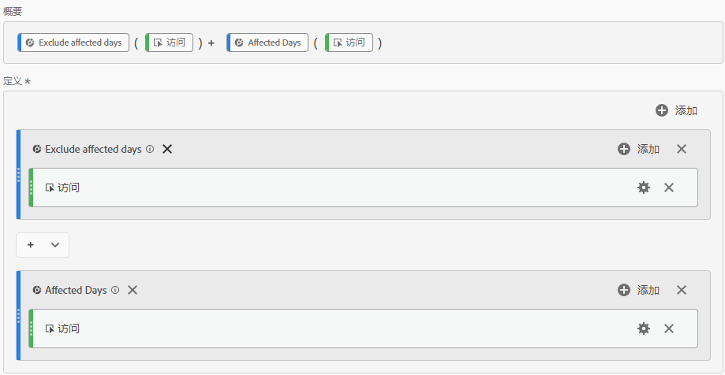
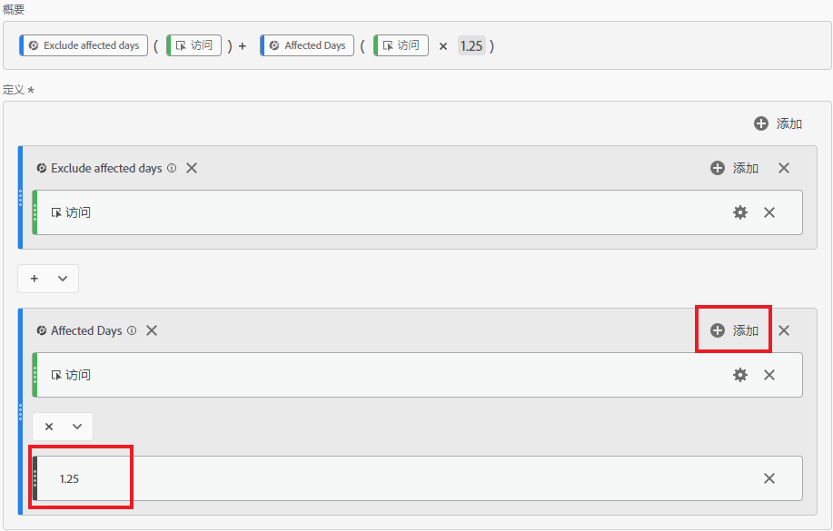
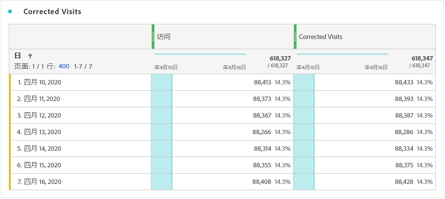

# 派生受事件影响的数据

如果您的数据[受事件](overview.md)影响，则可以使用计算量度推导该事件持续时间的预计值。 例如，如果某个事件导致数据减少25%，则可以将其用作计算量度中的乘数。

当您从分段和日期比较的视角了解事件影响时，这些步骤最有效。 请确保在关注此页面之前遵循[将受事件影响的日期与先前的范围进行比较](compare-dates.md)和[在分析中排除特定日期](segments.md)。

>[!NOTE]
>
>此方法乃根据一组特定输入及日期范围作出估计。 它不是针对所有用例或数据片段的全面解决方案。 此外，此方法要求受影响的日期范围至少有1次点击可供计算。

要为受影响的时段创建估计的计算指标，请执行以下操作：

1. 按照[在分析中排除特定日期](segments.md)中所述，为“受影响的日期”和“排除受影响的日期”创建两个区段。
2. 导航到&#x200B;**[!UICONTROL 组件]** > **[!UICONTROL 计算量度]**。
3. 单击&#x200B;**[!UICONTROL 添加]**。
4. 将以上两个区段拖动到定义画布。 将它们之间的运算符更改为`+`以求和。
5. 在两个区段中添加所需的量度。 例如，您可以使用“访问次数”量度。

   

6. 单击“受影响的天数”容器右上角的&#x200B;**[!UICONTROL 添加]**，然后单击&#x200B;**[!UICONTROL 静态数字]**。 将静态数字设置为要偏移数据的百分比，如[将受事件影响的日期与先前的范围进行比较](compare-dates.md)中所述。 在本例中，偏移为25%，即1.25。

   

7. 在趋势自由格式表中并排应用“更正”的量度。 事件外的所有天数反映了它们的正常量度计数，而所有受影响的天数都使用乘数偏移。

   

8. 在折线图可视化图表中查看数据，以查看修正后指标的效果。

   
