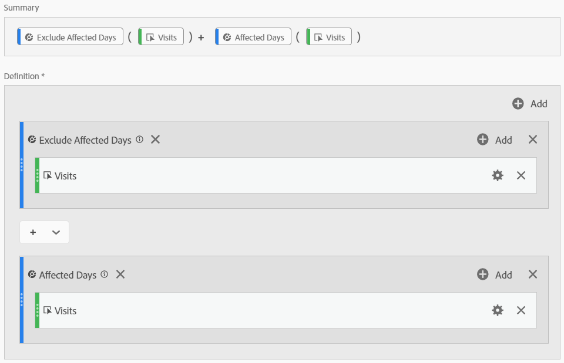

# 派生受事件影响的数据

如果事件影 [响了](overview.md)，则可以使用计算量度来推导事件持续时间的估计值。 例如，如果您的事件导致数据下降25%，则可以将其用作计算度量中的乘数。

当您从细分和日期比较角度了解事件的影响时，这些步骤会发挥最佳作用。 确保在此页 [面之前，在事件中比较受影响的日期](compare-dates.md) , [并在分析中排除特定日期](segments.md) 。

>[!NOTE]
>
>此方法是根据一组特定输入数据及日期范围作出估计。 它不会是针对所有使用案例或数据片段的全面解决方案。 此外，此方法要求受影响的日期范围至少有1次点击才能计算。

要为受影响的时间段创建估计的计算量度，请执行以下操作：

1. 如排除分析中的特定日期中所述，为“受影响的日期”和“排除受影响 [的日期”创建两个区段](segments.md)。
2. 导航到 **[!UICONTROL 组件]** >计 **[!UICONTROL 算量度]**。
3. 单击&#x200B;**[!UICONTROL 添加]**。
4. 将以上两个区段拖动到定义画布。 将它们之间的运算符更 `+` 改为求和。
5. 在两个区段内添加所需的量度。 例如，您可以使用“访问”量度。

   

6. 单 **[!UICONTROL 击]** “受影响的天数”容器右上角的“添加”，然后单击“ **[!UICONTROL 静态编号”]**。 将静态数字设置为要抵消数据的百分比，如将受事件影响 [的日期与先前范围进行比较中所述](compare-dates.md)。 在此示例中，偏移量为25%或1.25。

   

7. 在趋势自由表格中并排应用“已更正”的度量。 事件以外的所有天都反映其正常度量计数，而所有受影响的天都使用乘数偏移。

   

8. 视图行可视化中的数据，查看更正的度量的效果。

   
