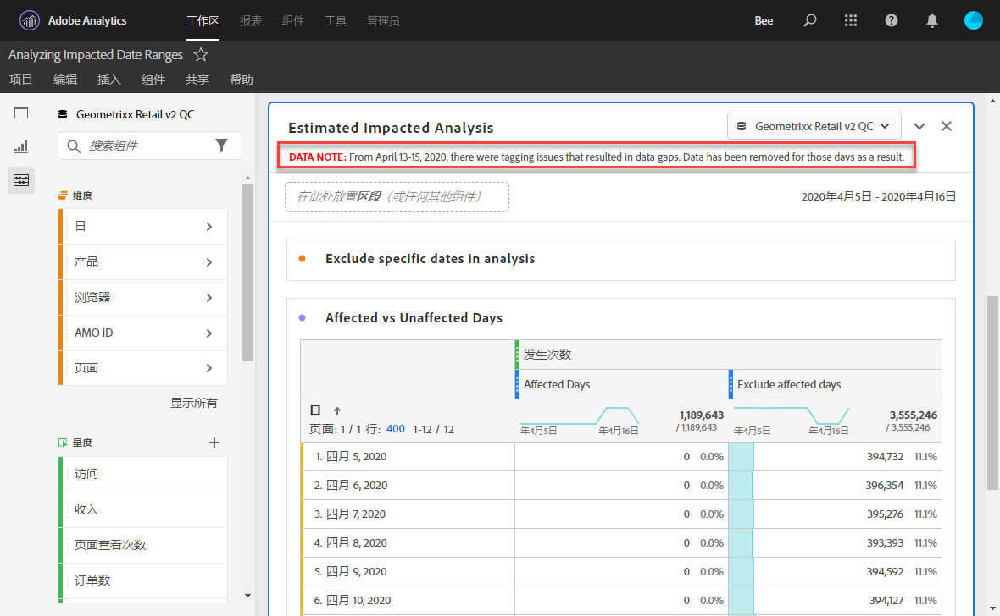
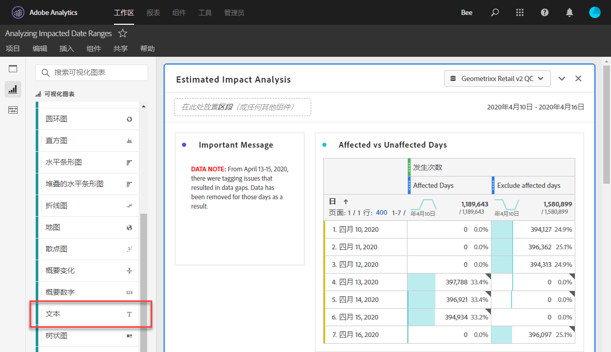
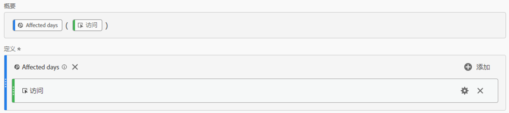
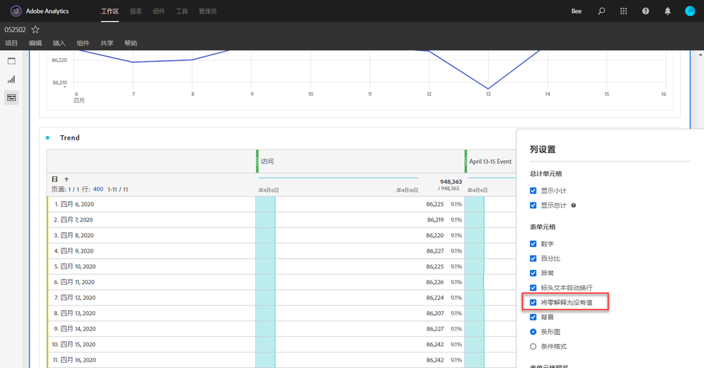
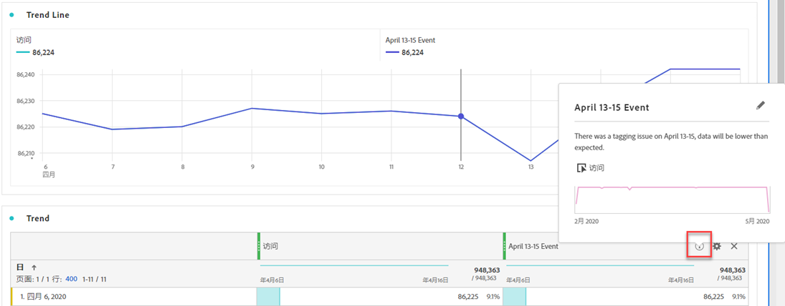

# 将事件影响告知用户

如果您的数据[受事件](overview.md)影响，请务必将该事件告知组织中的用户。

* 制定可在通信中使用的通用免责声明，以保持一致性
* 在活动期间和之后持续与Analytics用户和主要利益相关者沟通
* 为后续里程碑（例如下个月或下一年）设置日历提醒。 此通信可帮助提醒查看报表的用户月同比报表或年同比报表的影响。

在Adobe Analytics中，以下部分显示与组织中用户沟通的不同方式。 您也可以使用Adobe Analytics以外的其他方法（如电子邮件）与用户通信。

## 通过面板或可视化图表描述进行通信

如果您在组织中的用户之间共享了Workspace项目，则可以通过面板或可视化图表描述来传达事件的影响。 右键单击面板或可视化图表标题，然后选择&#x200B;**[!UICONTROL 编辑描述]**。

## 通过文本可视化图表进行通信

您还可以通过专用的文本可视化图表传达事件的影响。 请参阅分析用户指南中的[文本可视化图表](/help/analyze/analysis-workspace/visualizations/text.md)。

## 将自定义日历事件添加到Workspace中的趋势

对于Workspace中的任何趋势可视化图表，您可以添加一个数列，以表示受影响的日期范围。

1. 按照[在分析中排除特定日期](segments.md)创建具有“受影响的天数”区段的计算指标。
1. 将所需的量度添加到计算量度画布。

   

1. 添加标题和描述，以告知用户影响。 如果需要，您还可以将此量度标记为日历注释。

   

1. 在自由格式表中，添加“日”维度。 将“访问量”和计算量度作为列并排添加。

   

1. 单击计算量度的列设置齿轮图标，并启用&#x200B;**[!UICONTROL 将零解释为没有值]**。

   

1. 添加折线图可视化图表。 受影响的日期使用不同的颜色表示。 用户还可以单击计算指标中的“信息”图标以了解更多信息。

   

