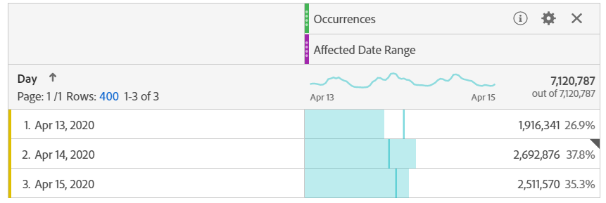

# 将受事件影响的日期与先前的范围进行比较

如果事件影 [响了](overview.md)，您可以查看历史趋势来评估其影响。 此比较对于了解事件对数据的影响程度非常有价值，因此您可以决定是排除数据、在报告中添加备注还是忽略它。

## 创建包含事件的日期范围

创建包含事件的日期范围，以开始探索该事件的影响。

1. 导航到 **[!UICONTROL 组件]** >日 **[!UICONTROL 期范围]**。
2. 单击&#x200B;**[!UICONTROL 添加]**。
3. 选择发生事件的日期范围。 单击&#x200B;**[!UICONTROL 保存]**。

   

## 视图事件日期和类似的先前范围并排

您可以使用自由形式表可视化将事件的日期范围与相似的先前日期范围之间的任何度量进行比较。

1. 打开一个Workspace项目，并将“天”维添加到自由形式表。 应用累积在度量上的最近创建的日期范围，如“发生次数”。

   

2. 右键单击日期范围，然后单 **[!UICONTROL 击添加时间段列]** > **[!UICONTROL 自定义日期范围到此日期范围]**。
   * 要进行一周比较，请选择事件减7天的范围。 确保事件与此日期范围之间的一周中的天数保持一致。
   * 对于按月比较，请选择上个月事件的范围。 如果要对齐一周中的天数，还可以选择事件减28天的范围。
   * 要进行逐年比较，请选择去年的事件范围。
3. 当您选择所需的日期范围时，这些日期范围将添加到自由格式表中。 您可以右键单击并添加任意想要比较的日期范围。

   

## 计算事件与相似先验范围之间的百分比差异

使用自由形式表可视化，在事件的日期范围和类似的先前日期范围之间比较维度项目。 这些步骤说明了您可以关注的一周比一周的示例。

1. 打开一个Workspace项目，并向 **自由形式表添加** 一个非时间维。 例如，您可以使用“移动设备类型”维。 应用累积在度量上的最近创建的日期范围，如“发生次数”:

   

2. 右键单击日期范围，然后单击 **[!UICONTROL 比较时间段]** >自 **[!UICONTROL 定义日期范围到此日期范围]**。 选择事件减7天的范围。 确保事件与此日期范围之间的一周中的天数保持一致。

   

3. 将生成的“百分比更改”量度重命名为更具体的指标，如“WoW受影响范围”。 单击信息图标，然后单击编辑铅笔以编辑度量名称。

   

4. 重复步骤3和4，进行逐月和逐年比较。 可以在同一表或单独的表中执行此操作。

## 并排分析比较日期范围（如行）

如果要进一步分析上述百分比更改，可以将它们转换为行。

1. 添加自由形式表可视化并启用表生成器。 通过此操作，您可以按所需顺序放置百分比更改量度。
2. 按住 `Ctrl` (Windows) `Cmd` 或(Mac)并将3%的更改量度拖动到表的行中，一次一个。

   

3. 将“所有访问”区段添加到表的列，以及任何其他所需的区段。

   

4. 单击&#x200B;**[!UICONTROL 生成]**。从生成的表中，您可以视图任何所需区段的受影响范围与上周、月和年的相比。

   
