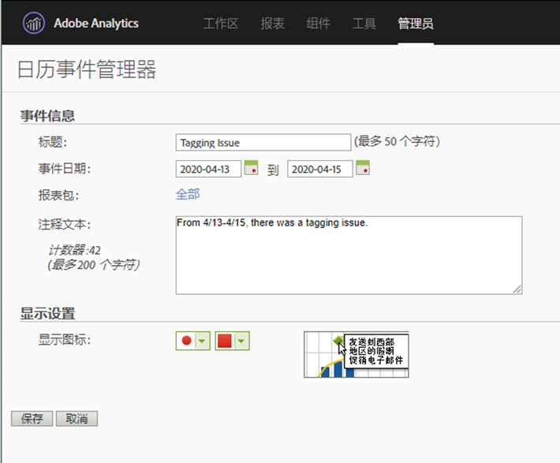

# 向用户传达影响

如果数据受 [到事件影响](../event-impacted.md)，请务必将该事件传达给组织中的用户。 以下各节显示了与组织中的用户进行通信的不同方式。

## 通过面板或可视化描述进行通信

如果您的组织中的用户共享了一个工作区项目，则可以通过面板或可视化描述来传达事件的影响。 右键单击面板或可视化标题，然后选择编 **[!UICONTROL 辑说明]**。

## 通过文本可视化进行交流

您还可以通过专用的文本可视化来传达事件的影响。 See [Text visualizations](/help/analyze/analysis-workspace/visualizations/text.md) in the Analyze user guide.

## 在Reports &amp; Analytics中使用日历事件

如果您使用Reports &amp; Analytics，则可以使用日历 [事件](/help/components/t-calendar-event.md) ，在任何趋势报告中突出显示受影响的日期。 此方法不适用于分析工作区。

1. 导航到 **[!UICONTROL 组件]** >日 **[!UICONTROL 历事件]**。
2. 输入所需的标题、日期范围和附注文本。
3. 单击&#x200B;**[!UICONTROL 保存]**。

