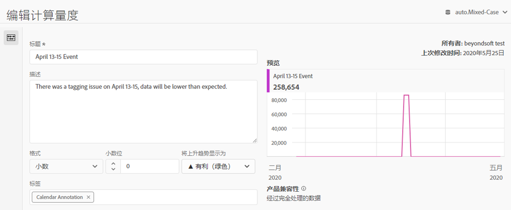
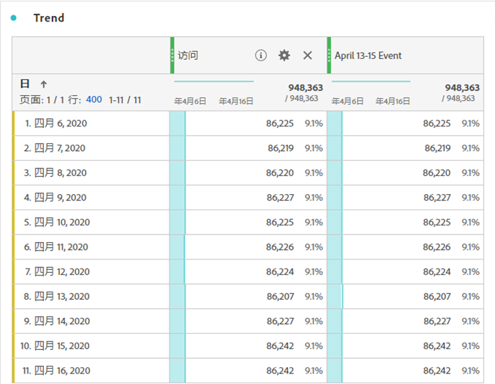
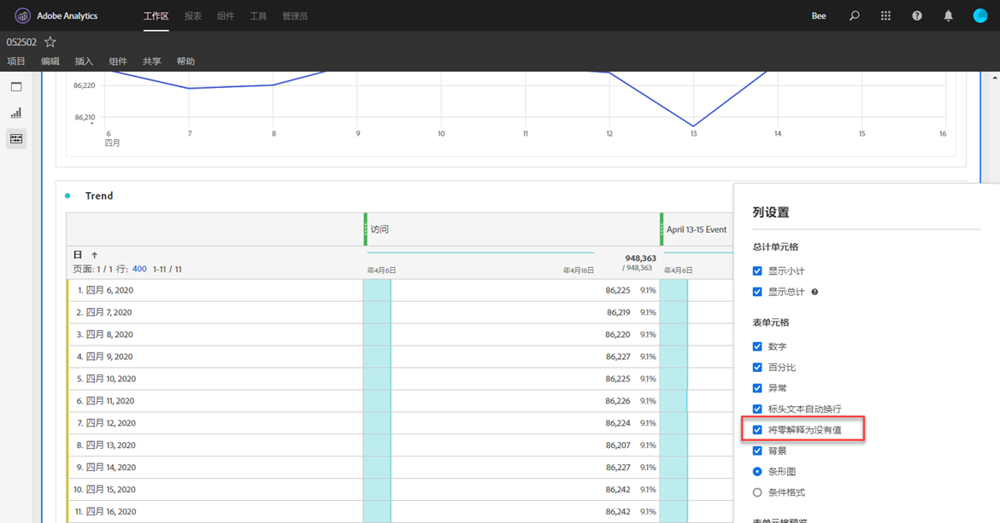
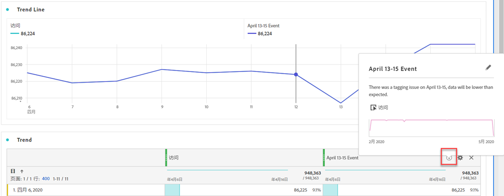

# 向用户传达影响

如果数据受 [到事件影响](../event-impacted.md)，请务必将该事件传达给组织中的用户。

* 制作可在通信中使用的通用免责声明，以实现一致性
* 在事件期间和之后，向Analytics用户和主要利益相关方提供持续沟通
* 为后续里程碑（如下月或年）发送日历提醒。 此通信将来有助于提醒查看报告的用户在按月或按年报告中的影响。

在Adobe Analytics中，以下部分显示了您与组织中的用户进行通信的不同方式。 您还可以使用Adobe Analytics之外的其他方法（如电子邮件）与用户进行交流。

## 通过面板或可视化描述进行通信

如果您的组织中的用户共享了一个工作区项目，则可以通过面板或可视化描述来传达事件的影响。 右键单击面板或可视化标题，然后选择 **[!UICONTROL Edit description]**。

## 通过文本可视化进行交流

您还可以通过专用的文本可视化来传达事件的影响。 See [Text visualizations](/help/analyze/analysis-workspace/visualizations/text.md) in the Analyze user guide.

## 将自定义日历事件添加到Workspace中的趋势

对于Workspace中的任何趋势可视化，您可以添加一个表示受影响日期范围的系列。

1. 通过遵循排除分析中的特定日期，使用“受影响的天数”区段 [创建计算量度](/help/components/c-segmentation/use-cases/exclude-date-range.md)。
1. 将所需的量度添加到计算的量度画布。

   

1. 添加标题和说明，告知用户影响。 如果需要，还可以将此量度标记为日历注释。

   

1. 在自由格式表中，添加“天”维。 将“访问”和计算量度并排添加为列。

   

1. 单击计算量度的列设置齿轮图标，然后启用 **[!UICONTROL Interpret zero as no value]**。

   

1. 添加线条可视化。 受影响的天数以不同的颜色表示。 用户还可以单击计算度量中的“信息”图标以了解更多信息。

   

## 在Reports &amp; Analytics中使用日历事件

如果您使用Reports &amp; Analytics，则可以使用日历 [事件](/help/components/t-calendar-event.md) ，在任何趋势报告中突出显示受影响的日期。 此方法不适用于分析工作区。

1. 导航到 **[!UICONTROL Components]** > **[!UICONTROL Calendar events]**。
2. 输入所需的标题、日期范围和附注文本。
3. 单击 **[!UICONTROL Save]**.

