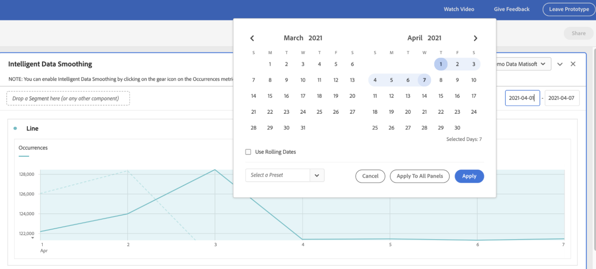
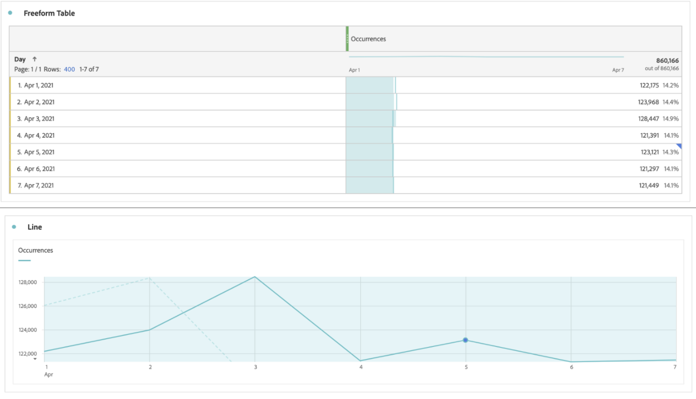

# 智能数据平滑

在极少数情况下，某些因素可能会影响数据质量。 机器人流量、实施更改或服务中断都可能影响所收集数据的完整性。 它们还使分析事件如何影响数据完整性变得复杂。

智能数据平滑是[Analytics Labs](/help/analyze/labs.md)中的一个原型，它通过分析历史趋势来预测受影响时间段内任何量度的值，从而帮助完成此视图。 原型应用先进的机器学习算法，以绘制所分析时段内量度的预期值。

## 运行智能数据平滑

1. 导航到Adobe Analytics Labs：
   
1. 启动智能数据平滑化原型。
   
1. 将必须分析的指标添加到自由格式表。 原型仅对每日粒度起作用，因此请确保表中的维度为“日”。
   
1. 选择比事件窗口宽的日期范围，但请确保该日期范围包含事件。
   
1. 单击自由格式表中量度的齿轮图标。
   
1. 在[!UICONTROL 数据设置]下，选择[!UICONTROL 数据平滑]选项。
   
1. 选择与事件对应的日期/日期范围，然后单击[!UICONTROL 应用]。
确保用于数据平滑的数据范围是为面板选择的日期范围的子集。 表和图表中的量度将被预测值替换。
   
