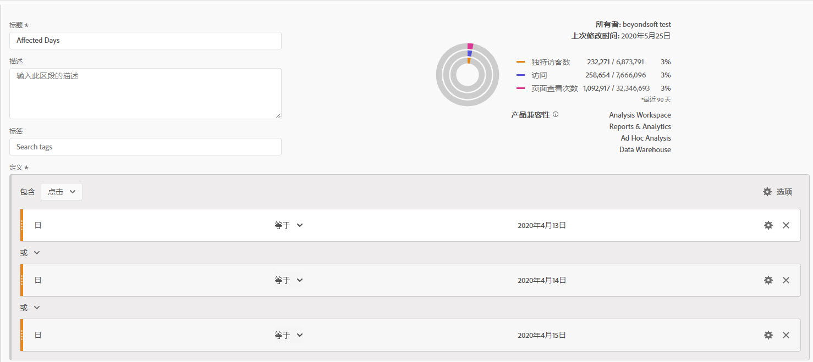
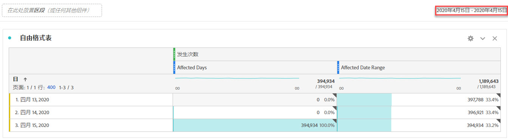
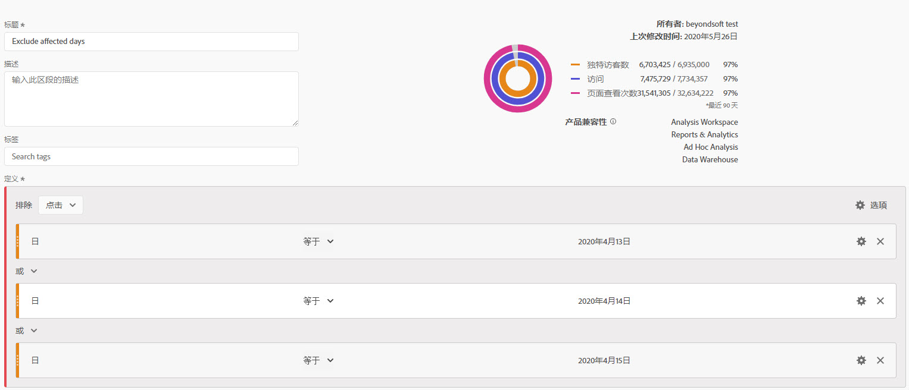
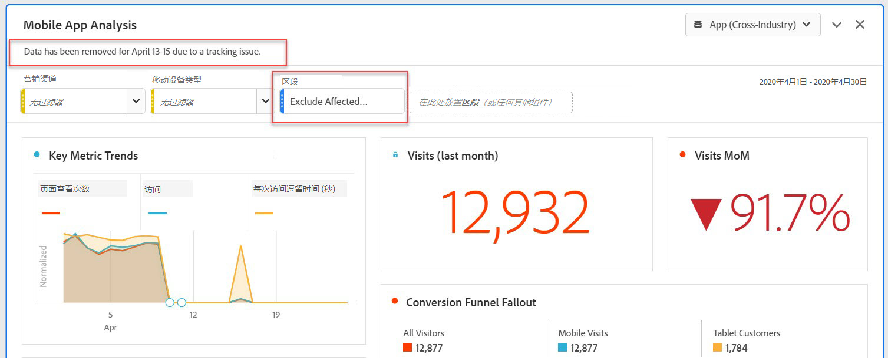
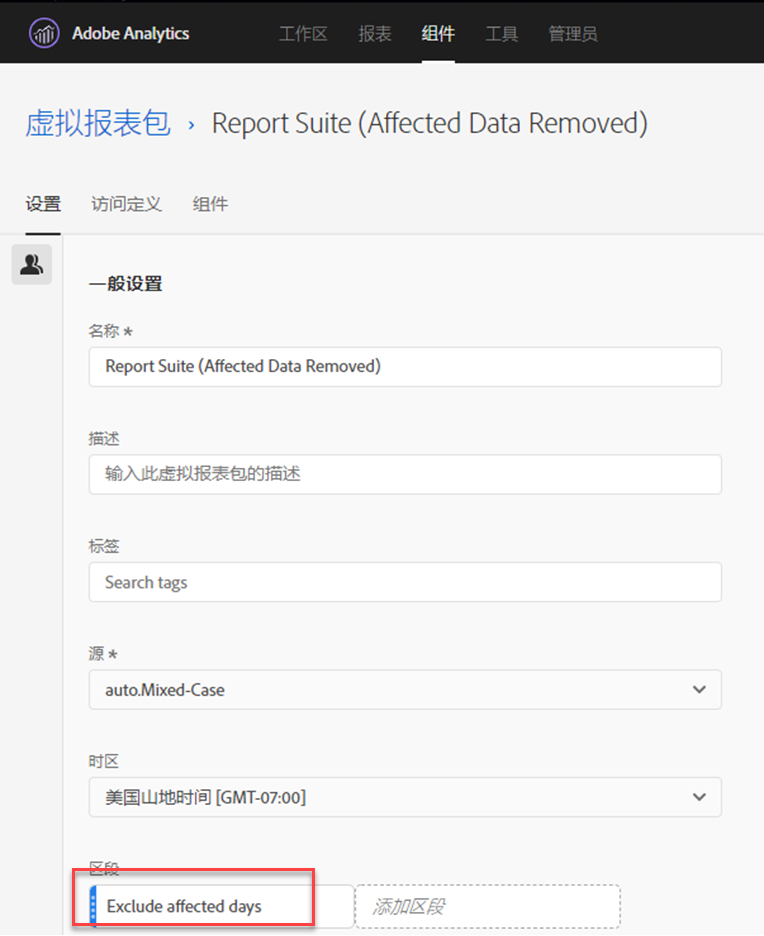

# 在分析中排除特定日期

如果您有数据 [受事件影响](overview.md)中，您可以使用区段排除不希望包含在报表中的任何日期范围。 对受事件影响的日期进行分段有助于防止您的组织对局部数据做出决策。

## 隔离受影响的天数 {#isolate}

创建区段以隔离受影响的日期或日期范围。 如果您只想关注问题日以查看有关其影响的更多信息，此区段非常有用。

1. 转到以打开区段生成器 **[!UICONTROL 组件]** > **[!UICONTROL 区段]**，然后单击 **[!UICONTROL 添加]**.
2. 将“天”维度拖动到定义画布，并将其设置为等于要隔离的天。
3. 对要在报告中隔离的每一天重复上述步骤。

>[!TIP]
>
>要将OR语句更改为AND语句，请单击OR旁边的向下箭头并选择AND。

Adobe建议使用橙色维度组件，而不要使用紫色日期范围组件。 如果使用紫色日期范围组件，则它们会覆盖项目的日历范围：

## 排除受影响的天数 {#exclude}

创建排除受影响日期或日期范围的区段。 如果您希望排除遇到问题的日期，以将对整体报表的影响降至最低，则此区段非常有用。

1. 转到以打开区段生成器 **[!UICONTROL 组件]** > **[!UICONTROL 区段]**，然后单击 **[!UICONTROL 添加]**.
2. 在区段定义画布的右上角，单击 **[!UICONTROL 选项]** > **[!UICONTROL 排除]**.
3. 将“日”维度拖动到定义画布，并将其设置为等于要删除的日期。
4. 对要在报表中删除的每一天重复上述步骤。

## 在报表中使用这些区段

创建排除区段后，您可以像使用其他区段一样使用该区段。

### 在趋势报表中比较区段 {#compare}

您可以在报表中同时应用“受影响的天数”区段和“排除受影响的天数”区段，以并排比较它们。 将这两个区段拖动到量度上方或下方以进行比较：

如果不想在表或可视化图表中显示零（导致下降），请启用 **[!UICONTROL 将零解释为没有值]** 在列设置下。

如果不想在表或可视化图表中显示零（导致下降），请启用 **[!UICONTROL 将零解释为没有值]** 在列设置下。

### 将排除区段应用于项目 {#apply}

您可以将“排除受影响的日期”区段应用于Workspace项目。 将排除区段拖到标记为的工作区画布部分 *将区段拖放到此处*.

>[!TIP]
>
>在面板的描述中包含有关排除数据的说明，以帮助查看报告的用户。 右键单击面板的标题，然后单击 **[!UICONTROL 编辑描述]**.

### 在虚拟报表包中使用排除区段 {#use-vrs}

可在以下位置使用该区段： [虚拟报表包](/help/components/vrs/vrs-about.md) 以更方便地排除数据。 此选项的理想情况是，您无需记住为包含受影响日期范围的每个报表应用区段。 如果您已将虚拟报表包用作主要数据源，则可以将该区段添加到现有的虚拟报表包。

1. 导航到 **[!UICONTROL 组件]** > **[!UICONTROL 虚拟报表包]**.
2. 单击&#x200B;**[!UICONTROL 添加]**。
3. 输入虚拟报表包所需的名称和描述。
4. 将排除区段拖动到标记为的区域 **[!UICONTROL 添加区段]**.
5. 单击 **[!UICONTROL 继续]** 图标，然后单击 **[!UICONTROL 保存]**.

