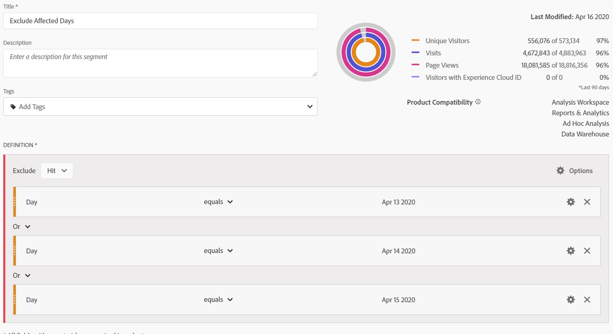

# 在分析中排除特定日期

如果事件影 [响了](overview.md)，则可以使用区段来排除您不希望在报表中包括的任何日期范围。 划分受事件影响的日期有助于防止组织对部分数据做出决策。

## 隔离受影响的天数

创建可隔离受影响的日期或日期范围的区段。 如果您只想关注问题日，以了解有关其影响的更多信息，则此部分很有用。

1. 转至组件>区段，然后单 **[!UICONTROL 击添加]** , **[!UICONTROL 以打开]**&#x200B;区段生 **[!UICONTROL 成器]**。
2. 将“天”维拖动到定义画布，并将其设置为与要隔离的天相等。
3. 对于要在报告中隔离的每一天，重复上述步骤。

Adobe建议使用橙色维度维度组件，而不是紫色日期范围组件。 如果您使用紫色日期范围组件，则它们将覆盖项目的日历范围：

## 排除受影响的天数

创建不包括受影响日期或日期范围的区段。 如果您希望排除遇到问题的天数，以最大限度地减少对整体报告的影响，则此细分很有用。

1. 转至组件>区段，然后单 **[!UICONTROL 击添加]** , **[!UICONTROL 以打开]**&#x200B;区段生 **[!UICONTROL 成器]**。
2. 在段定义画布的右上角，单击“选 **[!UICONTROL 项”]** > **[!UICONTROL Exclude]**。
3. 将“Day”维拖到定义画布上，并将其设置为与要删除的日相等。
4. 在报告中要删除的每天重复上述步骤。

## 在报表中使用这些区段

创建排除区段后，您可以完全按使用其他区段的方式使用它。

### 比较趋势报表中的区段

您可以在报表中同时应用“受影响的天数”段和“排除受影响的天数”段，并排比较它们。 将两个区段拖动到某个度量的上方或下方，进行比较：

如果不想在表中显示零或可视化（导致低谷），请在列设置 **[!UICONTROL 下启用“将零解释为]** 无值”。

如果不想在表中显示零或可视化（导致低谷），请在列设置 **[!UICONTROL 下启用“将零解释为]** 无值”。

### 将排除区段应用到项目

您可以将“排除受影响的天数”段应用于Workspace项目。 将排除区段拖至标有“将区段放 *到此处”的Workspace画布区*。

>[!TIP]
>
>在面板的说明中包括排除数据的附注，以帮助查看报告的用户。 右键单击面板的标题，然后单击“编 **[!UICONTROL 辑说明]**”。

### 在虚拟报告套件中使用排除区段

您可以在虚拟报告套件中 [使用区段](/help/components/vrs/vrs-about.md) ，更方便地排除数据。 此选项非常理想，因为您无需记住将区段应用于包含受影响日期范围的每个报表。 如果已使用虚拟报表包作为主数据源，则可以将区段添加到现有VRS。

1. Navigate to **[!UICONTROL Components]** > **[!UICONTROL Virtual report suites]**.
2. 单击&#x200B;**[!UICONTROL 添加]**。
3. 输入虚拟报表包的所需名称和说明。
4. 将排除段拖至标有“添加段” **[!UICONTROL 的区域]**。
5. 单击 **[!UICONTROL 右上]** 角的“继续”，然后单击“ **[!UICONTROL 保存”]**。

