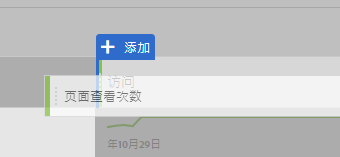
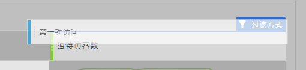
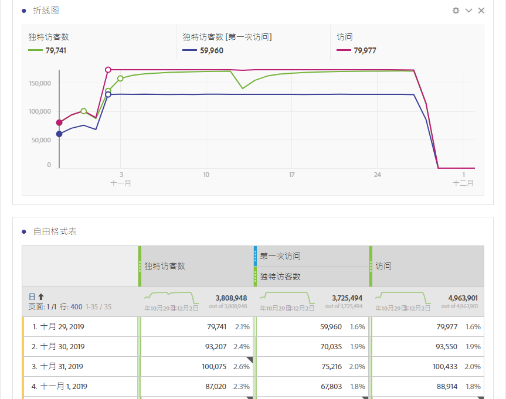
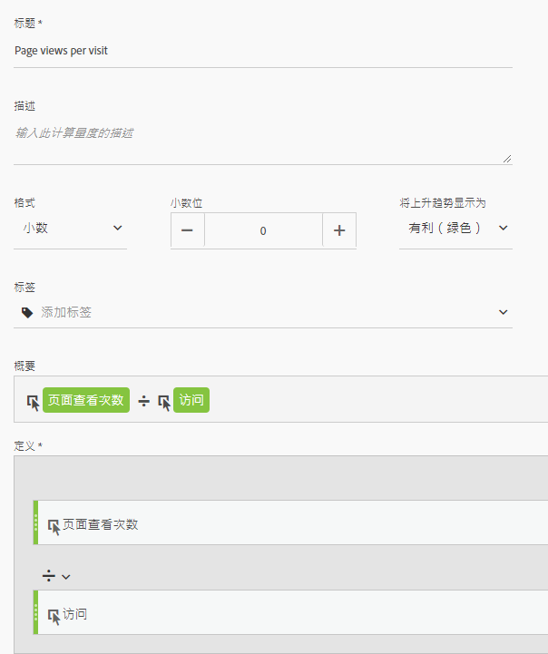
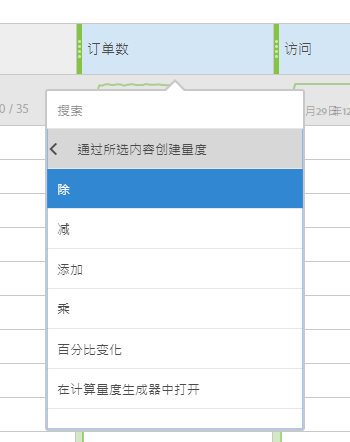

# 其他平台翻译指南中常用的指标

在Google Analytics等其他平台上，许多报告共享相同数量的指标。使用本页了解如何重新创建在许多报告中使用的量度。

要向工作区自由表中添加多个量度，请将度量从工作区中量度标题旁边的组件区域拖动：

## 客户赢取指标

**用户** 大约等于Workspace中 **的唯一访问者** 。See the [Unique Visitors](../../../components/c-variables/c-metrics/metrics-unique-visitors.md) metric in the Components user guide for additional details.

**新用户** 可通过以下方式获取：

1. Drag the **Unique Visitors** metric onto the workspace.
2. Drag the **First Time Visits** segment above the Unique Visitors metric headers:

   

**会话** 大约等于Analysis Workspace **中的访问次数** 。See the [Visits](../../../components/c-variables/c-metrics/metrics-visit.md) metric in the Components user guide for additional details.

## 行为指标

**跳出率** 在Analysis Workspace中很容易作为指标提供。See the [Bounce Rate](../../../components/c-variables/c-metrics/metrics-bounce-rate.md) metric in the Components user guide for additional information.

**页面/会话** 是计算量度。它可以通过以下方式获得：

1. 如果您已经创建了此计算量度，请在“Metrics”(指标)下找到它，然后将其拖动到工作区。
2. If you have not yet created this calculated metric, click the **+** icon near the metric list to open the Calculated Metric Builder.
3. 为其提供“每次访问页面查看次数”标题，如果需要，则为其提供一个描述。
4. 将格式设置为小数，将小数位数设置为2。
5. Drag the **Page views** metric and **Visits** metric into the definition area.
6. Arrange the definition so the formula is **Page Views divided by Visits**.

   

7. 单击保存以返回工作区。
8. 将新定义的计算量度拖动到工作区。

   Learn more about [Calculated Metrics](../../../components/c-variables/c-metrics/calculated-metric.md) in the Components user guide.

**平均Session Duration** is approximately equal to **Time Spent per Visit (seconds)**. Learn more about [Time Spent](../../../components/c-variables/c-metrics/metrics-time-spent.md) metrics in the Components user guide.

## 转换指标

**目标转化率**、 **目标完成** 和 **目标值** 需要在这两个平台上进行额外的实施。如果您的实施已经支持产品维度和购买事件，请考虑以下步骤：

1. Drag the **Orders** metric, **Revenue** metric, and **Visits** metric onto the workspace.
1. Create a calculated metric of **Orders per Visit**. 在两个度量标题上使用Ctrl并单击(Windows)或cmd并单击(Mac)以突出显示它们。Right-click one of the headers, select **Create Metric From Selection**, then click **Divide**. 此新指标类似于目标转化率。
1. 如果需要小数位，请编辑计算量度。单击量度标题中的“信息”按钮，然后单击铅笔图标。在“计算量度生成器”窗口中添加或分小数位，然后单击保存。

   

如果您的实施尚未容纳产品或转化数据，Adobe建议与实施顾问合作以确保数据质量和完整性。
