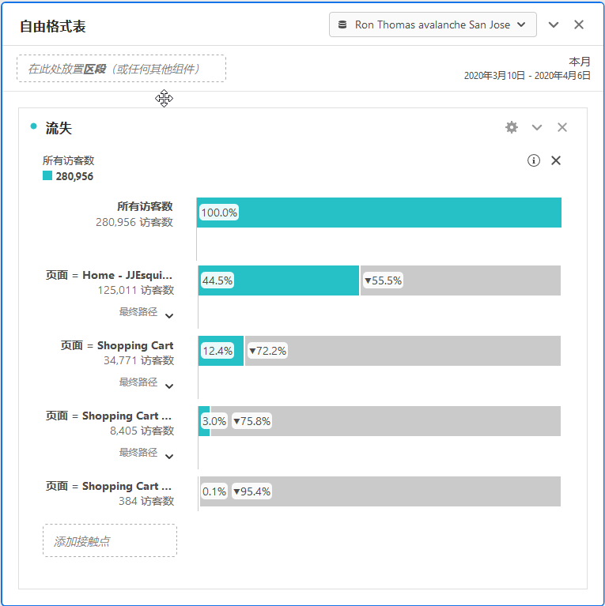
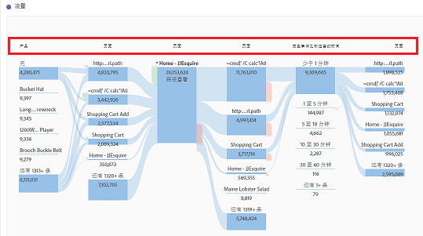

# 转换报告

“转换”是访客在您的网站上直接翻译为组织关键指示器的操作。转换报告显示访客如何转换的详细信息。

此页面假定用户具有使用Analysis Workspace的基本知识。See [Create a basic report in Analysis Workspace for Google Analytics users](create-report.md) if you are not yet familiar with the tool in Adobe Analytics.

## 目标报告

目标为Google Analytics用户提供一种定义网站转化的方式。它们是创建漏斗、反向行为流、多渠道漏斗和归因的默认方式。Google Analytics中的目标不是可追溯的，只能在管理页面上设置。此外，它们仅基于页面、活动、花费的时间或平均页面数。

在Adobe Analytics中，不需要目标的概念，因为指标可以应用于任何上下文。只要您的实施容纳了要跟踪的事件，就可以调整任何转化报告，并立即获得历史数据结果。

### 漏斗可视化

漏斗可视化报告帮助分析师专注于转化所需的特定一系列步骤。例如，在购买之前，电子商务网站上的访客需要访问购物车、计费和送货页面、付款页面和订单审阅页面。

在Analysis Workspace中，可以使用流失可视化查看此数据。

1. 单击左侧的可视化图标，并将流失可视化拖动到自由表上方的工作区上
2. Click the components icon on the left, then locate the **Pages** dimension.
3. 单击页面尺寸旁边的箭头图标以显示页面值。尺寸值为黄色。
4. 找到要充当第一个触点的所需页面，并将其拖动到可视化中标记为“添加触点”的空格中。
5. 通过将页面值拖动到可视化中，继续添加所需的触点。

流失可视化不仅仅局限于页面维度。任何维度、指标或细分可用于定制您的流失报告以满足组织的需求。

## 电子商务报告

电子商务报告通常由销售产品或服务的站点使用，用于测量购买的商品和收入。此功能在Adobe Analytics中可用，称为产品报告。

Google Analytics中的电子商务报告和Adobe Analytics中的产品报告都需要自定义的实施更改才能使用。See the [Products](../../../components/c-variables/dimensionslist/reports-products.md) dimension in the Components user guide for more information.

## 多渠道漏斗报告

多渠道漏斗报表提供了超出客户获取报告所提供的其他营销渠道数据。这些报告侧重于访客如何转化，而不是访客来到您的网站的方式。

> [!NOTE]
>
> 在Adobe Analytics中使用多渠道报告需要设置营销渠道和自定义实施以容纳产品变量和购买事件。如果尚未为您的报表套件配置这些功能，Adobe建议与实施顾问合作。

### 多渠道-协助转换

协助转化率显示每个渠道支持转化的次数。In Analysis Workspace, the **Order Assists** metric can be used.

1. In the Components menu, locate the **Marketing Channel** dimension and drag it onto the large freeform table area labeled 'Drop a Dimension here'.
2. Drag the **Order Assists** metric on top of the automatically created **Occurrences** metric header to replace it. 如果需要，可以将其他指标拖动到工作区上。

### 多通道-顶部转换路径

顶部转换路径报告显示用户在转换前所采用的顶部渠道路径。Analysis Workspace使用流动报告来可视化顶部转化路径。

1. 单击左侧的面板图标，并在自由表上方拖动“归因”面板。
2. Click the Components icon on the left, locate the **Marketing Channel** dimension, and drag it to the box labeled 'Add Dimension'.
3. 在量度(例如订单)下找到所需的转化事件，然后将其拖动到标记为“添加量度”的框中。请注意，“归因”面板不支持计算得出的度量。
4. 单击生成。
5. 在生成的报告中，找到“渠道流”可视化。此流显示访客在购买之前所接触的顶部路径。

此流可视化是交互式的。单击每个渠道以沿任一方向展开流。

### 多通道-时间延迟

延迟报告显示访客在您的网站上转换所花费的时间。In Analysis Workspace, this data is available using the **Days Before First Purchase** dimension. 它仅在正确实施的购买事件的上下文中可用。

1. In the Components menu, locate the **Days Before First Purchase** dimension and drag it onto the large freeform table area labeled 'Drop a Dimension here'.
2. Drag the desired metrics onto the workspace alongside the automatically created **Occurrences** metric. See the [Metric translation guide](common-metrics.md) for details on how to obtain each respective metric.

Adobe recommends using the **Orders**, **Units**, or **Revenue** metrics with this dimension.

For other types of conversions, including custom events, the **Time Prior to Event** dimension is available. 它显示一个访客在访问中触发活动所花费的时间(以分钟为单位)。

1. In the Components menu, locate the **Time Prior to Event** dimension and drag it onto the large freeform table area labeled 'Drop a Dimension here'.
2. Drag the desired metrics onto the workspace alongside the automatically created **Occurrences** metric. See the [Metric translation guide](common-metrics.md) for details on how to obtain each respective metric.

Adobe建议在自定义事件或购买事件旁边使用此维度。

### 多通道-路径长度

路径长度报告显示转换事件之前所接触的渠道数。在Analysis Workspace中，“归因”面板在其一个可视化中包含此数据。

1. 单击左侧的面板图标，并在自由表上方拖动“归因”面板
2. Click the Components icon on the left, locate the **Marketing Channel** dimension, and drag it to the box labeled 'Add Dimension'.
3. 在量度(例如订单)下找到所需的转化事件，然后将其拖动到标记为“添加量度”的框中。请注意，“归因”面板不支持计算得出的度量。
4. 单击生成。
5. 在生成的报告中，找到“每个旅程触点”可视化。此直方图显示访客在购买之前所接触的渠道数。
