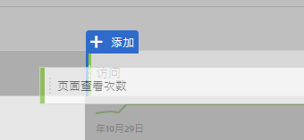

# 在Analysis Workspace中为Google Analytics用户创建基本报告

Analysis Workspace(Adobe Analytics中的主要功能之一)为用户提供了一个强大的领域，供用户对收集的数据进行任何分析。Google Analytics和Adobe Analytics之间的报告差别很大：

* Google Analytics中的报告结构允许您选择特定类型的数据，例如地理位置或引用流量。平台根据预期的最佳方式使用预制的报表视图来查看该数据。
* Analysis Workspace中的报告结构提供了一个空白画布，能够更灵活地满足准确的报告需求。

由于Analysis Workspace更像是一个画布，而不是预制报表，因此从Google Analytics重新创建报表只是使用正确的可视化和组件。

## Workspace中使用的主要术语

* **面板** 是工作区的覆盖构件。在几乎所有情况下，都使用自由面板。
* **可视化** 构成了所有自由形式面板。其目的是代表不同格式的数据。大多数情况下，格式是表，但其他时间可能会像圆环或折线图一样。Google Analytics中的许多报告由两个可视化组成：折线图和自由表。
* **组件** 放在可视化中以返回数据。可以通过多种不同的方式混合组件以满足报表需求。
   * **维度** 是可变值，通常包含文本。例如页面名称、引介或地理国家/地区。它们通常作为表中的行列出。
   * **指标** 通常表示某种事件或转换的转换。示例包括诸如页面查看等常见事件，或如购买或注册等更重要的事件。它们最常被视为表中的列，以显示每个维度发生的事件次数。
   * **细分** 是数据的子集，其行为类似于Google Analytics中的区段。它们允许您制作自定义滤镜，使您能够专注于数据的特定部分。
   * **日期范围** 允许您在活动发生时组织数据。它们是查看趋势随时间推移的支柱，通常与指标相协调。

## 在Workspace中创建基本报表

通过将正确的组件拖动到工作区画布上，创建“所有页面”报表(与Google Analytics中的报表相似)。

1. Log in to [experiencecloud.adobe.com](https://experiencecloud.adobe.com) using your Adobe ID credentials.
2. 单击右上角的方形图标，然后单击彩色的Analytics徽标。
3. 在顶部导航栏中，单击工作区。
4. 单击“创建新项目”按钮。
5. 在模态弹出窗口中，确保选中“空白项目”，然后单击“创建”。
6. 在左侧显示维度、量度、区段和日期范围的列表。找到页面尺寸(彩色橙色)，然后将其拖动到画布上标记为“在此处放置尺寸”的画布上。
7. 可查看显示本月顶部页面的报告。Analysis Workspace automatically populates the report with the [Occurrences](../../../components/c-variables/c-metrics/metrics-occurrences.md) metric.
8. Google Analytics中的表格通常包含7-8指标。找到“跳出率”量度(彩色绿色)，然后将其拖动到“出现次数”量度标题旁。如果您将“跳出率”量度拖动到“发生次数”旁边，两个量度将并排显示。
9. 可以通过将指标拖动到现有指标标题旁边，并排放置许多指标。See [commonly used metrics](common-metrics.md) for information on how to obtain metrics typically used in Google Analytics.

   

## 从Workspace中的预构建报表模板开始

通过访问项目模板，创建内容消耗模板(与Google Analytics中的“所有页面”报表类似)。

1. 单击“创建新项目”按钮。
2. 找到并双击“所有模板”下列出的“内容消耗(Web)”图标。
3. 浏览已预先构建的每个可视化：入口页面流量、顶部页面表、退出页面流量、入口站点区域流量和顶部站点部分表。

   

## 使用工具进行试验

由于Analysis Workspace是一种报表工具，因此它对数据收集没有影响。不会影响将组件拖入项目以查看有效内容。将不同的维度和计量指标组合拖入工作区项目，以了解可供您使用的内容。

如果意外将无效组件拖动到工作区项目或希望返回一个步骤，按Ctrl+ Z(Windows)或cmd+ Z(Mac)可撤消上次执行的操作。You can also start with a clean slate by clicking *[!UICONTROL Project] &gt; [!UICONTROL New]* in the upper left menu.

Adobe在右键单击上下文菜单中在Analysis Workspace中放置了许多功能。可以右键单击大多数可视化和组件，以进行更详细的分析和交互。考虑在工作区中右键单击组件以查看可用选项。

## 了解要使用的维度和指标

如果您习惯使用Analysis Workspace并希望重新创建通常在Google Analytics中查看的特定报告，请在其各自页面上找到该报告：

* [实时报表](realtime-reports.md)
* [受众报告](audience-reports.md)
* [客户获取报告](acquisition-reports.md)
* [行为报告](behavior-reports.md)
* [转换报告](conversions-reports.md)
