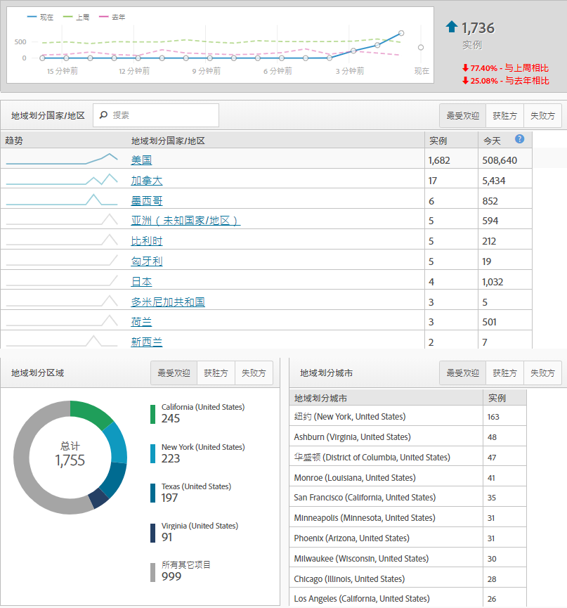
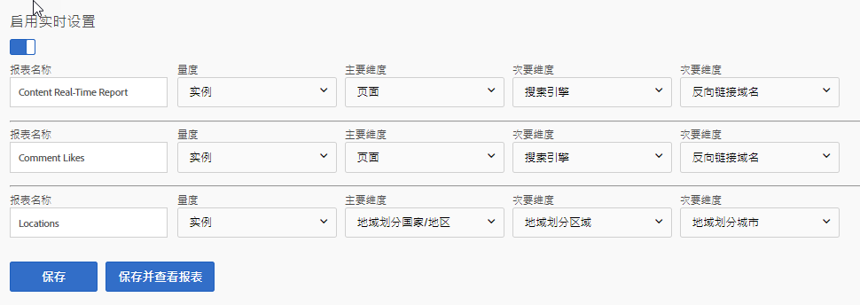

# 实时报表

实时报告会立即展示您的网站所发生的事情。这些类型的报告特别有价值，可立即看到您对网站进行的更新结果。例如，在黑色星期五运行的一家公司可以评估到特定页面的流量，并确定根据该时刻的性能确定哪些销售优先级。

实时报告是尚未引入Analysis Workspace的少数几项功能之一。使用Reports&amp; Analytics获取此数据。他们需要简单的配置来开始收集数据。

要达到实时报告配置页面(需要管理权限)，请执行以下操作：

1. Click [!UICONTROL Reports] in the Adobe Analytics header navigation.
2. In the left menu, Click *[!UICONTROL Site Metrics]* &gt; *[!UICONTROL Real-Time]*.
3. 如果报表包尚未启用实时启用，则会显示一条消息，其中含有配置报表包的链接。If the report suite has real-time enabled, click [!UICONTROL Configure] near the real-time report&#39;s title.

Adobe最多可允许三个实时报告同时收集数据。每个都必须在开始收集数据之前进行配置。

## 实时位置

实时位置告诉您访客在当前时刻访问站点的位置。要配置三个实时报告之一以显示位置数据，请执行以下操作：

1. Click [!UICONTROL Configure] near the real-time report&#39;s title.
2. 在某个实时报告槽下：
   * 命名您的实时报告；例如，“位置”。
   * 实例通常用作量度。此时，用户/唯一访客在实时报告中不可用。
   * 对于主要维度，通常使用地域划分国家/地区。地域划分区域、地域划分US DMA和地域划分城市也可用。
   * 对于两个次要维度，请使用您希望看到的用于此流量的额外数据。辅助维度不必特定于位置。
3. Click [!UICONTROL Save and View Report].

## 实时流量源

实时流量来源告诉您访客在当前时刻访问站点的位置。要配置三个实时报告之一以显示流量源数据，请执行以下操作：

1. 单击实时报告标题附近的“配置”。
2. 在某个实时报告槽下：
   * 命名您的实时报告；例如，“流量源”。
   * 实例通常用作量度。此时，用户/唯一访客在实时报告中不可用。
   * 对于主维度，通常使用引用域。搜索引擎和搜索关键字也可用。
   * 对于两个次要维度，请使用您希望看到的用于此流量的额外数据。次要维度不必特定于流量源。
3. Click [!UICONTROL Save and View Report].

## 实时内容

实时内容会告诉您访客当前正在查看哪些页面。要配置三个实时报告之一以显示内容数据，请执行以下操作：

1. Click [!UICONTROL Configure] near the real-time report&#39;s title.
2. 在某个实时报告槽下：
   * 命名您的实时报告；例如，“内容”。
   * 实例通常用作量度。此时，用户/唯一访客在实时报告中不可用。
   * 对于主维度，通常使用页面。如果您的实施定义了这些变量，则站点部分和服务器也可用。
   * 对于两个次要维度，请使用您希望看到的用于此流量的额外数据。辅助维度不必特定于内容。
3. Click [!UICONTROL Save and View Report].

## 实时活动

实时活动告诉您哪些活动在您的网站上产生最多。在Google Analytics中，活动捕获特定操作(通常是与页面查看无关的行为)的次数。GA事件通过类别、标签和动作发送。在Adobe Analytics中，自定义事件是在管理控制台中获得友好名称的指标，并且可以在任何维度旁边进行分析。如果您在Adobe Analytics中查找类似于Google Analytics事件的维度，请考虑应用“自定义链接尺寸”，该维度通常用作收集与页面视图无关的数据的catch-all(除退出链接-“退出链接-下载链接-下载链接-下载链接)”。

> [!NOTE] 在实时报告中使用自定义事件时，必须在与自定义事件相同的点击中定义维度值。例如，如果查看“Referencing Domain”(引用域)维度的“Registratory”(注册)自定义事件，则无需额外实施即可返回数据。由于引用域仅在第一次点击时出现，且自定义事件通常稍后出现在访问中，因此数据不能在实时报告中关联。此数据可使用标准处理滞后时间(通常为30-90分钟)使用Analysis Workspace。

## 实时转化

实时转化率在平台之间有不同的表现。Google Analytics中的目标精通Adobe Analytics中的指标和成功事件。您可以在Real Time Reports中使用Adobe Analytics中的大多数指标(如成功事件和标准指标等自定义指标)。与Google Analytics类似，您还可以在实时报告中应用产品名称、跟踪代码和营销活动效果等维度。

1. Click [!UICONTROL Configure] near the real-time report&#39;s title.
2. 在某个实时报告槽下：
   * 命名您的实时报告；例如，“转换”。
   * 实例通常用作量度。此时，用户/唯一访客在实时报告中不可用。
   * 对于主维度，通常使用跟踪代码。如果您的实施使用了产品维度，则也可以使用该维度。
   * 对于两个次要维度，请使用您希望看到的用于此流量的额外数据。次要维度不必特定于转换。
3. Click [!UICONTROL Save and View Report].

> [!NOTE] 如果在实例之外使用事件(如“顺序”)，则确保您的实施定义同一点击上的维度和事件。如果在同一点击上不触发维度和事件，则使用标准处理滞后时间(通常为30-90分钟)中可以使用该数据。
